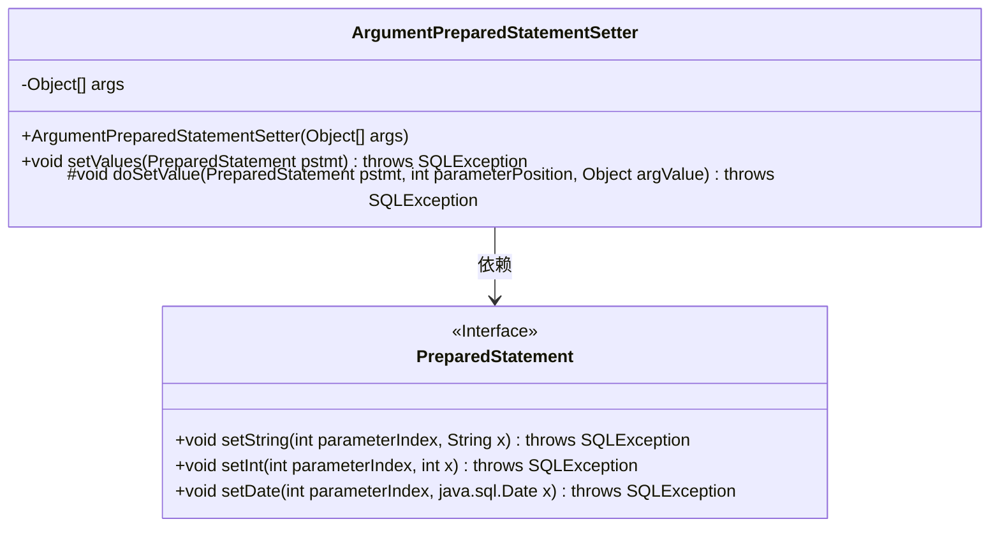
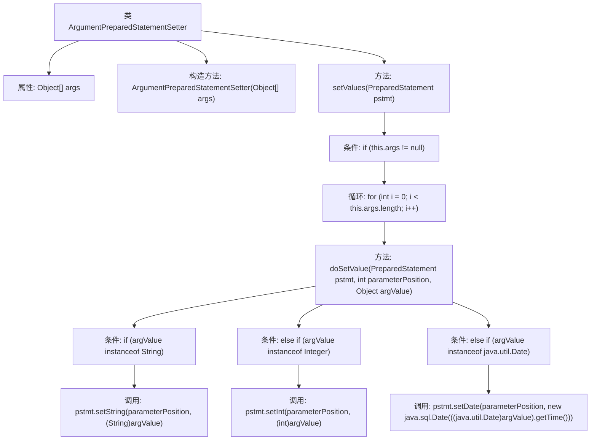

# 基础信息

|      |      |
|------|------|
| 名称 | ArgumentPreparedStatementSetter |
| 编码语言 | .java |
| 代码路径 | Minis/src/com/minis/jdbc/core/ArgumentPreparedStatementSetter.java |
| 包名 | com.minis.jdbc.core |
| 依赖项 | ['java.sql.PreparedStatement', 'java.sql.SQLException'] |
| 概述说明 | PreparedStatement参数设置类，支持字符串、整数和日期类型。 |

# 说明

该类用于配置PreparedStatement的参数，支持多种数据类型，包括字符串、整数和日期。通过该类，用户可以方便地为PreparedStatement设置不同类型的参数值，确保数据在数据库操作中的准确传递和处理。

# 类列表 Class Summary

| 名称   | 类型  | 说明 |
|-------|------|-------------|
| ArgumentPreparedStatementSetter | class | 类用于设置PreparedStatement参数，支持字符串、整数和日期类型。 |

## 类 ArgumentPreparedStatementSetter

|      |      |
|------|------|
| 访问范围 | public |
| 类型 | class |
| 名称 | ArgumentPreparedStatementSetter |
| 说明 | 类用于设置PreparedStatement参数，支持字符串、整数和日期类型。 |

### UML类图

**描述：**  
`ArgumentPreparedStatementSetter` 类用于将一组参数设置到 `PreparedStatement` 中。它包含一个构造函数，用于接收参数数组，并提供了 `setValues` 方法来遍历参数并将其设置到 `PreparedStatement` 中。`doSetValue` 方法根据参数的类型调用 `PreparedStatement` 的相应方法（如 `setString`、`setInt`、`setDate`）来设置参数值。该类依赖于 `PreparedStatement` 接口，该接口定义了设置不同类型参数的方法。

### 内部方法调用关系图

这段代码描述了一个`ArgumentPreparedStatementSetter`类，用于将一组参数设置到`PreparedStatement`中。代码首先检查参数数组是否为空，然后遍历数组中的每个参数，并根据参数的类型调用相应的`PreparedStatement`设置方法。流程图清晰地展示了类中的方法调用关系和条件判断逻辑，帮助理解代码的执行流程。

### 字段列表 Field List

| 名称  | 类型  | 说明 |
|-------|-------|------|
| args | Object[] | 私有不可变对象数组args。 |

### 方法列表 Method List

| 名称  | 类型  | 说明 |
|-------|-------|------|
| doSetValue | void | 根据参数类型设置PreparedStatement的值。 |
| setValues | void | 方法setValues为PreparedStatement设置参数，遍历args数组并调用doSetValue。 |

