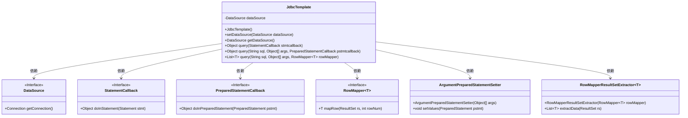

# 基础信息

|      |      |
|------|------|
| 名称 | JdbcTemplate |
| 编码语言 | .java |
| 代码路径 | Minis/src/com/minis/jdbc/core/JdbcTemplate.java |
| 包名 | com.minis.jdbc.core |
| 依赖项 | ['java.sql.Connection', 'java.sql.DriverManager', 'java.sql.PreparedStatement', 'java.sql.ResultSet', 'java.sql.Statement', 'java.util.List', 'javax.sql.DataSource'] |
| 概述说明 | JdbcTemplate简化JDBC操作，自动处理连接与资源释放。 |

# 说明

JdbcTemplate类是对JDBC操作的封装，简化了数据库查询流程。它提供了多种查询方法，并自动处理数据库连接的获取与资源的释放，减少了开发者的工作量，提高了代码的可维护性和安全性。

# 类列表 Class Summary

| 名称   | 类型  | 说明 |
|-------|------|-------------|
| JdbcTemplate | class | JdbcTemplate类封装了JDBC操作，提供查询方法并处理数据库连接和资源释放。 |

## 类 JdbcTemplate

|      |      |
|------|------|
| 访问范围 | public |
| 类型 | class |
| 名称 | JdbcTemplate |
| 说明 | JdbcTemplate类封装了JDBC操作，提供查询方法并处理数据库连接和资源释放。 |

### UML类图

这段代码定义了一个 `JdbcTemplate` 类，用于简化 JDBC 操作。它通过依赖注入 `DataSource` 来获取数据库连接，并提供了三种不同的 `query` 方法来执行 SQL 查询。`StatementCallback` 和 `PreparedStatementCallback` 是回调接口，用于处理不同类型的 SQL 语句。`RowMapper` 接口用于将查询结果映射为对象。`ArgumentPreparedStatementSetter` 和 `RowMapperResultSetExtractor` 是辅助类，分别用于设置 SQL 参数和提取查询结果。

### 内部方法调用关系图

```mermaid
graph TD
    A["类JdbcTemplate"]
    B["属性: DataSource dataSource"]
    C["方法: setDataSource(DataSource dataSource)"]
    D["方法: getDataSource()"]
    E["构造方法: JdbcTemplate()"]
    F["方法: query(StatementCallback stmtcallback)"]
    G["方法: query(String sql, Object[] args, PreparedStatementCallback pstmtcallback)"]
    H["方法: query(String sql, Object[] args, RowMapper<T> rowMapper)"]
    I["内部流程: query(StatementCallback stmtcallback)"]
    J["内部流程: query(String sql, Object[] args, PreparedStatementCallback pstmtcallback)"]
    K["内部流程: query(String sql, Object[] args, RowMapper<T> rowMapper)"]
    L["步骤: con = dataSource.getConnection()"]
    M["步骤: stmt = con.createStatement()"]
    N["步骤: return stmtcallback.doInStatement(stmt)"]
    O["步骤: pstmt = con.prepareStatement(sql)"]
    P["步骤: argumentSetter.setValues(pstmt)"]
    Q["步骤: return pstmtcallback.doInPreparedStatement(pstmt)"]
    R["步骤: rs = pstmt.executeQuery()"]
    S["步骤: return resultExtractor.extractData(rs)"]
    T["步骤: stmt.close()"]
    U["步骤: con.close()"]
    V["步骤: pstmt.close()"]
    W["步骤: con.close()"]
    X["步骤: pstmt.close()"]
    Y["步骤: con.close()"]
    Z["异常处理: e.printStackTrace()"]
    AA["异常处理: e.printStackTrace()"]
    AB["异常处理: e.printStackTrace()"]
    AC["异常处理: e.printStackTrace()"]
    AD["异常处理: e.printStackTrace()"]
    AE["异常处理: e.printStackTrace()"]

    A --> B
    A --> C
    A --> D
    A --> E
    A --> F
    A --> G
    A --> H
    F --> I
    G --> J
    H --> K
    I --> L
    I --> M
    I --> N
    I --> Z
    I --> T
    I --> U
    J --> L
    J --> O
    J --> P
    J --> Q
    J --> AA
    J --> V
    J --> W
    K --> L
    K --> O
    K --> P
    K --> R
    K --> S
    K --> AB
    K --> X
    K --> Y
    T --> AC
    U --> AD
    V --> AE
    W --> AE
    X --> AE
    Y --> AE
```

这段代码定义了一个`JdbcTemplate`类，用于简化JDBC操作。类中包含三个主要的`query`方法，分别用于执行不同类型的SQL查询。每个方法都遵循类似的流程：获取数据库连接、创建并执行SQL语句、处理结果集，并在最后关闭资源。代码中还包含了异常处理机制，确保在出现错误时能够捕获并打印异常信息。流程图展示了类中各个方法的调用关系以及每个方法内部的执行步骤。

### 字段列表 Field List

| 名称  | 类型  | 说明 |
|-------|-------|------|
| dataSource | DataSource | 私有数据源实例变量声明。 |

### 方法列表 Method List

| 名称  | 类型  | 说明 |
|-------|-------|------|
| query | List<T> | 该方法执行SQL查询，处理结果集并返回映射对象列表。 |
| setDataSource | void | 设置数据源方法，将传入的dataSource赋值给当前对象的dataSource属性。 |
| query | Object | 方法执行SQL查询，处理参数并回调，最终关闭连接和语句。 |
| getDataSource | DataSource | 获取数据源方法返回当前数据源对象。 |
| query | Object | 方法query执行数据库查询，处理连接与语句，返回回调结果，异常处理并关闭资源。 |

