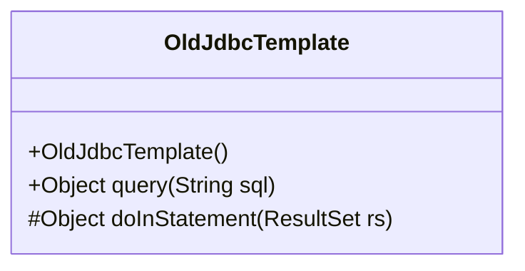
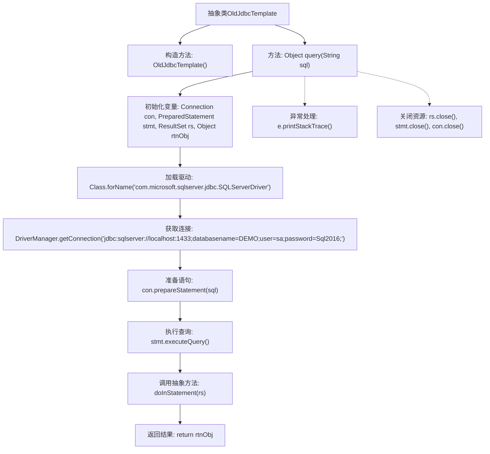

# 基础信息

|      |      |
|------|------|
| 名称 | OldJdbcTemplate |
| 编码语言 | .java |
| 代码路径 | Minis/src/com/minis/jdbc/core/OldJdbcTemplate.java |
| 包名 | com.minis.jdbc.core |
| 依赖项 | ['java.sql.Connection', 'java.sql.DriverManager', 'java.sql.PreparedStatement', 'java.sql.ResultSet'] |
| 概述说明 | OldJdbcTemplate封装JDBC连接、执行及结果处理。 |

# 说明

OldJdbcTemplate类是一个用于提供JDBC查询功能的工具类，其主要职责是封装数据库连接、执行查询操作以及处理查询结果。通过该类，开发者可以简化JDBC操作的复杂性，减少重复代码，提升开发效率。该类隐藏了底层的连接管理和结果处理细节，使得开发者能够更专注于业务逻辑的实现。

# 类列表 Class Summary

| 名称   | 类型  | 说明 |
|-------|------|-------------|
| OldJdbcTemplate | class | OldJdbcTemplate类提供JDBC查询功能，封装连接、执行及结果处理。 |

## 类 OldJdbcTemplate

|      |      |
|------|------|
| 访问范围 | public abstract |
| 类型 | class |
| 名称 | OldJdbcTemplate |
| 说明 | OldJdbcTemplate类提供JDBC查询功能，封装连接、执行及结果处理。 |

### UML类图

**描述：**  
`OldJdbcTemplate` 是一个抽象类，主要用于执行 JDBC 查询操作。它包含一个公共的 `query` 方法，该方法负责建立数据库连接、执行 SQL 查询，并调用抽象方法 `doInStatement` 来处理结果集。`doInStatement` 是一个受保护的抽象方法，需要子类实现以处理具体的业务逻辑。该类还包含一个默认构造函数。整个流程通过异常处理确保资源在操作完成后被正确关闭。

### 内部方法调用关系图

这段代码定义了一个抽象类 `OldJdbcTemplate`，其中包含一个 `query` 方法，用于执行 SQL 查询并返回结果。代码首先加载数据库驱动，然后获取数据库连接，准备并执行 SQL 语句，最后通过抽象方法 `doInStatement` 处理结果集。在整个过程中，代码还处理了可能的异常，并在最后确保关闭所有数据库资源。流程图清晰地展示了代码的执行流程，包括初始化、连接、查询、异常处理和资源关闭等步骤。

### 字段列表 Field List

| 名称  | 类型  | 说明 |
|-------|-------|------|

### 方法列表 Method List

| 名称  | 类型  | 说明 |
|-------|-------|------|
| doInStatement | Object | 受保护抽象方法，处理结果集返回对象。 |
| query | Object | 方法query执行SQL查询，返回结果对象，处理异常并关闭资源。 |

