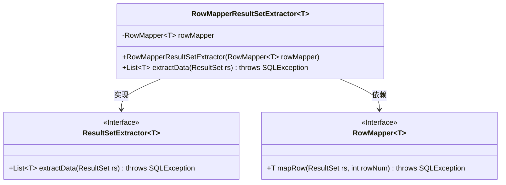
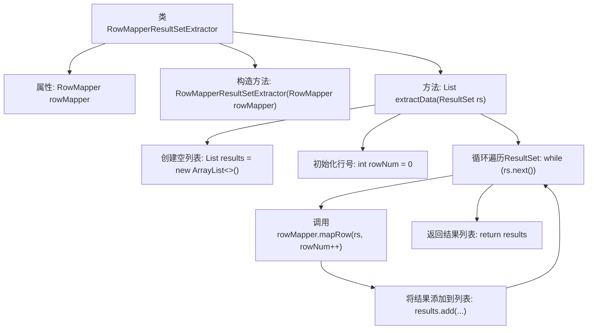

# 基础信息

|      |      |
|------|------|
| 名称 | RowMapperResultSetExtractor |
| 编码语言 | .java |
| 代码路径 | Minis/src/com/minis/jdbc/core/RowMapperResultSetExtractor.java |
| 包名 | com.minis.jdbc.core |
| 依赖项 | ['java.sql.ResultSet', 'java.sql.SQLException', 'java.util.ArrayList', 'java.util.List'] |
| 概述说明 | RowMapperResultSetExtractor类实现接口，映射ResultSet为对象列表。 |

# 说明

RowMapperResultSetExtractor类实现了ResultSetExtractor接口，其主要功能是将数据库查询结果集ResultSet转换为对象列表。该类通过映射机制，将ResultSet中的每一行数据映射为相应的对象，并将这些对象组织成一个列表，便于后续处理和使用。这种设计使得数据库操作与对象模型之间的转换更加高效和便捷。

# 类列表 Class Summary

| 名称   | 类型  | 说明 |
|-------|------|-------------|
| RowMapperResultSetExtractor | class | RowMapperResultSetExtractor类实现ResultSetExtractor接口，用于将ResultSet映射为对象列表。 |

## 类 RowMapperResultSetExtractor

|      |      |
|------|------|
| 访问范围 | public |
| 类型 | class |
| 名称 | RowMapperResultSetExtractor |
| 说明 | RowMapperResultSetExtractor类实现ResultSetExtractor接口，用于将ResultSet映射为对象列表。 |

### UML类图

这段代码定义了一个泛型类 `RowMapperResultSetExtractor<T>`，它实现了 `ResultSetExtractor<List<T>>` 接口。该类通过构造函数接收一个 `RowMapper<T>` 对象，并在 `extractData` 方法中遍历 `ResultSet`，使用 `RowMapper` 将每一行数据映射为对象，最终返回一个包含所有映射结果的列表。`RowMapper` 和 `ResultSetExtractor` 都是接口，分别定义了数据行映射和结果集提取的行为。

### 内部方法调用关系图

**描述：**  
`RowMapperResultSetExtractor<T>` 是一个泛型类，用于从 `ResultSet` 中提取数据并将其映射为 `List<T>`。类中包含一个 `RowMapper<T>` 类型的属性，通过构造方法初始化。`extractData` 方法负责遍历 `ResultSet`，逐行调用 `rowMapper.mapRow` 方法将数据映射为对象，并将结果添加到列表中，最后返回该列表。流程图展示了类的结构和方法执行的流程。

### 字段列表 Field List

| 名称  | 类型  | 说明 |
|-------|-------|------|
| rowMapper | RowMapper<T> | 私有不可变的RowMapper<T>类型变量rowMapper。 |

### 方法列表 Method List

| 名称  | 类型  | 说明 |
|-------|-------|------|
| extractData | List<T> | 该方法从结果集中提取数据并映射为对象列表返回。 |

