# 基础信息

|      |      |
|------|------|
| 名称 | SingleConnectionDataSource |
| 编码语言 | .java |
| 代码路径 | Minis/src/com/minis/jdbc/datasource/SingleConnectionDataSource.java |
| 包名 | com.minis.jdbc.datasource |
| 依赖项 | ['java.io.PrintWriter', 'java.sql.Connection', 'java.sql.DriverManager', 'java.sql.SQLException', 'java.sql.SQLFeatureNotSupportedException', 'java.util.Properties', 'java.util.logging.Logger', 'javax.sql.DataSource'] |
| 概述说明 | SingleConnectionDataSource类实现DataSource接口，管理数据库连接，支持URL、用户名、密码及连接属性设置。 |

# 说明

SingleConnectionDataSource类实现了DataSource接口，专门用于管理数据库连接。它支持通过URL、用户名和密码进行数据库访问，并且允许设置连接属性。该类通过单一连接管理数据库操作，确保连接的一致性和高效性。

# 类列表 Class Summary

| 名称   | 类型  | 说明 |
|-------|------|-------------|
| SingleConnectionDataSource | class | SingleConnectionDataSource类实现DataSource接口，管理数据库连接，支持URL、用户名、密码及连接属性设置。 |


## 类 SingleConnectionDataSource

|      |      |
|------|------|
| 访问范围 | public |
| 类型 | class |
| 名称 | SingleConnectionDataSource |
| 说明 | SingleConnectionDataSource类实现DataSource接口，管理数据库连接，支持URL、用户名、密码及连接属性设置。 |


### UML类图

```mermaid
classDiagram
    class SingleConnectionDataSource {
        -String driverClassName
        -String url
        -String username
        -String password
        -Properties connectionProperties
        -Connection connection
        +SingleConnectionDataSource()
        +String getUrl()
        +void setUrl(String url)
        +String getUsername()
        +void setUsername(String username)
        +String getPassword()
        +void setPassword(String password)
        +Properties getConnectionProperties()
        +void setConnectionProperties(Properties connectionProperties)
        +PrintWriter getLogWriter() throws SQLException
        +int getLoginTimeout() throws SQLException
        +Logger getParentLogger() throws SQLFeatureNotSupportedException
        +void setLogWriter(PrintWriter arg0) throws SQLException
        +void setLoginTimeout(int arg0) throws SQLException
        +boolean isWrapperFor(Class<?> arg0) throws SQLException
        +<T> T unwrap(Class<T> arg0) throws SQLException
        +void setDriverClassName(String driverClassName)
        +Connection getConnection() throws SQLException
        +Connection getConnection(String username, String password) throws SQLException
        #Connection getConnectionFromDriver(String username, String password) throws SQLException
        #Connection getConnectionFromDriverManager(String url, Properties props) throws SQLException
    }

    interface DataSource {
        <<Interface>>
        +PrintWriter getLogWriter() throws SQLException
        +int getLoginTimeout() throws SQLException
        +Logger getParentLogger() throws SQLFeatureNotSupportedException
        +void setLogWriter(PrintWriter arg0) throws SQLException
        +void setLoginTimeout(int arg0) throws SQLException
        +boolean isWrapperFor(Class<?> arg0) throws SQLException
        +<T> T unwrap(Class<T> arg0) throws SQLException
        +Connection getConnection() throws SQLException
        +Connection getConnection(String username, String password) throws SQLException
    }

    SingleConnectionDataSource ..|> DataSource : 实现
```

这段代码定义了一个 `SingleConnectionDataSource` 类，该类实现了 `DataSource` 接口。`SingleConnectionDataSource` 类用于管理与数据库的单一连接，提供了设置和获取连接属性（如URL、用户名、密码等）的方法，并通过 `DriverManager` 获取数据库连接。该类还实现了 `DataSource` 接口中的方法，如获取日志写入器、设置登录超时等。通过 `getConnectionFromDriver` 和 `getConnectionFromDriverManager` 方法，类内部实现了从驱动程序管理器获取连接的功能。


### 内部方法调用关系图

```mermaid
graph TD
    A["类SingleConnectionDataSource"]
    B["属性: String driverClassName"]
    C["属性: String url"]
    D["属性: String username"]
    E["属性: String password"]
    F["属性: Properties connectionProperties"]
    G["属性: Connection connection"]
    H["构造方法: SingleConnectionDataSource()"]
    I["方法: String getUrl()"]
    J["方法: void setUrl(String url)"]
    K["方法: String getUsername()"]
    L["方法: void setUsername(String username)"]
    M["方法: String getPassword()"]
    N["方法: void setPassword(String password)"]
    O["方法: Properties getConnectionProperties()"]
    P["方法: void setConnectionProperties(Properties connectionProperties)"]
    Q["方法: void setDriverClassName(String driverClassName)"]
    R["方法: Connection getConnection()"]
    S["方法: Connection getConnection(String username, String password)"]
    T["方法: Connection getConnectionFromDriver(String username, String password)"]
    U["方法: Connection getConnectionFromDriverManager(String url, Properties props)"]
    V["重写方法: PrintWriter getLogWriter()"]
    W["重写方法: int getLoginTimeout()"]
    X["重写方法: Logger getParentLogger()"]
    Y["重写方法: void setLogWriter(PrintWriter arg0)"]
    Z["重写方法: void setLoginTimeout(int arg0)"]
    AA["重写方法: boolean isWrapperFor(Class<?> arg0)"]
    AB["重写方法: <T> T unwrap(Class<T> arg0)"]

    A --> B
    A --> C
    A --> D
    A --> E
    A --> F
    A --> G
    A --> H
    A --> I
    A --> J
    A --> K
    A --> L
    A --> M
    A --> N
    A --> O
    A --> P
    A --> Q
    A --> R
    A --> S
    A --> T
    A --> U
    A --> V
    A --> W
    A --> X
    A --> Y
    A --> Z
    A --> AA
    A --> AB

    Q --> T1["Class.forName(this.driverClassName)"]
    T1 --> T2["抛出IllegalStateException"]
    R --> T
    S --> T
    T --> U1["DriverManager.getConnection(url, props)"]
    U1 --> U2["返回Connection"]
```



这段代码定义了一个名为`SingleConnectionDataSource`的类，该类实现了`DataSource`接口，用于管理与数据库的单一连接。它包含了多个属性用于配置数据库连接，如`driverClassName`、`url`、`username`、`password`等，并提供了相应的getter和setter方法。类中的主要方法包括`getConnection`和`getConnectionFromDriver`，用于从数据库驱动管理器获取连接。此外，类还重写了`DataSource`接口中的多个方法，如`getLogWriter`、`getLoginTimeout`等。流程图展示了类中各个方法和属性之间的关系，以及方法调用的流程。

### 字段列表 Field List

| 名称  | 类型  | 说明 |
|-------|-------|------|
| url | String | 定义一个私有字符串变量url。 |
| username | String | 定义私有字符串变量username。 |
| connectionProperties | Properties | 定义私有属性connectionProperties。 |
| connection | Connection | 私有变量connection用于数据库连接。 |
| password | String | 定义了一个私有的字符串类型变量password。 |
| driverClassName | String | 定义了一个私有字符串变量driverClassName。 |

### 方法列表 Method List

| 名称  | 类型  | 说明 |
|-------|-------|------|
| setUsername | void | 设置用户名的Java方法。 |
| getPassword | String | 获取密码的字符串方法。 |
| setLoginTimeout | void | 重写setLoginTimeout方法，不实现具体功能。 |
| getConnectionProperties | Properties | 获取连接属性的公共方法。 |
| getUsername | String | 方法getUsername返回字符串类型的username变量。 |
| getLogWriter | PrintWriter | 重写方法getLogWriter，返回null并抛出SQLException。 |
| getUrl | String | 获取URL的方法，返回字符串类型的URL值。 |
| unwrap | T | 该方法重写unwrap，返回null，可能抛出SQLException。 |
| setPassword | void | 设置密码方法，将输入密码赋值给类成员变量。 |
| getLoginTimeout | int | 重写方法，返回登录超时时间为0。 |
| setUrl | void | 设置URL的方法，将传入的URL赋值给当前对象的URL属性。 |
| isWrapperFor | boolean | 该方法始终返回false，表示不支持包装特定类。 |
| setDriverClassName | void | 设置JDBC驱动类名并验证其可加载性，失败则抛出异常。 |
| setLogWriter | void | 重写setLogWriter方法，接受PrintWriter参数，抛出SQLException异常。 |
| setConnectionProperties | void | 设置连接属性的方法，接收Properties对象并赋值给内部变量。 |
| getConnection | Connection | 重写getConnection方法，调用getConnectionFromDriver获取数据库连接。 |
| getParentLogger | Logger | 重写方法getParentLogger，返回null，抛出SQLFeatureNotSupportedException异常。 |
| getConnectionFromDriverManager | Connection | 通过DriverManager获取数据库连接，传入URL和属性参数。 |
| getConnection | Connection | 重写getConnection方法，调用getConnectionFromDriver获取数据库连接。 |
| getConnectionFromDriver | Connection | 从驱动获取连接，合并属性，设置用户名密码，返回连接。 |


