# 基础信息

|      |      |
|------|------|
| 名称 | PooledConnection |
| 编码语言 | .java |
| 代码路径 | Minis/src/com/minis/jdbc/pool/PooledConnection.java |
| 包名 | com.minis.jdbc.pool |
| 依赖项 | ['java.sql.Array', 'java.sql.Blob', 'java.sql.CallableStatement', 'java.sql.Clob', 'java.sql.Connection', 'java.sql.DatabaseMetaData', 'java.sql.NClob', 'java.sql.PreparedStatement', 'java.sql.SQLClientInfoException', 'java.sql.SQLException', 'java.sql.SQLWarning', 'java.sql.SQLXML', 'java.sql.Savepoint', 'java.sql.Statement', 'java.sql.Struct', 'java.util.Map', 'java.util.Properties', 'java.util.concurrent.Executor'] |
| 概述说明 | PooledConnection类负责管理数据库连接及其状态和操作。 |

# 说明

PooledConnection类负责管理数据库连接，主要功能包括维护连接状态和提供相关操作方法。该类确保连接的有效性和高效利用，通过集中管理连接资源，优化数据库操作的性能与可靠性。

# 类列表 Class Summary

| 名称   | 类型  | 说明 |
|-------|------|-------------|
| PooledConnection | class | PooledConnection类管理数据库连接，包含连接状态和操作方法。 |

## 类 PooledConnection

|      |      |
|------|------|
| 访问范围 | public |
| 类型 | class |
| 名称 | PooledConnection |
| 说明 | PooledConnection类管理数据库连接，包含连接状态和操作方法。 |

### UML类图

```mermaid
classDiagram
    class Connection {
        <<Interface>>
        +void close() throws SQLException
        +boolean isWrapperFor(Class~?~ iface) throws SQLException
        +~T~ unwrap(Class~T~ iface) throws SQLException
        +void abort(Executor arg0) throws SQLException
        +void clearWarnings() throws SQLException
        +void commit() throws SQLException
        +Array createArrayOf(String arg0, Object[] arg1) throws SQLException
        +Blob createBlob() throws SQLException
        +Clob createClob() throws SQLException
        +NClob createNClob() throws SQLException
        +SQLXML createSQLXML() throws SQLException
        +Statement createStatement() throws SQLException
        +Statement createStatement(int arg0, int arg1) throws SQLException
        +Statement createStatement(int arg0, int arg1, int arg2) throws SQLException
        +Struct createStruct(String arg0, Object[] arg1) throws SQLException
        +boolean getAutoCommit() throws SQLException
        +String getCatalog() throws SQLException
        +Properties getClientInfo() throws SQLException
        +String getClientInfo(String arg0) throws SQLException
        +int getHoldability() throws SQLException
        +DatabaseMetaData getMetaData() throws SQLException
        +int getNetworkTimeout() throws SQLException
        +String getSchema() throws SQLException
        +int getTransactionIsolation() throws SQLException
        +Map~String, Class~?~~ getTypeMap() throws SQLException
        +SQLWarning getWarnings() throws SQLException
        +boolean isClosed() throws SQLException
        +boolean isReadOnly() throws SQLException
        +boolean isValid(int arg0) throws SQLException
        +String nativeSQL(String sql) throws SQLException
        +CallableStatement prepareCall(String sql) throws SQLException
        +CallableStatement prepareCall(String sql, int resultSetType, int resultSetConcurrency) throws SQLException
        +CallableStatement prepareCall(String sql, int resultSetType, int resultSetConcurrency, int resultSetHoldability) throws SQLException
        +PreparedStatement prepareStatement(String sql) throws SQLException
        +PreparedStatement prepareStatement(String sql, int autoGeneratedKeys) throws SQLException
        +PreparedStatement prepareStatement(String sql, int[] columnIndexes) throws SQLException
        +PreparedStatement prepareStatement(String sql, String[] columnNames) throws SQLException
        +PreparedStatement prepareStatement(String sql, int resultSetType, int resultSetConcurrency) throws SQLException
        +PreparedStatement prepareStatement(String sql, int resultSetType, int resultSetConcurrency, int resultSetHoldability) throws SQLException
        +void releaseSavepoint(Savepoint savepoint) throws SQLException
        +void rollback() throws SQLException
        +void rollback(Savepoint savepoint) throws SQLException
        +void setAutoCommit(boolean autoCommit) throws SQLException
        +void setCatalog(String catalog) throws SQLException
        +void setClientInfo(Properties properties) throws SQLClientInfoException
        +void setClientInfo(String name, String value) throws SQLClientInfoException
        +void setHoldability(int holdability) throws SQLException
        +void setNetworkTimeout(Executor executor, int milliseconds) throws SQLException
        +void setReadOnly(boolean readOnly) throws SQLException
        +Savepoint setSavepoint() throws SQLException
        +Savepoint setSavepoint(String name) throws SQLException
        +void setSchema(String schema) throws SQLException
        +void setTransactionIsolation(int level) throws SQLException
        +void setTypeMap(Map~String, Class~?~~ map) throws SQLException
    }

    class PooledConnection {
        -Connection connection
        -boolean active
        +PooledConnection()
        +PooledConnection(Connection connection, boolean active)
        +Connection getConnection()
        +void setConnection(Connection connection)
        +boolean isActive()
        +void setActive(boolean active)
        +void close() throws SQLException
        +boolean isWrapperFor(Class~?~ iface) throws SQLException
        +~T~ unwrap(Class~T~ iface) throws SQLException
        +void abort(Executor arg0) throws SQLException
        +void clearWarnings() throws SQLException
        +void commit() throws SQLException
        +Array createArrayOf(String arg0, Object[] arg1) throws SQLException
        +Blob createBlob() throws SQLException
        +Clob createClob() throws SQLException
        +NClob createNClob() throws SQLException
        +SQLXML createSQLXML() throws SQLException
        +Statement createStatement() throws SQLException
        +Statement createStatement(int arg0, int arg1) throws SQLException
        +Statement createStatement(int arg0, int arg1, int arg2) throws SQLException
        +Struct createStruct(String arg0, Object[] arg1) throws SQLException
        +boolean getAutoCommit() throws SQLException
        +String getCatalog() throws SQLException
        +Properties getClientInfo() throws SQLException
        +String getClientInfo(String arg0) throws SQLException
        +int getHoldability() throws SQLException
        +DatabaseMetaData getMetaData() throws SQLException
        +int getNetworkTimeout() throws SQLException
        +String getSchema() throws SQLException
        +int getTransactionIsolation() throws SQLException
        +Map~String, Class~?~~ getTypeMap() throws SQLException
        +SQLWarning getWarnings() throws SQLException
        +boolean isClosed() throws SQLException
        +boolean isReadOnly() throws SQLException
        +boolean isValid(int arg0) throws SQLException
        +String nativeSQL(String sql) throws SQLException
        +CallableStatement prepareCall(String sql) throws SQLException
        +CallableStatement prepareCall(String sql, int resultSetType, int resultSetConcurrency) throws SQLException
        +CallableStatement prepareCall(String sql, int resultSetType, int resultSetConcurrency, int resultSetHoldability) throws SQLException
        +PreparedStatement prepareStatement(String sql) throws SQLException
        +PreparedStatement prepareStatement(String sql, int autoGeneratedKeys) throws SQLException
        +PreparedStatement prepareStatement(String sql, int[] columnIndexes) throws SQLException
        +PreparedStatement prepareStatement(String sql, String[] columnNames) throws SQLException
        +PreparedStatement prepareStatement(String sql, int resultSetType, int resultSetConcurrency) throws SQLException
        +PreparedStatement prepareStatement(String sql, int resultSetType, int resultSetConcurrency, int resultSetHoldability) throws SQLException
        +void releaseSavepoint(Savepoint savepoint) throws SQLException
        +void rollback() throws SQLException
        +void rollback(Savepoint savepoint) throws SQLException
        +void setAutoCommit(boolean autoCommit) throws SQLException
        +void setCatalog(String catalog) throws SQLException
        +void setClientInfo(Properties properties) throws SQLClientInfoException
        +void setClientInfo(String name, String value) throws SQLClientInfoException
        +void setHoldability(int holdability) throws SQLException
        +void setNetworkTimeout(Executor executor, int milliseconds) throws SQLException
        +void setReadOnly(boolean readOnly) throws SQLException
        +Savepoint setSavepoint() throws SQLException
        +Savepoint setSavepoint(String name) throws SQLException
        +void setSchema(String schema) throws SQLException
        +void setTransactionIsolation(int level) throws SQLException
        +void setTypeMap(Map~String, Class~?~~ map) throws SQLException
    }

    PooledConnection --> Connection : 实现
```

**描述**：`PooledConnection` 类实现了 `Connection` 接口，用于管理数据库连接池中的连接。它包含一个 `Connection` 对象和一个 `active` 状态标志，用于控制连接的活动状态。`PooledConnection` 类提供了对 `Connection` 接口中所有方法的实现，并通过 `close` 方法将连接标记为非活动状态，以便连接池可以重新使用该连接。

### 内部方法调用关系图

这段代码定义了一个`PooledConnection`类，实现了`Connection`接口。该类包含两个主要属性：`connection`和`active`，分别表示连接对象和连接是否激活的状态。类中提供了多个构造方法和访问器方法，以及重写了`Connection`接口中的大量方法，用于管理数据库连接的各种操作。流程图展示了类的结构及其方法的调用关系，清晰地反映了类的内部逻辑和功能。

### 字段列表 Field List

| 名称  | 类型  | 说明 |
|-------|-------|------|
| connection | Connection | 私有连接对象声明。 |
| active | boolean | 声明一个私有布尔类型变量active。 |

### 方法列表 Method List

| 名称  | 类型  | 说明 |
|-------|-------|------|
| isActive | boolean | 该方法返回布尔值active，表示当前状态是否激活。 |
| setActive | void | 设置对象激活状态的方法。 |
| clearWarnings | void | 清除SQL警告的未实现方法。 |
| getConnection | Connection | 该方法返回一个连接对象。 |
| getAutoCommit | boolean | 重写getAutoCommit方法，返回false。 |
| isWrapperFor | boolean | 重写isWrapperFor方法，默认返回false。 |
| createStatement | Statement | 重写方法创建SQL语句，返回空值。 |
| createStatement | Statement | 重写方法创建SQL语句，返回null。 |
| createClob | Clob | 重写createClob方法，返回空值。 |
| getTransactionIsolation | int | 重写方法返回事务隔离级别，默认返回0。 |
| isReadOnly | boolean | 重写方法isReadOnly，默认返回false。 |
| unwrap | T | 重写unwrap方法，返回null并抛出SQLException。 |
| prepareCall | CallableStatement | 重写prepareCall方法，返回null，抛出SQLException。 |
| prepareCall | CallableStatement | 重写方法，准备可调用SQL语句，返回空值。 |
| setHoldability | void | 重写setHoldability方法，处理SQL异常。 |
| getNetworkTimeout | int | 重写getNetworkTimeout方法，返回0，抛出SQLException异常。 |
| getClientInfo | Properties | 重写方法获取客户端信息，返回空值。 |
| createStruct | Struct | 重写createStruct方法，返回null，可能抛出SQLException。 |
| getSchema | String | 重写getSchema方法，返回null，抛出SQLException。 |
| getClientInfo | String | 重写方法获取客户端信息，返回空值。 |
| createSQLXML | SQLXML | 重写方法createSQLXML，返回null，抛出SQLException。 |
| rollback | void | 重写rollback方法，抛出SQLException异常。 |
| releaseSavepoint | void | 覆盖方法释放保存点，默认空实现。 |
| getMetaData | DatabaseMetaData | 重写getMetaData方法，返回null，抛出SQLException。 |
| createStatement | Statement | 重写createStatement方法，返回null，抛出SQLException。 |
| getCatalog | String | 重写getCatalog方法，返回null，抛出SQLException异常。 |
| commit | void | 重写commit方法，未实现具体功能。 |
| createNClob | NClob | 重写createNClob方法，返回null。 |
| isClosed | boolean | 该方法检查数据库连接是否关闭，返回布尔值。 |
| createArrayOf | Array | 重写createArrayOf方法，接收字符串和对象数组，返回null。 |
| close | void | 重写close方法，关闭时将active属性设为false。 |
| abort | void | 重写方法abort，抛出SQLException异常，未实现功能。 |
| setCatalog | void | 重写setCatalog方法，未实现具体功能。 |
| setAutoCommit | void | 重写setAutoCommit方法，处理SQL异常。 |
| prepareStatement | PreparedStatement | 重写prepareStatement方法，返回连接的预处理语句。 |
| setConnection | void | 设置连接对象的方法，将传入的connection赋值给当前对象的connection属性。 |
| setSchema | void | 重写setSchema方法，抛出SQLException异常。 |
| setNetworkTimeout | void | 重写方法设置网络超时，未实现具体逻辑。 |
| isValid | boolean | 重写方法isValid，默认返回false，可能抛出SQLException。 |
| setReadOnly | void | 重写setReadOnly方法，支持只读设置。 |
| setSavepoint | Savepoint | 重写方法`setSavepoint`，返回空值并抛出SQL异常。 |
| setClientInfo | void | 重写setClientInfo方法，处理客户端信息设置异常。 |
| prepareStatement | PreparedStatement | 重写prepareStatement方法，返回null。 |
| getHoldability | int | 重写getHoldability方法，默认返回0。 |
| prepareStatement | PreparedStatement | 重写prepareStatement方法，接受SQL和列索引数组，返回null。 |
| setTypeMap | void | 重写setTypeMap方法，接收类型映射并抛出SQLException异常。 |
| prepareCall | CallableStatement | 重写prepareCall方法，处理SQL调用并返回CallableStatement对象。 |
| setSavepoint | Savepoint | 重写方法setSavepoint，返回null。 |
| prepareStatement | PreparedStatement | 重写prepareStatement方法，返回空PreparedStatement。 |
| setTransactionIsolation | void | 重写方法设置事务隔离级别，未实现具体功能。 |
| rollback | void | 重写rollback方法，处理SQL异常。 |
| getTypeMap | Map<String, Class<?>> | 重写方法getTypeMap，返回类型为Map<String, Class<?>>，抛出SQLException。 |
| prepareStatement | PreparedStatement | 重写方法，返回空PreparedStatement，处理SQL异常。 |
| getWarnings | SQLWarning | 重写getWarnings方法，返回SQLWarning，默认返回null。 |
| prepareStatement | PreparedStatement | 重写方法prepareStatement，返回null，抛出SQLException。 |
| nativeSQL | String | 重写nativeSQL方法，返回null，抛出SQLException。 |
| setClientInfo | void | 重写setClientInfo方法，未实现具体功能。 |
| createBlob | Blob | 重写createBlob方法，返回空值并抛出SQLException。 |

