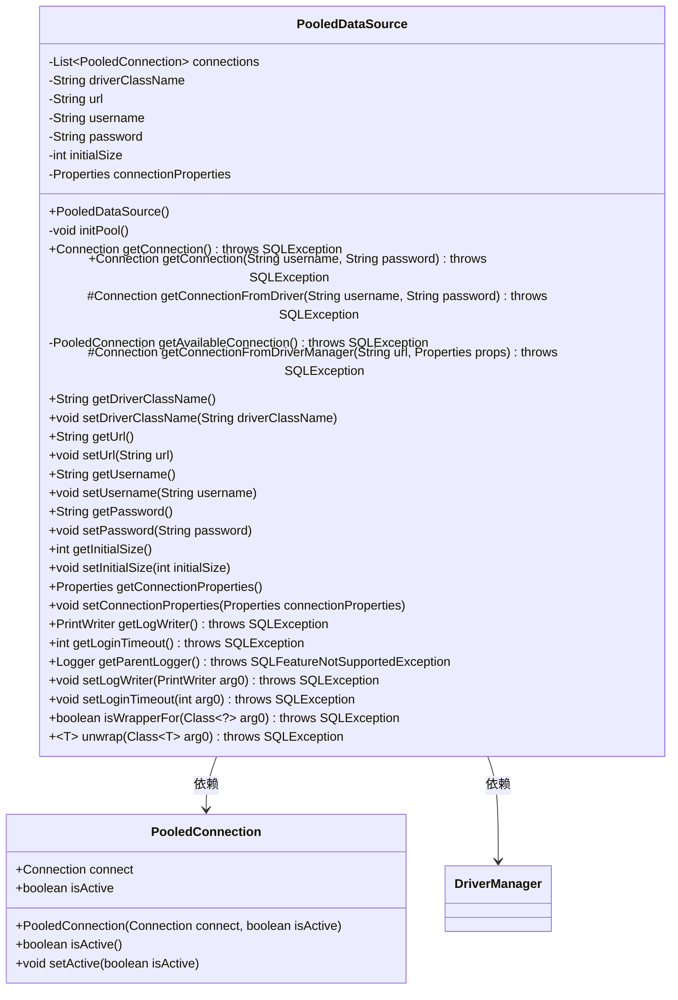

# 基础信息

|      |      |
|------|------|
| 名称 | PooledDataSource |
| 编码语言 | .java |
| 代码路径 | Minis/src/com/minis/jdbc/pool/PooledDataSource.java |
| 包名 | com.minis.jdbc.pool |
| 依赖项 | ['java.io.PrintWriter', 'java.sql.Connection', 'java.sql.DriverManager', 'java.sql.SQLException', 'java.sql.SQLFeatureNotSupportedException', 'java.util.ArrayList', 'java.util.List', 'java.util.Properties', 'java.util.concurrent.TimeUnit', 'java.util.logging.Logger', 'javax.sql.DataSource'] |
| 概述说明 | PooledDataSource实现连接池，管理初始化及可用连接。 |

# 说明

PooledDataSource实现了一个连接池机制，负责初始化数据库连接并管理这些连接的可用性。通过连接池，系统能够高效地复用连接资源，减少频繁创建和销毁连接的开销，从而提升数据库操作的性能和响应速度。连接池还确保了连接的有效性和可用性，避免了资源浪费和系统瓶颈。

# 类列表 Class Summary

| 名称   | 类型  | 说明 |
|-------|------|-------------|
| PooledDataSource | class | PooledDataSource实现连接池，初始化连接并管理可用连接。 |

## 类 PooledDataSource

|      |      |
|------|------|
| 访问范围 | public |
| 类型 | class |
| 名称 | PooledDataSource |
| 说明 | PooledDataSource实现连接池，初始化连接并管理可用连接。 |

### UML类图

### 描述
`PooledDataSource` 类实现了一个连接池机制，用于管理数据库连接。它通过 `initPool` 方法初始化连接池，并在需要时从连接池中获取可用连接。`PooledConnection` 类表示池化连接，包含连接对象及其活动状态。`PooledDataSource` 依赖 `DriverManager` 来创建新的数据库连接，并通过 `getConnectionFromDriver` 方法从驱动管理器获取连接。该类还提供了设置和获取连接属性的方法，以及处理日志和超时等功能。

### 内部方法调用关系图

```mermaid
graph TD
    A["类PooledDataSource"]
    B["属性: List<PooledConnection> connections"]
    C["属性: String driverClassName"]
    D["属性: String url"]
    E["属性: String username"]
    F["属性: String password"]
    G["属性: int initialSize"]
    H["属性: Properties connectionProperties"]
    I["构造方法: PooledDataSource()"]
    J["方法: private void initPool()"]
    K["方法: @Override public Connection getConnection()"]
    L["方法: @Override public Connection getConnection(String username, String password)"]
    M["方法: protected Connection getConnectionFromDriver(String username, String password)"]
    N["方法: private PooledConnection getAvailableConnection()"]
    O["方法: protected Connection getConnectionFromDriverManager(String url, Properties props)"]
    P["方法: public String getDriverClassName()"]
    Q["方法: public void setDriverClassName(String driverClassName)"]
    R["方法: public String getUrl()"]
    S["方法: public void setUrl(String url)"]
    T["方法: public String getUsername()"]
    U["方法: public void setUsername(String username)"]
    V["方法: public String getPassword()"]
    W["方法: public void setPassword(String password)"]
    X["方法: public int getInitialSize()"]
    Y["方法: public void setInitialSize(int initialSize)"]
    Z["方法: public Properties getConnectionProperties()"]
    AA["方法: public void setConnectionProperties(Properties connectionProperties)"]
    AB["方法: @Override public PrintWriter getLogWriter()"]
    AC["方法: @Override public int getLoginTimeout()"]
    AD["方法: @Override public Logger getParentLogger()"]
    AE["方法: @Override public void setLogWriter(PrintWriter arg0)"]
    AF["方法: @Override public void setLoginTimeout(int arg0)"]
    AG["方法: @Override public boolean isWrapperFor(Class<?> arg0)"]
    AH["方法: @Override public <T> T unwrap(Class<T> arg0)"]

    A --> B
    A --> C
    A --> D
    A --> E
    A --> F
    A --> G
    A --> H
    A --> I
    A --> J
    A --> K
    A --> L
    A --> M
    A --> N
    A --> O
    A --> P
    A --> Q
    A --> R
    A --> S
    A --> T
    A --> U
    A --> V
    A --> W
    A --> X
    A --> Y
    A --> Z
    A --> AA
    A --> AB
    A --> AC
    A --> AD
    A --> AE
    A --> AF
    A --> AG
    A --> AH
```

这段代码实现了一个连接池数据源类 `PooledDataSource`，用于管理和复用数据库连接。它通过 `initPool` 方法初始化连接池，并在 `getConnection` 方法中提供连接。代码还包含了多个属性的 getter 和 setter 方法，以及一些 `DataSource` 接口的实现方法。连接池的核心逻辑在于 `getAvailableConnection` 方法，它从池中获取可用的连接，并在连接不可用时进行等待。

### 字段列表 Field List

| 名称  | 类型  | 说明 |
|-------|-------|------|
| username | String | 定义了一个私有字符串类型的用户名变量。 |
| connectionProperties | Properties | 私有属性connectionProperties用于存储连接配置。 |
| connections = null | List<PooledConnection> | 声明了一个私有列表变量connections，初始值为null。 |
| driverClassName | String | 定义了一个私有的字符串类型变量driverClassName。 |
| initialSize = 2 | int | 私有整型变量initialSize初始值为2。 |
| password | String | 声明了一个私有的字符串类型变量password。 |
| url | String | 定义了一个私有字符串变量`url`。 |

### 方法列表 Method List

| 名称  | 类型  | 说明 |
|-------|-------|------|
| getUrl | String | 该方法返回URL字符串。 |
| getUsername | String | 获取用户名的Java方法。 |
| getDriverClassName | String | 获取驱动类名的方法。 |
| setInitialSize | void | 设置初始大小的方法，参数为initialSize。 |
| getAvailableConnection | PooledConnection | 从连接池获取可用非活动连接并激活返回。 |
| getConnectionFromDriverManager | Connection | 从DriverManager获取数据库连接，需提供URL和属性。 |
| getLogWriter | PrintWriter | 重写getLogWriter方法，返回null。 |
| initPool | void | 初始化连接池，创建指定数量的数据库连接并加入池中。 |
| setLoginTimeout | void | 重写setLoginTimeout方法，接收int参数并抛出SQLException异常。 |
| getPassword | String | 获取密码的方法，返回字符串类型密码。 |
| getConnection | Connection | 重写getConnection方法，调用getConnectionFromDriver获取数据库连接。 |
| getConnectionProperties | Properties | 获取连接属性的公共方法。 |
| setUsername | void | 设置用户名的Java方法，将传入值赋给类成员变量。 |
| getConnectionFromDriver | Connection | 从驱动获取连接，合并属性，初始化连接池，获取可用连接并返回。 |
| isWrapperFor | boolean | 重写方法，判断是否支持指定类型，默认返回false。 |
| unwrap | T | 重写unwrap方法，返回null，可能抛出SQLException。 |
| setUrl | void | 设置URL地址的方法。 |
| getConnection | Connection | 重写getConnection方法，调用getConnectionFromDriver获取数据库连接。 |
| setDriverClassName | void | 设置JDBC驱动类名并验证类是否存在，否则抛出异常。 |
| setPassword | void | 该方法用于设置密码，将传入的字符串赋值给类成员变量password。 |
| getParentLogger | Logger | 重写父类方法，返回空日志记录器，抛出未支持异常。 |
| getLoginTimeout | int | 该方法返回登录超时时间，默认值为0。 |
| setConnectionProperties | void | 设置连接属性的方法，用于更新当前连接属性。 |
| getInitialSize | int | 方法返回初始大小值。 |
| setLogWriter | void | 重写setLogWriter方法，接受PrintWriter参数，可能抛出SQLException。 |

