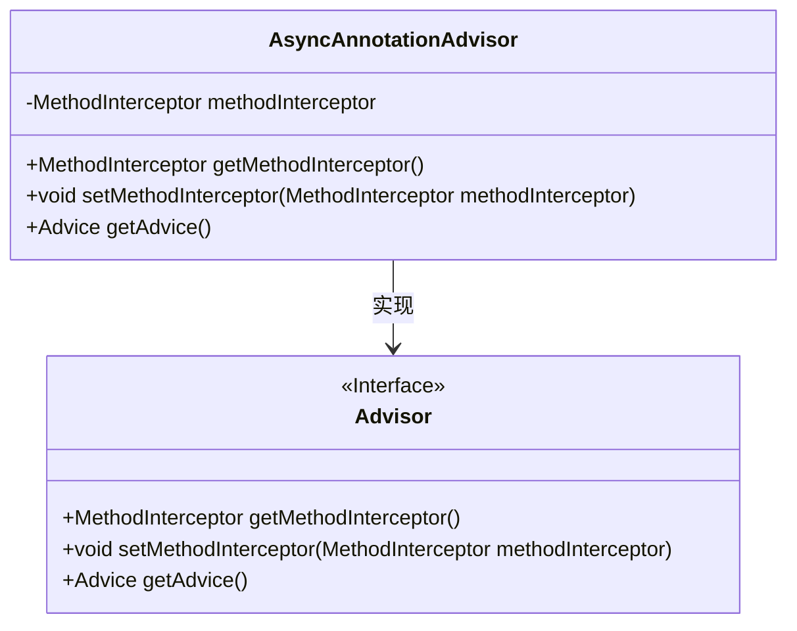
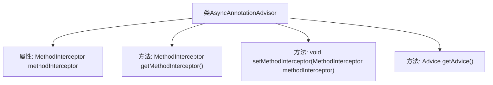

# 基础信息

|      |      |
|------|------|
| 名称 | AsyncAnnotationAdvisor |
| 编码语言 | .java |
| 代码路径 | Minis/src/com/minis/scheduling/annotation/AsyncAnnotationAdvisor.java |
| 包名 | com.minis.scheduling.annotation |
| 依赖项 | ['com.minis.aop.Advice', 'com.minis.aop.Advisor', 'com.minis.aop.AsyncExecutionInterceptor', 'com.minis.aop.MethodInterceptor'] |
| 概述说明 | AsyncAnnotationAdvisor类实现Advisor接口，提供MethodInterceptor的获取和设置功能。 |

# 说明

AsyncAnnotationAdvisor类实现了Advisor接口，主要负责处理异步注解相关的逻辑。该类包含获取和设置MethodInterceptor的方法，用于管理和操作方法拦截器，以实现对异步方法的拦截和处理。通过这种方式，AsyncAnnotationAdvisor能够有效地支持异步编程模式，确保在方法调用时能够正确地应用异步处理逻辑。

# 类列表 Class Summary

| 名称   | 类型  | 说明 |
|-------|------|-------------|
| AsyncAnnotationAdvisor | class | AsyncAnnotationAdvisor类实现Advisor接口，包含MethodInterceptor的获取和设置方法。 |

## 类 AsyncAnnotationAdvisor

|      |      |
|------|------|
| 访问范围 | public |
| 类型 | class |
| 名称 | AsyncAnnotationAdvisor |
| 说明 | AsyncAnnotationAdvisor类实现Advisor接口，包含MethodInterceptor的获取和设置方法。 |

### UML类图

这段代码定义了一个 `AsyncAnnotationAdvisor` 类，它实现了 `Advisor` 接口。`AsyncAnnotationAdvisor` 类包含一个私有的 `MethodInterceptor` 类型的成员变量 `methodInterceptor`，并提供了对该变量的获取和设置方法。此外，它还实现了 `Advisor` 接口中的 `getAdvice` 方法，但当前返回 `null`。`Advisor` 接口定义了三个方法：`getMethodInterceptor`、`setMethodInterceptor` 和 `getAdvice`，`AsyncAnnotationAdvisor` 类通过实现这些方法来提供具体的功能。

### 内部方法调用关系图

这段代码定义了一个名为`AsyncAnnotationAdvisor`的类，该类实现了`Advisor`接口。类中包含一个`MethodInterceptor`类型的属性`methodInterceptor`，并提供了三个方法：`getMethodInterceptor()`用于获取当前的`methodInterceptor`，`setMethodInterceptor()`用于设置`methodInterceptor`，以及`getAdvice()`方法，目前返回`null`。流程图展示了类与其属性和方法之间的关系，清晰地描述了类的结构和功能。

### 字段列表 Field List

| 名称  | 类型  | 说明 |
|-------|-------|------|
| methodInterceptor | MethodInterceptor | MethodInterceptor接口用于拦截方法调用。 |

### 方法列表 Method List

| 名称  | 类型  | 说明 |
|-------|-------|------|
| getAdvice | Advice | 重写getAdvice方法，返回空值。 |
| setMethodInterceptor | void | 重写方法设置方法拦截器，赋值给成员变量。 |
| getMethodInterceptor | MethodInterceptor | 重写方法，返回当前方法拦截器实例。 |

