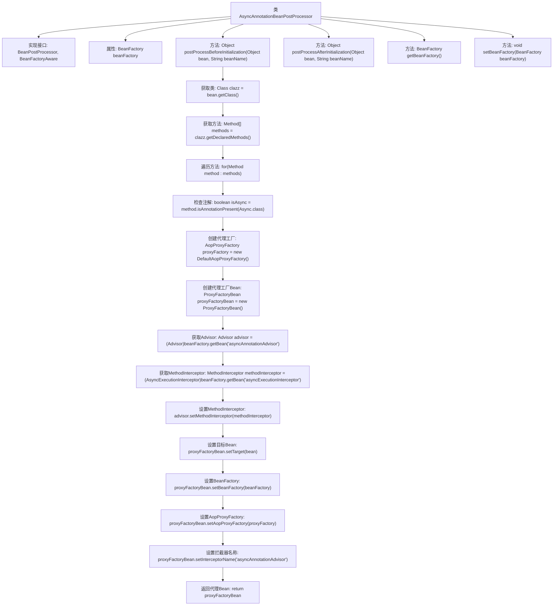

# 基础信息

|      |      |
|------|------|
| 名称 | AsyncAnnotationBeanPostProcessor |
| 编码语言 | .java |
| 代码路径 | Minis/src/com/minis/scheduling/annotation/AsyncAnnotationBeanPostProcessor.java |
| 包名 | com.minis.scheduling.annotation |
| 依赖项 | ['java.lang.reflect.Field', 'java.lang.reflect.Method', 'com.minis.aop.framework.AopProxyFactory', 'com.minis.aop.framework.DefaultAopProxyFactory', 'com.minis.aop.framework.ProxyFactoryBean', 'com.minis.beans.BeansException', 'com.minis.beans.factory.BeanFactory', 'com.minis.beans.factory.BeanFactoryAware', 'com.minis.beans.factory.annotation.Autowired', 'com.minis.beans.factory.config.BeanPostProcessor', 'com.minis.scheduling.concurrent.ThreadPoolTaskExecutor', 'com.minis.aop.Advisor', 'com.minis.aop.AsyncExecutionInterceptor', 'com.minis.aop.MethodInterceptor'] |
| 概述说明 | AsyncAnnotationBeanPostProcessor处理Async注解，生成代理对象。 |

# 说明

AsyncAnnotationBeanPostProcessor负责处理带有Async注解的方法，通过生成代理对象来实现异步执行功能。该处理器在Spring框架中用于自动识别并处理标记为异步的方法，确保这些方法能够在独立的线程中执行，从而提高应用的并发性能和响应速度。

# 类列表 Class Summary

| 名称   | 类型  | 说明 |
|-------|------|-------------|
| AsyncAnnotationBeanPostProcessor | class | AsyncAnnotationBeanPostProcessor处理带有Async注解的方法，生成代理对象。 |

## 类 AsyncAnnotationBeanPostProcessor

|      |      |
|------|------|
| 访问范围 | public |
| 类型 | class |
| 名称 | AsyncAnnotationBeanPostProcessor |
| 说明 | AsyncAnnotationBeanPostProcessor处理带有Async注解的方法，生成代理对象。 |

### UML类图

```mermaid
classDiagram
    class AsyncAnnotationBeanPostProcessor {
        -BeanFactory beanFactory
        +Object postProcessBeforeInitialization(Object bean, String beanName) throws BeansException
        +Object postProcessAfterInitialization(Object bean, String beanName) throws BeansException
        +BeanFactory getBeanFactory()
        +void setBeanFactory(BeanFactory beanFactory)
    }
    class BeanFactory {
        <<Interface>>
    }
    class BeanPostProcessor {
        <<Interface>>
    }
    class AopProxyFactory {
        <<Interface>>
    }
    class DefaultAopProxyFactory {
        +AopProxy createAopProxy(AdvisedSupport config) throws AopConfigException
    }
    class ProxyFactoryBean {
        +void setTarget(Object target)
        +void setBeanFactory(BeanFactory beanFactory)
        +void setAopProxyFactory(AopProxyFactory aopProxyFactory)
        +void setInterceptorName(String interceptorName)
    }
    class Advisor {
        +void setMethodInterceptor(MethodInterceptor methodInterceptor)
    }
    class MethodInterceptor {
        <<Interface>>
    }
    class AsyncExecutionInterceptor {
        +Object invoke(MethodInvocation invocation) throws Throwable
    }
    AsyncAnnotationBeanPostProcessor --> BeanFactory : 依赖
    AsyncAnnotationBeanPostProcessor --> BeanPostProcessor : 实现
    DefaultAopProxyFactory --> AopProxyFactory : 实现
    ProxyFactoryBean --> BeanFactory : 依赖
    ProxyFactoryBean --> AopProxyFactory : 依赖
    Advisor --> MethodInterceptor : 依赖
    AsyncExecutionInterceptor --> MethodInterceptor : 实现
```

**描述：**
`AsyncAnnotationBeanPostProcessor`类实现了`BeanPostProcessor`接口，用于在Spring容器中处理带有`@Async`注解的Bean。它通过`BeanFactory`获取必要的Bean实例，并利用`AopProxyFactory`和`ProxyFactoryBean`创建代理对象，以便在方法调用时实现异步执行。该类还依赖于`Advisor`和`MethodInterceptor`来配置方法拦截器，确保异步逻辑的正确执行。

### 内部方法调用关系图

这段代码定义了一个`AsyncAnnotationBeanPostProcessor`类，实现了`BeanPostProcessor`和`BeanFactoryAware`接口。该类的主要作用是在Spring容器中处理带有`@Async`注解的Bean，为其创建代理对象以实现异步执行。流程图展示了类的主要方法和属性，以及`postProcessBeforeInitialization`方法中处理`@Async`注解的具体步骤，包括获取方法、检查注解、创建代理工厂、设置拦截器等操作。

### 字段列表 Field List

| 名称  | 类型  | 说明 |
|-------|-------|------|
| beanFactory | BeanFactory | 声明了一个私有的BeanFactory类型变量beanFactory。 |

### 方法列表 Method List

| 名称  | 类型  | 说明 |
|-------|-------|------|
| setBeanFactory | void | 设置BeanFactory实例为当前类的成员变量。 |
| postProcessAfterInitialization | Object | Spring Bean初始化后处理，直接返回原Bean。 |
| getBeanFactory | BeanFactory | 获取BeanFactory实例的方法。 |
| postProcessBeforeInitialization | Object | 处理带有Async注解的方法，生成代理对象并返回。 |

