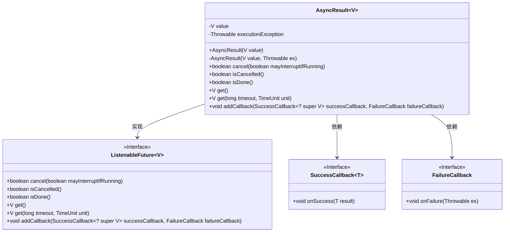
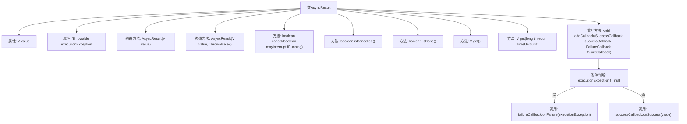

# 基础信息

|      |      |
|------|------|
| 名称 | AsyncResult |
| 编码语言 | .java |
| 代码路径 | Minis/src/com/minis/scheduling/annotation/AsyncResult.java |
| 包名 | com.minis.scheduling.annotation |
| 依赖项 | ['java.util.concurrent.TimeUnit', 'com.minis.util.concurrent.FailureCallback', 'com.minis.util.concurrent.ListenableFuture', 'com.minis.util.concurrent.SuccessCallback'] |
| 概述说明 | AsyncResult类实现ListenableFuture，封装值或异常，支持成功或失败回调。 |

# 说明

AsyncResult类实现了ListenableFuture接口，用于封装异步操作的结果，该结果可以是正常值或异常。它支持通过回调机制处理操作成功或失败的情况，使得异步操作的处理更加灵活和高效。

# 类列表 Class Summary

| 名称   | 类型  | 说明 |
|-------|------|-------------|
| AsyncResult | class | AsyncResult类实现ListenableFuture，封装值或异常，支持回调处理成功或失败。 |

## 类 AsyncResult

|      |      |
|------|------|
| 访问范围 | public |
| 类型 | class |
| 名称 | AsyncResult |
| 说明 | AsyncResult类实现ListenableFuture，封装值或异常，支持回调处理成功或失败。 |

### UML类图

这段代码定义了一个 `AsyncResult<V>` 类，它实现了 `ListenableFuture<V>` 接口。`AsyncResult` 类用于封装异步操作的结果，包含一个值和一个可能的异常。它提供了检查操作是否完成、取消操作、获取结果以及添加回调的方法。`ListenableFuture` 接口定义了异步操作的基本行为，`SuccessCallback` 和 `FailureCallback` 接口分别用于处理成功和失败的回调。`AsyncResult` 类通过 `addCallback` 方法根据操作结果调用相应的回调。

### 内部方法调用关系图

这段代码定义了一个`AsyncResult<V>`类，该类实现了`ListenableFuture<V>`接口。`AsyncResult`类有两个主要属性：`value`和`executionException`，分别用于存储结果值和执行异常。类中包含多个方法，如`cancel`、`isCancelled`、`isDone`、`get`等，用于管理异步任务的状态和结果。`addCallback`方法用于根据执行结果调用成功或失败的回调函数。流程图展示了类的结构及其方法的调用关系。

### 字段列表 Field List

| 名称  | 类型  | 说明 |
|-------|-------|------|
| executionException | Throwable | 私有且不可变的执行异常变量。 |
| value | V | 声明了一个私有的不可变变量value。 |

### 方法列表 Method List

| 名称  | 类型  | 说明 |
|-------|-------|------|
| isCancelled | boolean | 该方法始终返回false，表示未取消状态。 |
| isDone | boolean | 方法isDone返回布尔值true。 |
| addCallback | void | 方法根据异常调用成功或失败回调。 |
| get | V | 方法get在指定超时时间内返回结果，实际未使用超时参数。 |
| get | V | 该方法返回当前对象的value值。 |
| cancel | boolean | 方法cancel始终返回false，不中断运行任务。 |

