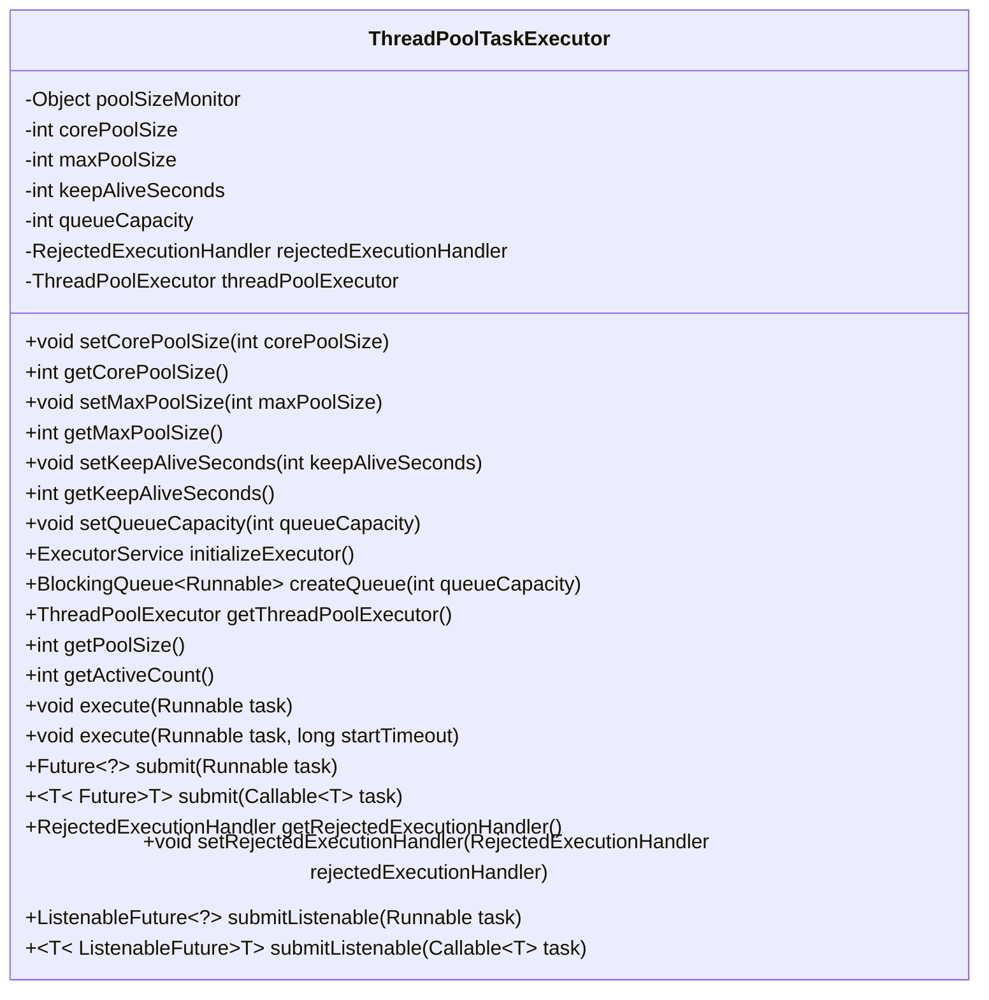

# 基础信息

|      |      |
|------|------|
| 名称 | ThreadPoolTaskExecutor |
| 编码语言 | .java |
| 代码路径 | Minis/src/com/minis/scheduling/concurrent/ThreadPoolTaskExecutor.java |
| 包名 | com.minis.scheduling.concurrent |
| 依赖项 | ['java.util.concurrent.BlockingQueue', 'java.util.concurrent.Callable', 'java.util.concurrent.Executor', 'java.util.concurrent.ExecutorService', 'java.util.concurrent.Executors', 'java.util.concurrent.Future', 'java.util.concurrent.LinkedBlockingQueue', 'java.util.concurrent.RejectedExecutionException', 'java.util.concurrent.RejectedExecutionHandler', 'java.util.concurrent.SynchronousQueue', 'java.util.concurrent.ThreadFactory', 'java.util.concurrent.ThreadPoolExecutor', 'java.util.concurrent.TimeUnit', 'com.minis.util.concurrent.ListenableFuture', 'com.minis.util.concurrent.ListenableFutureTask'] |
| 概述说明 | ThreadPoolTaskExecutor管理线程池大小、队列容量及任务执行策略。 |

# 说明

ThreadPoolTaskExecutor类用于管理线程池的大小、队列容量以及任务执行策略。通过该类，可以配置线程池的核心线程数、最大线程数以及队列的容量，从而控制并发任务的执行。此外，该类还支持定义任务拒绝策略，以应对线程池和队列满载时的情况，确保系统资源的合理利用和任务的稳定执行。

# 类列表 Class Summary

| 名称   | 类型  | 说明 |
|-------|------|-------------|
| ThreadPoolTaskExecutor | class | ThreadPoolTaskExecutor类管理线程池大小、队列容量和任务执行策略。 |

## 类 ThreadPoolTaskExecutor

|      |      |
|------|------|
| 访问范围 | public |
| 类型 | class |
| 名称 | ThreadPoolTaskExecutor |
| 说明 | ThreadPoolTaskExecutor类管理线程池大小、队列容量和任务执行策略。 |

### UML类图

**描述：**  
`ThreadPoolTaskExecutor` 类是一个线程池任务执行器，用于管理和执行多线程任务。它包含了核心线程池大小、最大线程池大小、线程存活时间、队列容量等配置项，并通过 `ThreadPoolExecutor` 实现具体的线程池管理。该类提供了设置和获取这些配置项的方法，并支持任务的提交、执行以及监听。通过同步机制确保线程安全，并且提供了多种任务提交方式，包括普通任务和可监听的任务。

### 内部方法调用关系图

```mermaid
graph TD
    A["类ThreadPoolTaskExecutor"]
    B["属性: Object poolSizeMonitor"]
    C["属性: int corePoolSize"]
    D["属性: int maxPoolSize"]
    E["属性: int keepAliveSeconds"]
    F["属性: int queueCapacity"]
    G["属性: RejectedExecutionHandler rejectedExecutionHandler"]
    H["属性: ThreadPoolExecutor threadPoolExecutor"]
    I["方法: setCorePoolSize(int corePoolSize)"]
    J["方法: getCorePoolSize()"]
    K["方法: setMaxPoolSize(int maxPoolSize)"]
    L["方法: getMaxPoolSize()"]
    M["方法: setKeepAliveSeconds(int keepAliveSeconds)"]
    N["方法: getKeepAliveSeconds()"]
    O["方法: setQueueCapacity(int queueCapacity)"]
    P["方法: initializeExecutor()"]
    Q["方法: createQueue(int queueCapacity)"]
    R["方法: getThreadPoolExecutor()"]
    S["方法: getPoolSize()"]
    T["方法: getActiveCount()"]
    U["方法: execute(Runnable task)"]
    V["方法: execute(Runnable task, long startTimeout)"]
    W["方法: submit(Runnable task)"]
    X["方法: submit(Callable<T> task)"]
    Y["方法: getRejectedExecutionHandler()"]
    Z["方法: setRejectedExecutionHandler(RejectedExecutionHandler rejectedExecutionHandler)"]
    AA["方法: submitListenable(Runnable task)"]
    AB["方法: submitListenable(Callable<T> task)"]

    A --> B
    A --> C
    A --> D
    A --> E
    A --> F
    A --> G
    A --> H
    A --> I
    A --> J
    A --> K
    A --> L
    A --> M
    A --> N
    A --> O
    A --> P
    A --> Q
    A --> R
    A --> S
    A --> T
    A --> U
    A --> V
    A --> W
    A --> X
    A --> Y
    A --> Z
    A --> AA
    A --> AB
```

该流程图展示了`ThreadPoolTaskExecutor`类的结构及其方法之间的关系。`ThreadPoolTaskExecutor`类主要用于管理线程池，包含多个属性如`corePoolSize`、`maxPoolSize`等，以及一系列方法用于设置和获取这些属性，同时提供了线程池的初始化、任务提交和执行等功能。通过同步机制确保线程安全，并支持不同类型的任务提交方式。

### 字段列表 Field List

| 名称  | 类型  | 说明 |
|-------|-------|------|
| corePoolSize = 1 | int | 核心线程池大小为1。 |
| poolSizeMonitor = new Object() | Object | 私有对象用于监控池大小。 |
| maxPoolSize = Integer.MAX_VALUE | int | 私有整型变量maxPoolSize默认值为整型最大值。 |
| queueCapacity = Integer.MAX_VALUE | int | 队列容量设置为最大整数值。 |
| threadPoolExecutor | ThreadPoolExecutor | 定义了一个私有线程池执行器变量。 |
| rejectedExecutionHandler = new ThreadPoolExecutor.DiscardPolicy() | RejectedExecutionHandler | 线程池拒绝策略设置为直接丢弃任务。 |
| keepAliveSeconds = 60 | int | 私有整型变量keepAliveSeconds默认值为60秒。 |

### 方法列表 Method List

| 名称  | 类型  | 说明 |
|-------|-------|------|
| setRejectedExecutionHandler | void | 设置线程池拒绝策略处理器。 |
| getKeepAliveSeconds | int | 同步获取线程池保活时间。 |
| getRejectedExecutionHandler | RejectedExecutionHandler | 获取线程池的拒绝执行处理器。 |
| getThreadPoolExecutor | ThreadPoolExecutor | 获取线程池执行器实例，可能抛出非法状态异常。 |
| getCorePoolSize | int | 获取线程池核心线程数，同步锁定确保线程安全。 |
| submitListenable | ListenableFuture<?> | 提交可监听任务至线程池，返回ListenableFuture对象。 |
| setKeepAliveSeconds | void | 设置线程池的保活时间，同步更新线程池执行器。 |
| submitListenable | ListenableFuture<T> | 提交可监听任务，返回ListenableFuture对象。 |
| setQueueCapacity | void | 设置队列容量的方法，将参数赋值给类成员变量。 |
| getPoolSize | int | 获取线程池当前线程数，若未初始化则返回核心线程数。 |
| getActiveCount | int | 获取线程池中当前活动线程数，若线程池为空则返回0。 |
| getMaxPoolSize | int | 获取线程池最大容量，需同步监控对象以确保线程安全。 |
| submit | Future<?> | 提交Runnable任务到线程池执行，返回Future对象。 |
| setMaxPoolSize | void | 同步设置线程池最大大小并更新执行器。 |
| submit | Future<T> | 提交任务至线程池执行，捕获并抛出拒绝执行异常。 |
| execute | void | 方法execute接受任务和超时参数，调用无参execute执行任务。 |
| createQueue | BlockingQueue<Runnable> | 根据容量创建阻塞队列，大于0用LinkedBlockingQueue，否则用SynchronousQueue。 |
| initializeExecutor | ExecutorService | 初始化线程池执行器，设置核心池大小、最大池大小、存活时间及队列容量。 |
| setCorePoolSize | void | 同步设置线程池核心大小并更新执行器。 |
| execute | void | 方法执行Runnable任务，使用线程池执行器，捕获并抛出拒绝执行异常。 |

