# 基础信息

|      |      |
|------|------|
| 名称 | ClassUtils |
| 编码语言 | .java |
| 代码路径 | Minis/src/com/minis/util/ClassUtils.java |
| 包名 | com.minis.util |
| 依赖项 | ['java.beans.Introspector', 'java.io.Closeable', 'java.io.Externalizable', 'java.io.Serializable', 'java.lang.reflect.Array', 'java.lang.reflect.Constructor', 'java.lang.reflect.Method', 'java.lang.reflect.Modifier', 'java.lang.reflect.Proxy', 'java.util.Arrays', 'java.util.Collection', 'java.util.Collections', 'java.util.Enumeration', 'java.util.HashMap', 'java.util.HashSet', 'java.util.IdentityHashMap', 'java.util.Iterator', 'java.util.LinkedHashSet', 'java.util.List', 'java.util.Map', 'java.util.Optional', 'java.util.Set', 'java.util.StringJoiner', 'java.util.concurrent.ConcurrentHashMap'] |
| 概述说明 | ClassUtils类提供处理类名、数组、原始类型、接口、方法及类加载、类型转换的工具方法。 |

# 说明

ClassUtils类是一个工具类，提供了一系列方法用于处理类名、数组、原始类型、接口和方法等相关操作。其主要功能包括类加载和类型转换，帮助开发者更便捷地进行类相关的操作和处理。该类为开发者在处理类和类型相关问题时提供了高效且灵活的解决方案。

# 类列表 Class Summary

| 名称   | 类型  | 说明 |
|-------|------|-------------|
| ClassUtils | class | ClassUtils类提供工具方法，处理类名、数组、原始类型、接口、方法等操作，支持类加载和类型转换。 |

## 类 ClassUtils

|      |      |
|------|------|
| 访问范围 | public abstract |
| 类型 | class |
| 名称 | ClassUtils |
| 说明 | ClassUtils类提供工具方法，处理类名、数组、原始类型、接口、方法等操作，支持类加载和类型转换。 |

### UML类图

```mermaid
classDiagram
    class ClassUtils {
        +String ARRAY_SUFFIX
        -String INTERNAL_ARRAY_PREFIX
        -String NON_PRIMITIVE_ARRAY_PREFIX
        -char PACKAGE_SEPARATOR
        -char PATH_SEPARATOR
        -char INNER_CLASS_SEPARATOR
        +String CGLIB_CLASS_SEPARATOR
        +String CLASS_FILE_SUFFIX
        -Map~Class~?~, Class~?~~ primitiveWrapperTypeMap
        -Map~Class~?~, Class~?~~ primitiveTypeToWrapperMap
        -Map~String, Class~?~~ primitiveTypeNameMap
        -Map~String, Class~?~~ commonClassCache
        -Set~Class~?~~ javaLanguageInterfaces
        -Map~Method, Method~ interfaceMethodCache
        +ClassLoader getDefaultClassLoader()
        +ClassLoader overrideThreadContextClassLoader(ClassLoader classLoaderToUse)
        +Class~?~ forName(String name, ClassLoader classLoader)
        +Class~?~ resolveClassName(String className, ClassLoader classLoader)
        +boolean isPresent(String className, ClassLoader classLoader)
        +boolean isVisible(Class~?~ clazz, ClassLoader classLoader)
        +boolean isCacheSafe(Class~?~ clazz, ClassLoader classLoader)
        +Class~?~ resolvePrimitiveClassName(String name)
        +boolean isPrimitiveWrapper(Class~?~ clazz)
        +boolean isPrimitiveOrWrapper(Class~?~ clazz)
        +boolean isPrimitiveArray(Class~?~ clazz)
        +boolean isPrimitiveWrapperArray(Class~?~ clazz)
        +Class~?~ resolvePrimitiveIfNecessary(Class~?~ clazz)
        +boolean isAssignable(Class~?~ lhsType, Class~?~ rhsType)
        +boolean isAssignableValue(Class~?~ type, Object value)
        +String convertResourcePathToClassName(String resourcePath)
        +String convertClassNameToResourcePath(String className)
        +String addResourcePathToPackagePath(Class~?~ clazz, String resourceName)
        +String classPackageAsResourcePath(Class~?~ clazz)
        +String classNamesToString(Class~?~... classes)
        +String classNamesToString(Collection~Class~?~~ classes)
        +Class~?~[] toClassArray(Collection~Class~?~~ collection)
        +Class~?~[] getAllInterfaces(Object instance)
        +Class~?~[] getAllInterfacesForClass(Class~?~ clazz)
        +Class~?~[] getAllInterfacesForClass(Class~?~ clazz, ClassLoader classLoader)
        +Set~Class~?~~ getAllInterfacesAsSet(Object instance)
        +Set~Class~?~~ getAllInterfacesForClassAsSet(Class~?~ clazz)
        +Set~Class~?~~ getAllInterfacesForClassAsSet(Class~?~ clazz, ClassLoader classLoader)
        +Class~?~ createCompositeInterface(Class~?~[] interfaces, ClassLoader classLoader)
        +Class~?~ determineCommonAncestor(Class~?~ clazz1, Class~?~ clazz2)
        +boolean isJavaLanguageInterface(Class~?~ ifc)
        +boolean isInnerClass(Class~?~ clazz)
        +Class~?~ getUserClass(Object instance)
        +Class~?~ getUserClass(Class~?~ clazz)
        +String getDescriptiveType(Object value)
        +boolean matchesTypeName(Class~?~ clazz, String typeName)
        +String getShortName(String className)
        +String getShortName(Class~?~ clazz)
        +String getShortNameAsProperty(Class~?~ clazz)
        +String getClassFileName(Class~?~ clazz)
        +String getPackageName(Class~?~ clazz)
        +String getPackageName(String fqClassName)
        +String getQualifiedName(Class~?~ clazz)
        +String getQualifiedMethodName(Method method)
        +String getQualifiedMethodName(Method method, Class~?~ clazz)
        +boolean hasConstructor(Class~?~ clazz, Class~?~... paramTypes)
        +Constructor~T~ getConstructorIfAvailable(Class~T~ clazz, Class~?~... paramTypes)
        +boolean hasMethod(Class~?~ clazz, Method method)
        +boolean hasMethod(Class~?~ clazz, String methodName, Class~?~... paramTypes)
        +Method getMethod(Class~?~ clazz, String methodName, Class~?~... paramTypes)
        +Method getMethodIfAvailable(Class~?~ clazz, String methodName, Class~?~... paramTypes)
        +int getMethodCountForName(Class~?~ clazz, String methodName)
        +boolean hasAtLeastOneMethodWithName(Class~?~ clazz, String methodName)
        +Method getMostSpecificMethod(Method method, Class~?~ targetClass)
        +Method getInterfaceMethodIfPossible(Method method)
        +boolean isUserLevelMethod(Method method)
        +Method getStaticMethod(Class~?~ clazz, String methodName, Class~?~... args)
    }
```

**描述**：`ClassUtils` 是一个抽象工具类，提供了丰富的静态方法来处理与类相关的操作，如类加载、类型转换、接口解析、方法查找等。它包含多个静态字段和方法，用于处理类名、类路径、接口、方法等。该类的主要功能包括解析类名、检查类的可见性、查找类的接口、判断类的类型等。通过这些方法，开发者可以更方便地进行类相关的操作，尤其是在处理反射和类加载时。

### 内部方法调用关系图

这段代码定义了一个名为 `ClassUtils` 的抽象类，主要用于处理与 Java 类相关的操作。它包含了许多静态方法和常量，用于解析类名、处理类加载器、检查类的可见性和可缓存性、处理原始类型和包装类型、以及处理数组和内部类等。代码还提供了方法来获取类的短名称、包名、资源路径等。通过这些方法，开发者可以更方便地进行类相关的操作，尤其是在处理反射和类加载时。

### 字段列表 Field List

| 名称  | 类型  | 说明 |
|-------|-------|------|
| ARRAY_SUFFIX = "[]" | String | 定义一个静态不可变字符串常量，表示数组后缀“[]”。 |
| CLASS_FILE_SUFFIX = ".class" | String | 定义常量CLASS_FILE_SUFFIX，值为".class"。 |
| PACKAGE_SEPARATOR = '.' | char | 定义私有静态常量PACKAGE_SEPARATOR，值为点号。 |
| CGLIB_CLASS_SEPARATOR = "$$" | String | CGLIB类分隔符定义为"$$"。 |
| INTERNAL_ARRAY_PREFIX = "[" | String | 定义私有静态常量字符串INTERNAL_ARRAY_PREFIX，值为"["。 |
| interfaceMethodCache = new ConcurrentHashMap<>(256) | Map<Method, Method> | 私有静态并发映射缓存接口方法，初始容量256。 |
| NON_PRIMITIVE_ARRAY_PREFIX = "[L" | String | 定义私有静态常量，表示非基本类型数组前缀。 |
| PATH_SEPARATOR = '/' | char | 定义常量PATH_SEPARATOR为字符'/'。 |
| javaLanguageInterfaces | Set<Class<?>> | 定义了一个私有的静态最终Set，用于存储Java语言接口类。 |
| INNER_CLASS_SEPARATOR = '$' | char | 定义私有静态常量INNER_CLASS_SEPARATOR，值为'$'。 |
| primitiveTypeToWrapperMap = new IdentityHashMap<>(8) | Map<Class<?>, Class<?>> | 定义了一个静态不可变的映射，用于存储基本类型与其包装类的对应关系。 |
| primitiveTypeNameMap = new HashMap<>(32) | Map<String, Class<?>> | 定义了一个私有静态不可变的Map，用于存储字符串与类类型的映射，初始容量为32。 |
| commonClassCache = new HashMap<>(64) | Map<String, Class<?>> | 定义了一个静态的、不可变的、初始容量为64的类缓存映射。 |
| primitiveWrapperTypeMap = new IdentityHashMap<>(8) | Map<Class<?>, Class<?>> | 定义了一个存储基本类型与包装类映射的私有静态常量Map。 |

### 方法列表 Method List

| 名称  | 类型  | 说明 |
|-------|-------|------|
| isPrimitiveArray | boolean | 判断类是否为原始类型数组。 |
| toClassArray | Class<?>[] | 将集合转换为类数组。 |
| getPackageName | String | 获取类对象的包名。 |
| isAssignable | boolean | 检查类是否可赋值，包括原始类型及其包装类。 |
| addResourcePathToPackagePath | String | 静态方法将资源路径添加到包路径中，处理路径格式。 |
| hasConstructor | boolean | 检查类是否有指定参数类型的构造函数。 |
| isAssignableValue | boolean | 检查值是否可分配给指定类型，考虑空值和原始类型。 |
| convertResourcePathToClassName | String | 将资源路径转换为类名，替换路径分隔符为包分隔符。 |
| getUserClass | Class<?> | 获取对象实例的类类型。 |
| isJavaLanguageInterface | boolean | 检查给定类是否为Java语言接口。 |
| isPrimitiveWrapper | boolean | 检查类是否为基本类型包装类。 |
| resolvePrimitiveClassName | Class<?> | 解析基本类型类名，返回对应类对象。 |
| getQualifiedName | String | 静态方法获取类的全限定名。 |
| isPrimitiveWrapperArray | boolean | 检查类是否为原始类型包装类的数组。 |
| getAllInterfacesForClass | Class<?>[] | 获取指定类的所有接口并返回数组。 |
| hasAtLeastOneMethodWithName | boolean | 检查类及其父类和接口是否包含指定名称的方法。 |
| registerCommonClasses | void | 将传入的类名与类对象存入缓存。 |
| classPackageAsResourcePath | String | 静态方法将类包名转换为资源路径，返回路径字符串。 |
| isPrimitiveOrWrapper | boolean | 判断类是否为基本类型或其包装类。 |
| getUserClass | Class<?> | 获取用户类，若为CGLIB代理则返回其父类。 |
| isGroovyObjectMethod | boolean | 检查方法是否属于GroovyObject类。 |
| isCacheSafe | boolean | 检查类加载器关系，判断类缓存是否安全。 |
| getShortNameAsProperty | String | 获取类名并转换为属性格式。 |
| getAllInterfacesForClassAsSet | Set<Class<?>> | 获取指定类的所有接口并以集合形式返回。 |
| getAllInterfacesAsSet | Set<Class<?>> | 获取对象实例所有接口的静态方法。 |
| getClassFileName | String | 获取类文件名，提取类名并添加文件后缀。 |
| getAllInterfacesForClass | Class<?>[] | 获取指定类的所有接口。 |
| isInnerClass | boolean | 该方法判断类是否为非静态内部类。 |
| getMethodCountForName | int | 统计类及其父类和接口中指定方法名的出现次数。 |
| convertClassNameToResourcePath | String | 将类名转换为资源路径，替换包分隔符为路径分隔符。 |
| hasMethod | boolean | 检查类中是否存在指定方法。 |
| getShortName | String | 提取类名短名，处理包分隔符和内部类分隔符。 |
| getConstructorIfAvailable | Constructor<T> | 获取类的指定参数构造器，若不存在则返回空。 |
| overrideThreadContextClassLoader | ClassLoader | 覆盖线程上下文类加载器并返回原加载器，若无需覆盖则返回空。 |
| resolveClassName | Class<?> | 根据类名和类加载器解析类，捕获并处理异常。 |
| getInterfaceMethodIfPossible | Method | 获取接口方法，若存在则返回，否则返回原方法。 |
| getAllInterfaces | Class<?>[] | 获取对象实例所有接口的静态方法。 |
| getQualifiedMethodName | String | 获取方法全名，包含类名和方法名。 |
| classNamesToString | String | 将类集合转换为字符串，格式为"[类名1, 类名2]"。 |
| getDefaultClassLoader | ClassLoader | 获取默认类加载器，优先线程上下文，其次类加载器，最后系统类加载器。 |
| isUserLevelMethod | boolean | 该方法判断是否为用户级别方法，排除桥接、合成及Groovy对象方法。 |
| getShortName | String | 该方法获取类的短名称，通过调用getQualifiedName方法实现。 |
| getMethod | Method | 获取指定类的方法，支持参数类型匹配，未找到时抛出异常。 |
| resolvePrimitiveIfNecessary | Class<?> | 该方法检查类是否为基本类型，若是则返回其包装类，否则返回原类。 |
| isPresent | boolean | 检查类是否存在，存在返回true，否则返回false，处理异常。 |
| getMostSpecificMethod | Method | 获取目标类中特定方法，若存在则返回，否则返回原方法。 |
| forName | Class<?> | 根据类名和类加载器查找类，支持数组和内部类处理。 |
| getMethodOrNull | Method | 获取类中指定方法，若不存在则返回空。 |
| determineCommonAncestor | Class<?> | 方法确定两个类的最近公共父类，返回该父类或null。 |
| getDescriptiveType | String | 该方法根据对象类型返回描述性信息，处理代理类和非代理类两种情况。 |
| matchesTypeName | boolean | 静态方法检查类名与类型名是否匹配。 |
| getQualifiedMethodName | String | 获取方法的全限定名称，可指定参数。 |
| findMethodCandidatesByName | Set<Method> | 通过类和方法名查找匹配的方法集合。 |
| hasMethod | boolean | 检查类是否包含指定方法，若声明类相同或方法名和参数类型匹配则返回真。 |
| getStaticMethod | Method | 获取指定类的静态方法，若存在则返回，否则返回空。 |
| createCompositeInterface | Class<?> | JDK 9中使用@SuppressWarnings忽略弃用警告，创建复合接口代理类。 |
| getMethodIfAvailable | Method | 静态方法获取类中指定名称和参数类型的方法，若无参数类型则返回唯一候选方法。 |
| isVisible | boolean | 判断类是否对指定类加载器可见，通过类加载器检查和加载能力验证。 |
| classNamesToString | String | 静态方法将类数组转换为类名列表。 |
| getAllInterfacesForClassAsSet | Set<Class<?>> | 获取类及其父类所有可见接口的集合。 |
| getPackageName | String | 获取类名中的包名部分，若无包名则返回空字符串。 |
| isOverridable | boolean | 判断方法是否可重写，私有方法不可重写，公共或保护方法可重写，默认方法需同包。 |
| isLoadable | boolean | 检查类是否可由指定类加载器加载。 |

