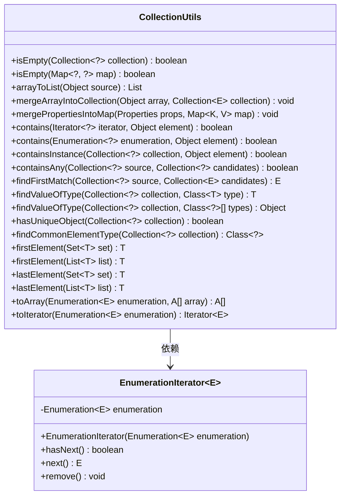

# 基础信息

|      |      |
|------|------|
| 名称 | CollectionUtils |
| 编码语言 | .java |
| 代码路径 | Minis/src/com/minis/util/CollectionUtils.java |
| 包名 | com.minis.util |
| 依赖项 | ['java.io.Serializable', 'java.util.ArrayList', 'java.util.Arrays', 'java.util.Collection', 'java.util.Collections', 'java.util.Enumeration', 'java.util.Iterator', 'java.util.LinkedHashMap', 'java.util.LinkedList', 'java.util.List', 'java.util.Map', 'java.util.Properties', 'java.util.Set', 'java.util.SortedSet'] |
| 概述说明 | CollectionUtils提供集合操作工具，涵盖判空、转换、合并、查找、类型判断等功能。 |

# 说明

CollectionUtils是一个集合操作工具类，提供了多种实用功能，包括判断集合是否为空、集合类型转换、合并多个集合、查找特定元素以及判断集合类型等。这些功能帮助开发者更高效地处理集合数据，简化代码逻辑，提升开发效率。

# 类列表 Class Summary

| 名称   | 类型  | 说明 |
|-------|------|-------------|
| CollectionUtils | class | CollectionUtils提供集合操作工具，包括判空、转换、合并、查找、类型判断等功能。 |

## 类 CollectionUtils

|      |      |
|------|------|
| 访问范围 | public abstract |
| 类型 | class |
| 名称 | CollectionUtils |
| 说明 | CollectionUtils提供集合操作工具，包括判空、转换、合并、查找、类型判断等功能。 |

### UML类图

### 描述
`CollectionUtils` 是一个工具类，提供了多种静态方法用于处理集合和映射。这些方法包括检查集合是否为空、合并数组到集合、查找集合中的元素、以及将枚举转换为迭代器等。`EnumerationIterator` 是一个内部类，用于将 `Enumeration` 适配为 `Iterator`，以便在需要迭代器的地方使用枚举。这些方法简化了集合操作，提高了代码的可读性和可维护性。

### 内部方法调用关系图

```mermaid
graph TD
    A["类CollectionUtils"]
    B["方法: boolean isEmpty(Collection<?> collection)"]
    C["方法: boolean isEmpty(Map<?, ?> map)"]
    D["方法: List arrayToList(Object source)"]
    E["方法: void mergeArrayIntoCollection(Object array, Collection<E> collection)"]
    F["方法: void mergePropertiesIntoMap(Properties props, Map<K, V> map)"]
    G["方法: boolean contains(Iterator<?> iterator, Object element)"]
    H["方法: boolean contains(Enumeration<?> enumeration, Object element)"]
    I["方法: boolean containsInstance(Collection<?> collection, Object element)"]
    J["方法: boolean containsAny(Collection<?> source, Collection<?> candidates)"]
    K["方法: E findFirstMatch(Collection<?> source, Collection<E> candidates)"]
    L["方法: T findValueOfType(Collection<?> collection, Class<T> type)"]
    M["方法: Object findValueOfType(Collection<?> collection, Class<?>[] types)"]
    N["方法: boolean hasUniqueObject(Collection<?> collection)"]
    O["方法: Class<?> findCommonElementType(Collection<?> collection)"]
    P["方法: T firstElement(Set<T> set)"]
    Q["方法: T firstElement(List<T> list)"]
    R["方法: T lastElement(Set<T> set)"]
    S["方法: T lastElement(List<T> list)"]
    T["方法: A[] toArray(Enumeration<E> enumeration, A[] array)"]
    U["方法: Iterator<E> toIterator(Enumeration<E> enumeration)"]
    V["内部类: EnumerationIterator<E>"]

    A --> B
    A --> C
    A --> D
    A --> E
    A --> F
    A --> G
    A --> H
    A --> I
    A --> J
    A --> K
    A --> L
    A --> M
    A --> N
    A --> O
    A --> P
    A --> Q
    A --> R
    A --> S
    A --> T
    A --> U
    U --> V
```

这段代码定义了一个名为`CollectionUtils`的抽象类，提供了多种静态方法来处理集合和映射的操作。这些方法包括检查集合或映射是否为空、将数组转换为列表、合并数组或属性到集合或映射中、查找集合中的元素、判断集合中是否包含唯一对象、查找集合中的共同元素类型、获取集合的第一个或最后一个元素、将枚举转换为数组或迭代器等。这些方法为集合操作提供了丰富的工具，简化了集合处理的复杂性。

### 字段列表 Field List

| 名称  | 类型  | 说明 |
|-------|-------|------|

### 方法列表 Method List

| 名称  | 类型  | 说明 |
|-------|-------|------|
| isEmpty | boolean | 检查Map是否为空或为null。 |
| isEmpty | boolean | 检查集合是否为空或为null。 |
| mergePropertiesIntoMap | void | 将Properties属性合并到Map中，处理null值。 |
| contains | boolean | 静态方法检查迭代器是否包含指定元素。 |
| mergeArrayIntoCollection | void | 将数组元素合并到集合中，支持泛型类型转换。 |
| firstElement | T | 静态方法返回列表首个元素，空列表返回null。 |
| findValueOfType | T | 查找集合中指定类型的唯一值，若无或多个则返回空。 |
| arrayToList | List | 将对象数组转换为List集合。 |
| toIterator | Iterator<E> | 将枚举转换为迭代器，若枚举为空则返回空迭代器。 |
| containsInstance | boolean | 检查集合是否包含指定元素，存在返回true，否则false。 |
| findCommonElementType | Class<?> | 查找集合中所有元素的共同类型，若类型不一致则返回null。 |
| containsAny | boolean | 检查源集合是否包含候选集合中的任一元素。 |
| firstElement | T | 获取集合首个元素，支持排序集合优先。 |
| toArray | A[] | 将枚举转换为指定类型数组的方法。 |
| hasUniqueObject | boolean | 检查集合中所有元素是否唯一，若为空返回false。 |
| findFirstMatch | E | 查找集合中首个匹配项，返回匹配元素或空。 |
| findValueOfType | Object | 在集合中查找指定类型值的静态方法，返回首个匹配值，无则返回空。 |
| lastElement | T | 静态方法返回列表最后一个元素，空列表返回null。 |
| lastElement | T | 静态方法获取集合最后一个元素，空集返回null，排序集直接取尾。 |
| contains | boolean | 检查枚举中是否包含指定元素，若存在返回true，否则返回false。 |

