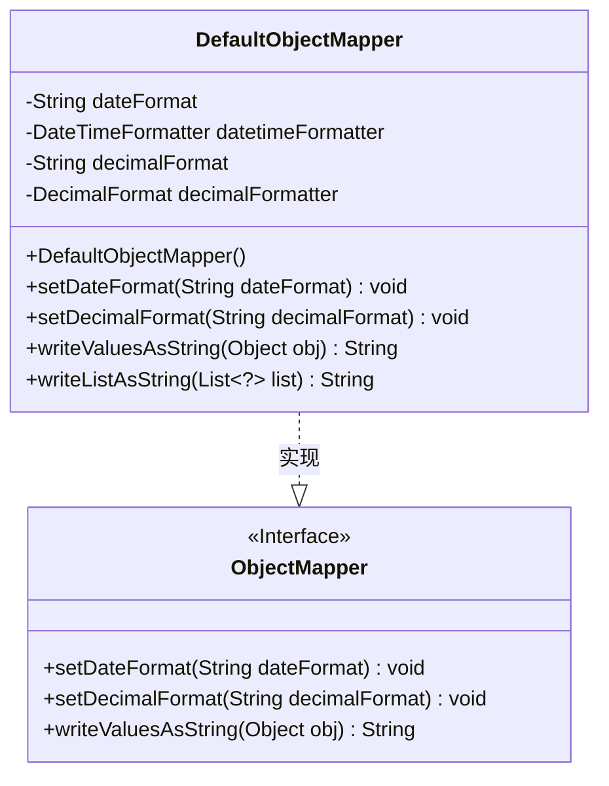

# 基础信息

|      |      |
|------|------|
| 名称 | DefaultObjectMapper |
| 编码语言 | .java |
| 代码路径 | Minis/src/com/minis/util/DefaultObjectMapper.java |
| 包名 | com.minis.util |
| 依赖项 | ['java.lang.reflect.Field', 'java.math.BigDecimal', 'java.text.DecimalFormat', 'java.time.LocalDate', 'java.time.ZoneId', 'java.time.format.DateTimeFormatter', 'java.util.Date', 'java.util.List'] |
| 概述说明 | DefaultObjectMapper实现ObjectMapper接口，支持日期数字格式化，转换对象列表为JSON字符串。 |

# 说明

DefaultObjectMapper实现了ObjectMapper接口，具备日期和数字格式化的功能，能够将对象或列表转换为JSON字符串。

# 类列表 Class Summary

| 名称   | 类型  | 说明 |
|-------|------|-------------|
| DefaultObjectMapper | class | DefaultObjectMapper实现ObjectMapper接口，支持日期和数字格式化，将对象或列表转换为JSON字符串。 |


## 类 DefaultObjectMapper

|      |      |
|------|------|
| 访问范围 | public |
| 类型 | class |
| 名称 | DefaultObjectMapper |
| 说明 | DefaultObjectMapper实现ObjectMapper接口，支持日期和数字格式化，将对象或列表转换为JSON字符串。 |


### UML类图



这段代码定义了一个 `DefaultObjectMapper` 类，它实现了 `ObjectMapper` 接口。`DefaultObjectMapper` 类用于将对象序列化为 JSON 字符串，支持自定义日期和数字格式。类中包含两个私有字段 `dateFormat` 和 `decimalFormat`，分别用于存储日期和数字的格式化模式。`writeValuesAsString` 方法将单个对象序列化为 JSON 字符串，而 `writeListAsString` 方法将对象列表序列化为 JSON 数组。通过 `setDateFormat` 和 `setDecimalFormat` 方法，用户可以动态设置日期和数字的格式化模式。


### 内部方法调用关系图

```mermaid
graph TD
    A["类DefaultObjectMapper"]
    B["属性: String dateFormat"]
    C["属性: DateTimeFormatter datetimeFormatter"]
    D["属性: String decimalFormat"]
    E["属性: DecimalFormat decimalFormatter"]
    F["构造方法: DefaultObjectMapper()"]
    G["方法: setDateFormat(String dateFormat)"]
    H["方法: setDecimalFormat(String decimalFormat)"]
    I["方法: writeValuesAsString(Object obj)"]
    J["方法: writeListAsString(List<?> list)"]
    K["判断: obj是否为List<?>类型"]
    L["初始化: sJsonStr = '{'"]
    M["获取: Class<?> clz = obj.getClass()"]
    N["获取: Field[] fields = clz.getDeclaredFields()"]
    O["遍历: Field field : fields"]
    P["获取: Object value = field.get(obj)"]
    Q["获取: Class<?> type = field.getType()"]
    R["判断: value是否为Date类型"]
    S["格式化: strValue = localDate.format(this.datetimeFormatter)"]
    T["判断: value是否为BigDecimal、Double或Float类型"]
    U["格式化: strValue = this.decimalFormatter.format(value)"]
    V["默认处理: strValue = value.toString()"]
    W["拼接: sField = '\"' + name + '\":\"' + strValue + '\"'"]
    X["拼接: sJsonStr += sField"]
    Y["结束: sJsonStr += '}'"]
    Z["返回: sJsonStr"]
    AA["初始化: sJsonStr = '['"]
    AB["遍历: Object obj : list"]
    AC["调用: writeValuesAsString(obj)"]
    AD["拼接: sJsonStr += sObj"]
    AE["结束: sJsonStr += ']'"]
    AF["返回: sJsonStr"]

    A --> B
    A --> C
    A --> D
    A --> E
    A --> F
    A --> G
    A --> H
    A --> I
    A --> J
    I --> K
    K -- 是 --> J
    K -- 否 --> L
    L --> M
    M --> N
    N --> O
    O --> P
    P --> Q
    Q --> R
    R -- 是 --> S
    R -- 否 --> T
    T -- 是 --> U
    T -- 否 --> V
    S --> W
    U --> W
    V --> W
    W --> X
    X --> Y
    Y --> Z
    J --> AA
    AA --> AB
    AB --> AC
    AC --> AD
    AD --> AE
    AE --> AF
```

**描述：**  
`DefaultObjectMapper`类实现了`ObjectMapper`接口，主要用于将对象或对象列表转换为JSON字符串。类中包含日期和数字的格式化功能，通过`writeValuesAsString`方法处理单个对象的字段，并根据字段类型进行格式化，最终拼接成JSON字符串。如果对象是列表类型，则调用`writeListAsString`方法，遍历列表中的每个对象并递归调用`writeValuesAsString`，最终将整个列表转换为JSON数组格式。

### 字段列表 Field List

| 名称  | 类型  | 说明 |
|-------|-------|------|
| dateFormat = "yyyy-MM-dd" | String | 定义日期格式为年-月-日。 |
| datetimeFormatter = DateTimeFormatter.ofPattern(dateFormat) | DateTimeFormatter | 创建指定日期格式的日期时间格式化器。 |
| decimalFormat = "#,##0.00" | String | 定义字符串格式为千位分隔符保留两位小数。 |
| decimalFormatter = new DecimalFormat(decimalFormat) | DecimalFormat | 创建DecimalFormat实例并指定格式。 |

### 方法列表 Method List

| 名称  | 类型  | 说明 |
|-------|-------|------|
| writeListAsString | String | 将列表转换为JSON字符串格式。 |
| setDateFormat | void | 重写setDateFormat方法，更新日期格式和格式化器。 |
| setDecimalFormat | void | 重写setDecimalFormat方法，设置小数格式并初始化格式化器。 |
| writeValuesAsString | String | 将对象转换为JSON字符串，处理列表、日期和数字格式。 |


