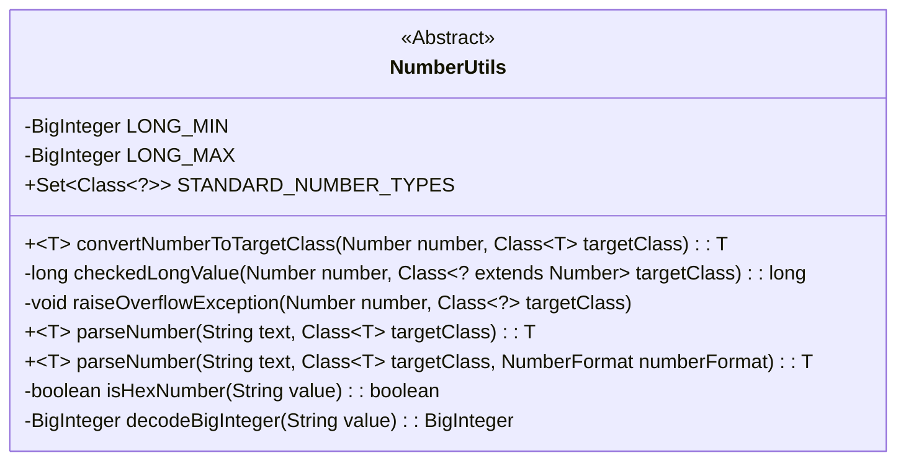
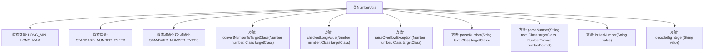

# 基础信息

|      |      |
|------|------|
| 名称 | NumberUtils |
| 编码语言 | .java |
| 代码路径 | Minis/src/com/minis/util/NumberUtils.java |
| 包名 | com.minis.util |
| 依赖项 | ['java.math.BigDecimal', 'java.math.BigInteger', 'java.text.DecimalFormat', 'java.text.NumberFormat', 'java.text.ParseException', 'java.util.Collections', 'java.util.HashSet', 'java.util.Set'] |
| 概述说明 | NumberUtils类支持多种数字类型转换、解析及溢出处理。 |

# 说明

NumberUtils类是一个提供数字类型转换和解析功能的工具类。它支持标准数字类型，包括Byte、Short、Integer等，并能处理数字溢出问题。此外，该类还具备十六进制转换的能力，能够将数字在不同进制之间进行转换和解析。通过这些功能，NumberUtils类为开发者提供了便捷的数字处理解决方案。

# 类列表 Class Summary

| 名称   | 类型  | 说明 |
|-------|------|-------------|
| NumberUtils | class | NumberUtils类提供数字类型转换和解析功能，支持标准数字类型如Byte、Short、Integer等，并处理溢出和十六进制转换。 |

## 类 NumberUtils

|      |      |
|------|------|
| 访问范围 | public abstract |
| 类型 | class |
| 名称 | NumberUtils |
| 说明 | NumberUtils类提供数字类型转换和解析功能，支持标准数字类型如Byte、Short、Integer等，并处理溢出和十六进制转换。 |

### UML类图

### 描述
`NumberUtils` 是一个抽象工具类，主要用于处理数字的转换和解析。它包含一组静态方法，用于将数字转换为目标类型（如 `Byte`、`Short`、`Integer` 等），并支持从字符串解析数字。类中定义了标准的数字类型集合 `STANDARD_NUMBER_TYPES`，并提供了检查溢出、处理十六进制数字等功能。该类通过泛型方法 `convertNumberToTargetClass` 和 `parseNumber` 实现了灵活的数值转换和解析，适用于多种数字类型。

### 内部方法调用关系图

**描述：**  
`NumberUtils` 类提供了一系列用于数字转换和解析的静态方法。它包含两个静态常量 `LONG_MIN` 和 `LONG_MAX`，以及一个静态初始化块用于初始化 `STANDARD_NUMBER_TYPES` 集合。类中的 `convertNumberToTargetClass` 方法用于将数字转换为指定目标类的实例，而 `parseNumber` 方法则用于将字符串解析为指定目标类的数字实例。此外，`checkedLongValue` 和 `raiseOverflowException` 方法用于处理数字转换时的溢出问题，`isHexNumber` 和 `decodeBigInteger` 方法则用于处理十六进制和八进制数字的解析。

### 字段列表 Field List

| 名称  | 类型  | 说明 |
|-------|-------|------|
| STANDARD_NUMBER_TYPES | Set<Class<?>> | 标准数字类型集合的静态常量定义。 |
| LONG_MAX = BigInteger.valueOf(Long.MAX_VALUE) | BigInteger | 定义常量LONG_MAX为Long类型的最大值。 |
| LONG_MIN = BigInteger.valueOf(Long.MIN_VALUE) | BigInteger | 定义私有静态常量LONG_MIN，值为Long.MIN_VALUE的BigInteger类型。 |

### 方法列表 Method List

| 名称  | 类型  | 说明 |
|-------|-------|------|
| raiseOverflowException | void | 私有方法抛出溢出异常，提示数字类型转换失败。 |
| parseNumber | T | 解析字符串为指定数字类型，支持自定义格式和类型转换。 |
| checkedLongValue | long | 检查数值是否在长整型范围内，若超出则抛出异常。 |
| isHexNumber | boolean | 判断字符串是否为十六进制数，支持前缀0x、0X和#。 |
| decodeBigInteger | BigInteger | 解析字符串为BigInteger，支持负号、十六进制、八进制。 |
| parseNumber | T | 解析字符串为指定数值类型，支持多种数值类型转换。 |
| convertNumberToTargetClass | T | 将数字转换为指定类型，支持Byte、Short、Integer等，超出范围抛出异常。 |

