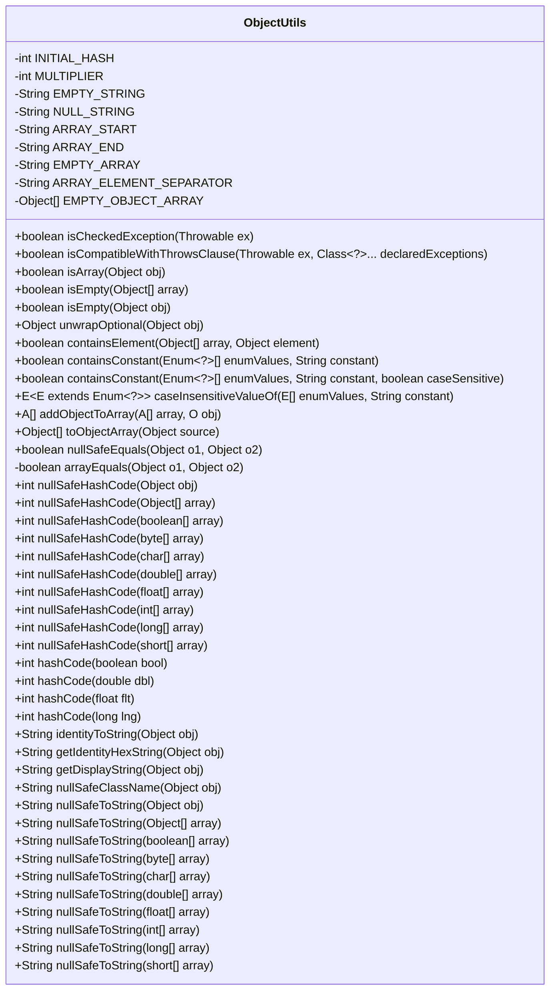

# 基础信息

|      |      |
|------|------|
| 名称 | ObjectUtils |
| 编码语言 | .java |
| 代码路径 | Minis/src/com/minis/util/ObjectUtils.java |
| 包名 | com.minis.util |
| 依赖项 | ['java.lang.reflect.Array', 'java.util.Arrays', 'java.util.Collection', 'java.util.Map', 'java.util.Optional', 'java.util.StringJoiner'] |
| 概述说明 | ObjectUtils类提供对象操作工具，包含异常检查、数组处理、哈希计算和字符串转换功能。 |

# 说明

ObjectUtils类是一个用于对象操作的工具类，提供了多种实用功能。其主要功能包括异常检查，确保对象在使用前符合预期条件；数组处理，支持对数组进行各种操作和转换；哈希计算，用于生成对象的哈希值；以及字符串转换，将对象转换为字符串形式。这些功能旨在简化开发过程中的常见操作，提高代码的健壮性和可维护性。

# 类列表 Class Summary

| 名称   | 类型  | 说明 |
|-------|------|-------------|
| ObjectUtils | class | ObjectUtils类提供对象操作工具，包括异常检查、数组处理、哈希计算和字符串转换等功能。 |

## 类 ObjectUtils

|      |      |
|------|------|
| 访问范围 | public abstract |
| 类型 | class |
| 名称 | ObjectUtils |
| 说明 | ObjectUtils类提供对象操作工具，包括异常检查、数组处理、哈希计算和字符串转换等功能。 |

### UML类图

**描述：**
`ObjectUtils` 是一个工具类，提供了大量静态方法用于处理对象的常见操作，如检查异常类型、数组操作、对象比较、哈希码生成、字符串表示等。该类的方法设计用于处理各种边缘情况，如空对象、数组、集合等，并提供了安全的空值处理机制。通过这些方法，开发者可以更方便地进行对象操作，减少代码中的冗余和错误。

### 内部方法调用关系图

```mermaid
graph TD
    A["类ObjectUtils"]
    B["常量: INITIAL_HASH, MULTIPLIER, EMPTY_STRING, NULL_STRING, ARRAY_START, ARRAY_END, EMPTY_ARRAY, ARRAY_ELEMENT_SEPARATOR, EMPTY_OBJECT_ARRAY"]
    C["方法: isCheckedException(Throwable ex)"]
    D["方法: isCompatibleWithThrowsClause(Throwable ex, Class<?>... declaredExceptions)"]
    E["方法: isArray(Object obj)"]
    F["方法: isEmpty(Object[] array)"]
    G["方法: isEmpty(Object obj)"]
    H["方法: unwrapOptional(Object obj)"]
    I["方法: containsElement(Object[] array, Object element)"]
    J["方法: containsConstant(Enum<?>[] enumValues, String constant)"]
    K["方法: containsConstant(Enum<?>[] enumValues, String constant, boolean caseSensitive)"]
    L["方法: caseInsensitiveValueOf(E[] enumValues, String constant)"]
    M["方法: addObjectToArray(A[] array, O obj)"]
    N["方法: toObjectArray(Object source)"]
    O["方法: nullSafeEquals(Object o1, Object o2)"]
    P["方法: arrayEquals(Object o1, Object o2)"]
    Q["方法: nullSafeHashCode(Object obj)"]
    R["方法: nullSafeHashCode(Object[] array)"]
    S["方法: nullSafeHashCode(boolean[] array)"]
    T["方法: nullSafeHashCode(byte[] array)"]
    U["方法: nullSafeHashCode(char[] array)"]
    V["方法: nullSafeHashCode(double[] array)"]
    W["方法: nullSafeHashCode(float[] array)"]
    X["方法: nullSafeHashCode(int[] array)"]
    Y["方法: nullSafeHashCode(long[] array)"]
    Z["方法: nullSafeHashCode(short[] array)"]
    AA["方法: hashCode(boolean bool)"]
    AB["方法: hashCode(double dbl)"]
    AC["方法: hashCode(float flt)"]
    AD["方法: hashCode(long lng)"]
    AE["方法: identityToString(Object obj)"]
    AF["方法: getIdentityHexString(Object obj)"]
    AG["方法: getDisplayString(Object obj)"]
    AH["方法: nullSafeClassName(Object obj)"]
    AI["方法: nullSafeToString(Object obj)"]
    AJ["方法: nullSafeToString(Object[] array)"]
    AK["方法: nullSafeToString(boolean[] array)"]
    AL["方法: nullSafeToString(byte[] array)"]
    AM["方法: nullSafeToString(char[] array)"]
    AN["方法: nullSafeToString(double[] array)"]
    AO["方法: nullSafeToString(float[] array)"]
    AP["方法: nullSafeToString(int[] array)"]
    AQ["方法: nullSafeToString(long[] array)"]
    AR["方法: nullSafeToString(short[] array)"]

    A --> B
    A --> C
    A --> D
    A --> E
    A --> F
    A --> G
    A --> H
    A --> I
    A --> J
    A --> K
    A --> L
    A --> M
    A --> N
    A --> O
    O --> P
    A --> Q
    Q --> R
    Q --> S
    Q --> T
    Q --> U
    Q --> V
    Q --> W
    Q --> X
    Q --> Y
    Q --> Z
    A --> AA
    A --> AB
    A --> AC
    A --> AD
    A --> AE
    AE --> AF
    A --> AG
    A --> AH
    A --> AI
    AI --> AJ
    AI --> AK
    AI --> AL
    AI --> AM
    AI --> AN
    AI --> AO
    AI --> AP
    AI --> AQ
    AI --> AR
```

这段代码定义了一个名为 `ObjectUtils` 的抽象类，提供了多种实用方法来处理对象、数组、异常、枚举等常见操作。这些方法包括检查异常类型、判断数组是否为空、比较对象、生成哈希码、以及将对象转换为字符串等。代码通过多种方法处理了各种边缘情况，确保了代码的健壮性和通用性。

### 字段列表 Field List

| 名称  | 类型  | 说明 |
|-------|-------|------|
| INITIAL_HASH = 7 | int | 定义常量INITIAL_HASH，初始值为7。 |
| MULTIPLIER = 31 | int | 定义私有静态常量MULTIPLIER，值为31。 |
| NULL_STRING = "null" | String | 定义常量NULL_STRING，值为"null"。 |
| EMPTY_STRING = "" | String | 定义空字符串常量EMPTY_STRING。 |
| ARRAY_ELEMENT_SEPARATOR = ", " | String | 定义静态常量字符串用于分隔数组元素。 |
| EMPTY_OBJECT_ARRAY = new Object[0] | Object[] | 定义空对象数组常量EMPTY_OBJECT_ARRAY。 |
| ARRAY_START = "{" | String | 定义私有静态常量字符串ARRAY_START，值为"{"。 |
| EMPTY_ARRAY = ARRAY_START + ARRAY_END | String | 定义空数组常量，值为数组起始和结束符组合。 |
| ARRAY_END = "}" | String | 定义常量ARRAY_END，值为右大括号。 |

### 方法列表 Method List

| 名称  | 类型  | 说明 |
|-------|-------|------|
| hashCode | int | 已弃用方法，使用Long.hashCode计算长整型哈希值。 |
| nullSafeHashCode | int | 静态方法nullSafeHashCode计算数组哈希值，空数组返回0。 |
| hashCode | int | 已弃用的静态方法hashCode(float flt)调用Float.hashCode(flt)。 |
| isEmpty | boolean | 检查数组是否为空或长度为0。 |
| arrayEquals | boolean | 比较两个数组是否相等，支持多种数据类型。 |
| nullSafeHashCode | int | 方法计算长整型数组的哈希值，空数组返回0。 |
| isEmpty | boolean | 判断对象是否为空，支持多种类型。 |
| nullSafeHashCode | int | 计算浮点数组哈希值，空数组返回0。 |
| nullSafeToString | String | 安全转换对象为字符串，处理空值和数组类型。 |
| containsConstant | boolean | 检查枚举数组中是否包含指定常量，忽略大小写。 |
| nullSafeToString | String | 将字节数组安全转换为字符串，处理空数组和null情况。 |
| nullSafeToString | String | 将整数数组安全转换为字符串，处理空数组和空值情况。 |
| nullSafeHashCode | int | 静态方法计算对象数组哈希值，空数组返回0。 |
| unwrapOptional | Object | 解包Optional对象，若为空返回null，否则返回其值。 |
| getIdentityHexString | String | 该方法返回对象内存地址的十六进制字符串表示。 |
| addObjectToArray | A[] | 静态方法将对象添加到数组并返回新数组。 |
| containsElement | boolean | 静态方法检查数组中是否包含指定元素，空数组返回false。 |
| isCompatibleWithThrowsClause | boolean | 检查异常是否与声明异常兼容，未检查异常直接返回真。 |
| nullSafeToString | String | 将字符数组安全转换为字符串，处理空数组和null值。 |
| toObjectArray | Object[] | 将对象转换为对象数组，处理空值和非数组类型异常。 |
| nullSafeToString | String | 将长整型数组转换为字符串，处理空数组和null情况。 |
| nullSafeToString | String | 将对象数组转换为字符串，处理null和空数组情况。 |
| nullSafeToString | String | 将短整型数组安全转换为字符串，处理空数组和空值情况。 |
| nullSafeHashCode | int | 空安全布尔数组哈希码计算方法。 |
| nullSafeEquals | boolean | 比较两个对象是否相等，处理空值和数组。 |
| isArray | boolean | 该方法检查对象是否为数组，非空且类型为数组时返回true。 |
| nullSafeToString | String | 将双精度数组安全转换为字符串，处理空数组和null值。 |
| nullSafeHashCode | int | nullSafeHashCode方法处理空对象和数组，返回对象哈希码或0。 |
| containsConstant | boolean | 检查枚举数组中是否包含指定常量，支持区分大小写。 |
| getDisplayString | String | 静态方法getDisplayString处理对象为空时返回空字符串，否则返回对象的字符串表示。 |
| nullSafeHashCode | int | 方法计算短整型数组的哈希值，空数组返回0。 |
| nullSafeToString | String | 将浮点数组转换为字符串，处理空数组和null值。 |
| nullSafeHashCode | int | 空安全哈希函数，计算字符数组哈希值，空数组返回0。 |
| hashCode | int | 已弃用的静态方法，用于计算双精度浮点数的哈希码。 |
| nullSafeToString | String | 将布尔数组安全转换为字符串，处理空数组和null情况。 |
| identityToString | String | 静态方法identityToString将对象转换为类名@哈希码的字符串表示，若对象为空返回空字符串。 |
| hashCode | int | 废弃方法：hashCode(boolean) 直接调用 Boolean.hashCode(bool)。 |
| nullSafeHashCode | int | 计算双精度数组哈希值，空数组返回0。 |
| isCheckedException | boolean | 方法判断异常是否为受检异常，非运行时异常和错误即返回真。 |
| nullSafeClassName | String | 静态方法返回对象类名，若为空则返回NULL_STRING。 |
| caseInsensitiveValueOf | E | 该方法通过忽略大小写匹配枚举值并返回对应枚举，若未找到则抛出异常。 |
| nullSafeHashCode | int | 该方法计算字节数组的哈希值，若数组为空则返回0。 |

