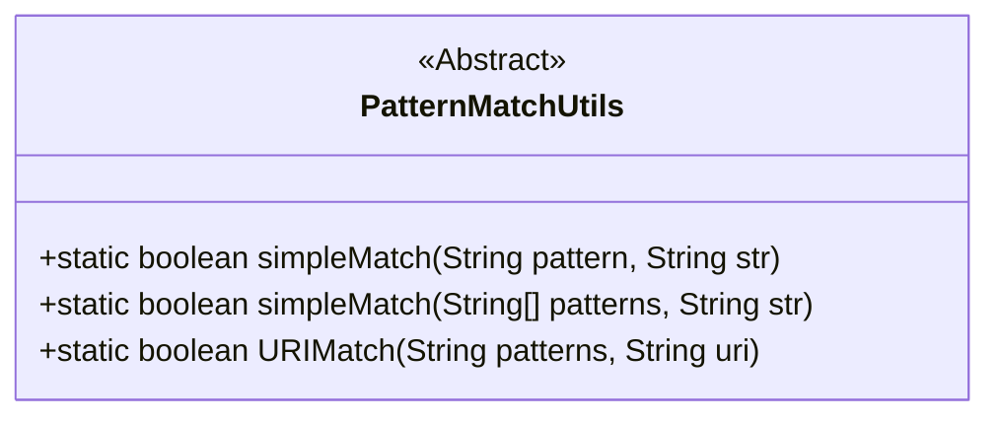
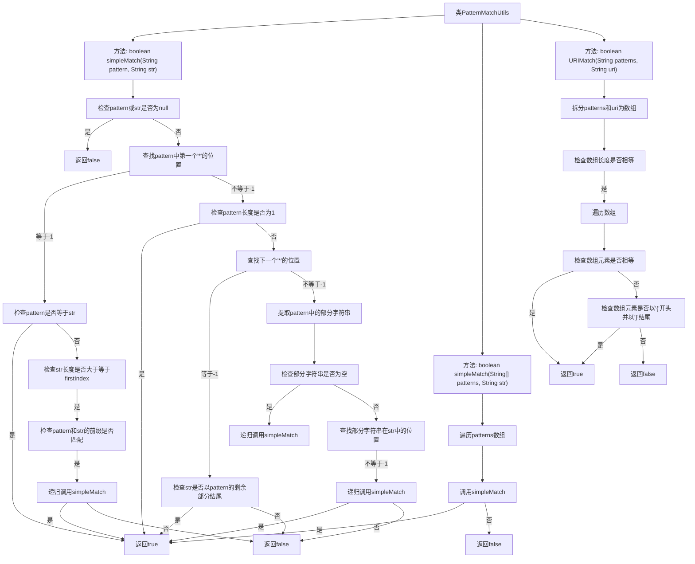

# 基础信息

|      |      |
|------|------|
| 名称 | PatternMatchUtils |
| 编码语言 | .java |
| 代码路径 | Minis/src/com/minis/util/PatternMatchUtils.java |
| 包名 | com.minis.util |
| 依赖项 | ['java.util.Arrays'] |
| 概述说明 | PatternMatchUtils类支持简单模式和URI的字符串匹配。 |

# 说明

PatternMatchUtils类是一个用于字符串模式匹配的工具类，主要提供两种匹配功能：简单模式匹配和URI匹配。简单模式匹配适用于基础的字符串模式识别，而URI匹配则专门针对URI格式的字符串进行匹配。该类旨在帮助开发者高效地处理字符串模式匹配需求，适用于多种应用场景。

# 类列表 Class Summary

| 名称   | 类型  | 说明 |
|-------|------|-------------|
| PatternMatchUtils | class | PatternMatchUtils类提供字符串模式匹配功能，支持简单模式和URI匹配。 |

## 类 PatternMatchUtils

|      |      |
|------|------|
| 访问范围 | public abstract |
| 类型 | class |
| 名称 | PatternMatchUtils |
| 说明 | PatternMatchUtils类提供字符串模式匹配功能，支持简单模式和URI匹配。 |

### UML类图

### 描述
`PatternMatchUtils` 是一个抽象类，提供了三种静态方法用于字符串模式匹配。`simpleMatch` 方法支持简单的通配符模式匹配，如 `"xxx*"`, `"*xxx"`, `"*xxx*"` 和 `"xxx*yyy"`，并支持直接相等匹配。`URIMatch` 方法用于匹配 URI 路径，支持路径中的占位符匹配。这些方法在处理字符串匹配时非常有用，特别是在需要灵活匹配规则的场景中。

### 内部方法调用关系图

**描述：** 该流程图展示了`PatternMatchUtils`类中三个主要方法的执行流程。`simpleMatch`方法用于匹配字符串与模式，支持多种模式样式，如`xxx*`、`*xxx`等。`simpleMatch`方法的重载版本用于匹配字符串与多个模式。`URIMatch`方法用于匹配URI路径与模式，支持路径参数的匹配。每个方法都包含详细的步骤和条件判断，确保匹配的准确性和灵活性。

### 字段列表 Field List

| 名称  | 类型  | 说明 |
|-------|-------|------|

### 方法列表 Method List

| 名称  | 类型  | 说明 |
|-------|-------|------|
| simpleMatch | boolean | 该方法用于匹配字符串与模式，支持通配符*。 |
| URIMatch | boolean | 方法URIMatch用于匹配URI与模式，返回布尔值。 |
| simpleMatch | boolean | 检查字符串是否匹配任一模式，匹配则返回真。 |

