# 基础信息

|      |      |
|------|------|
| 名称 | ReflectionUtils |
| 编码语言 | .java |
| 代码路径 | Minis/src/com/minis/util/ReflectionUtils.java |
| 包名 | com.minis.util |
| 依赖项 | ['java.lang.reflect.Constructor', 'java.lang.reflect.Field', 'java.lang.reflect.InvocationTargetException', 'java.lang.reflect.Method', 'java.lang.reflect.Modifier', 'java.lang.reflect.UndeclaredThrowableException', 'java.util.ArrayList', 'java.util.Arrays', 'java.util.List', 'java.util.Map', 'java.util.concurrent.ConcurrentHashMap'] |
| 概述说明 | ReflectionUtils类提供反射操作工具，支持方法、字段及异常处理。 |

# 说明

ReflectionUtils类是一个专门用于反射操作的工具类，提供了对方法和字段的处理功能，并且包含了异常处理机制。该类旨在简化反射相关的操作，使得开发者能够更方便地进行方法调用、字段访问等操作，同时确保在遇到异常时能够进行有效的处理。通过使用ReflectionUtils类，开发者可以更加高效地管理和操作类的成员，提升代码的可维护性和灵活性。

# 类列表 Class Summary

| 名称   | 类型  | 说明 |
|-------|------|-------------|
| ReflectionUtils | class | ReflectionUtils类提供反射操作工具，支持方法、字段处理及异常处理。 |


## 类 ReflectionUtils

|      |      |
|------|------|
| 访问范围 | public abstract |
| 类型 | class |
| 名称 | ReflectionUtils |
| 说明 | ReflectionUtils类提供反射操作工具，支持方法、字段处理及异常处理。 |


### UML类图

```mermaid
classDiagram
    class ReflectionUtils {
        <<abstract>>
        -String CGLIB_RENAMED_METHOD_PREFIX
        -Class<?>[] EMPTY_CLASS_ARRAY
        -Method[] EMPTY_METHOD_ARRAY
        -Field[] EMPTY_FIELD_ARRAY
        -Object[] EMPTY_OBJECT_ARRAY
        -Map~Class<?>, Method[]~ declaredMethodsCache
        -Map~Class<?>, Field[]~ declaredFieldsCache
        +MethodFilter USER_DECLARED_METHODS
        +FieldFilter COPYABLE_FIELDS
        +void handleReflectionException(Exception ex)
        +void handleInvocationTargetException(InvocationTargetException ex)
        +void rethrowRuntimeException(Throwable ex)
        +void rethrowException(Throwable ex) throws Exception
        +~T~ Constructor~T~ accessibleConstructor(Class~T~ clazz, Class<?>... parameterTypes) throws NoSuchMethodException
        +void makeAccessible(Constructor<?> ctor)
        +Method findMethod(Class<?> clazz, String name)
        +Method findMethod(Class<?> clazz, String name, Class<?>... paramTypes)
        +Object invokeMethod(Method method, Object target)
        +Object invokeMethod(Method method, Object target, Object... args)
        +boolean declaresException(Method method, Class<?> exceptionType)
        +void doWithLocalMethods(Class<?> clazz, MethodCallback mc)
        +void doWithMethods(Class<?> clazz, MethodCallback mc)
        +void doWithMethods(Class<?> clazz, MethodCallback mc, MethodFilter mf)
        +Method[] getAllDeclaredMethods(Class<?> leafClass)
        +Method[] getUniqueDeclaredMethods(Class<?> leafClass)
        +Method[] getUniqueDeclaredMethods(Class<?> leafClass, MethodFilter mf)
        +Method[] getDeclaredMethods(Class<?> clazz)
        +boolean isEqualsMethod(Method method)
        +boolean isHashCodeMethod(Method method)
        +boolean isToStringMethod(Method method)
        +boolean isObjectMethod(Method method)
        +boolean isCglibRenamedMethod(Method renamedMethod)
        +void makeAccessible(Method method)
        +Field findField(Class<?> clazz, String name)
        +Field findField(Class<?> clazz, String name, Class<?> type)
        +void setField(Field field, Object target, Object value)
        +Object getField(Field field, Object target)
        +void doWithLocalFields(Class<?> clazz, FieldCallback fc)
        +void doWithFields(Class<?> clazz, FieldCallback fc)
        +void doWithFields(Class<?> clazz, FieldCallback fc, FieldFilter ff)
        +void shallowCopyFieldState(Object src, Object dest)
        +boolean isPublicStaticFinal(Field field)
        +void makeAccessible(Field field)
        +void clearCache()
    }

    interface MethodCallback {
        <<Interface>>
        +void doWith(Method method) throws IllegalArgumentException, IllegalAccessException
    }

    interface MethodFilter {
        <<Interface>>
        +boolean matches(Method method)
    }

    interface FieldCallback {
        <<Interface>>
        +void doWith(Field field) throws IllegalArgumentException, IllegalAccessException
    }

    interface FieldFilter {
        <<Interface>>
        +boolean matches(Field field)
    }

    ReflectionUtils --> MethodCallback : 使用
    ReflectionUtils --> MethodFilter : 使用
    ReflectionUtils --> FieldCallback : 使用
    ReflectionUtils --> FieldFilter : 使用
```

**描述**：`ReflectionUtils` 是一个抽象工具类，提供了丰富的反射操作功能，包括方法、字段的查找、调用、处理异常等。它通过多个接口（如 `MethodCallback`、`MethodFilter`、`FieldCallback`、`FieldFilter`）来实现对方法和字段的灵活操作。类中使用了缓存机制来优化反射性能，并提供了多种静态方法来简化反射操作。


### 内部方法调用关系图

```mermaid
graph TD
    A["类ReflectionUtils"]
    B["常量: MethodFilter USER_DECLARED_METHODS"]
    C["常量: FieldFilter COPYABLE_FIELDS"]
    D["常量: String CGLIB_RENAMED_METHOD_PREFIX"]
    E["常量: Class<?>[] EMPTY_CLASS_ARRAY"]
    F["常量: Method[] EMPTY_METHOD_ARRAY"]
    G["常量: Field[] EMPTY_FIELD_ARRAY"]
    H["常量: Object[] EMPTY_OBJECT_ARRAY"]
    I["缓存: Map<Class<?>, Method[]> declaredMethodsCache"]
    J["缓存: Map<Class<?>, Field[]> declaredFieldsCache"]
    K["方法: handleReflectionException(Exception ex)"]
    L["方法: handleInvocationTargetException(InvocationTargetException ex)"]
    M["方法: rethrowRuntimeException(Throwable ex)"]
    N["方法: rethrowException(Throwable ex)"]
    O["方法: accessibleConstructor(Class<T> clazz, Class<?>... parameterTypes)"]
    P["方法: makeAccessible(Constructor<?> ctor)"]
    Q["方法: findMethod(Class<?> clazz, String name)"]
    R["方法: findMethod(Class<?> clazz, String name, Class<?>... paramTypes)"]
    S["方法: invokeMethod(Method method, Object target)"]
    T["方法: invokeMethod(Method method, Object target, Object... args)"]
    U["方法: declaresException(Method method, Class<?> exceptionType)"]
    V["方法: doWithLocalMethods(Class<?> clazz, MethodCallback mc)"]
    W["方法: doWithMethods(Class<?> clazz, MethodCallback mc)"]
    X["方法: doWithMethods(Class<?> clazz, MethodCallback mc, MethodFilter mf)"]
    Y["方法: getAllDeclaredMethods(Class<?> leafClass)"]
    Z["方法: getUniqueDeclaredMethods(Class<?> leafClass)"]
    AA["方法: getUniqueDeclaredMethods(Class<?> leafClass, MethodFilter mf)"]
    AB["方法: getDeclaredMethods(Class<?> clazz)"]
    AC["方法: getDeclaredMethods(Class<?> clazz, boolean defensive)"]
    AD["方法: findConcreteMethodsOnInterfaces(Class<?> clazz)"]
    AE["方法: isEqualsMethod(Method method)"]
    AF["方法: isHashCodeMethod(Method method)"]
    AG["方法: isToStringMethod(Method method)"]
    AH["方法: isObjectMethod(Method method)"]
    AI["方法: isCglibRenamedMethod(Method renamedMethod)"]
    AJ["方法: makeAccessible(Method method)"]
    AK["方法: findField(Class<?> clazz, String name)"]
    AL["方法: findField(Class<?> clazz, String name, Class<?> type)"]
    AM["方法: setField(Field field, Object target, Object value)"]
    AN["方法: getField(Field field, Object target)"]
    AO["方法: doWithLocalFields(Class<?> clazz, FieldCallback fc)"]
    AP["方法: doWithFields(Class<?> clazz, FieldCallback fc)"]
    AQ["方法: doWithFields(Class<?> clazz, FieldCallback fc, FieldFilter ff)"]
    AR["方法: getDeclaredFields(Class<?> clazz)"]
    AS["方法: shallowCopyFieldState(Object src, Object dest)"]
    AT["方法: isPublicStaticFinal(Field field)"]
    AU["方法: makeAccessible(Field field)"]
    AV["方法: clearCache()"]
    AW["接口: MethodCallback"]
    AX["接口: MethodFilter"]
    AY["接口: FieldCallback"]
    AZ["接口: FieldFilter"]

    A --> B
    A --> C
    A --> D
    A --> E
    A --> F
    A --> G
    A --> H
    A --> I
    A --> J
    A --> K
    K --> L
    L --> M
    M --> N
    A --> O
    O --> P
    A --> Q
    Q --> R
    A --> S
    S --> T
    A --> U
    A --> V
    V --> W
    W --> X
    A --> Y
    Y --> Z
    Z --> AA
    A --> AB
    AB --> AC
    AC --> AD
    A --> AE
    A --> AF
    A --> AG
    A --> AH
    A --> AI
    A --> AJ
    A --> AK
    AK --> AL
    A --> AM
    A --> AN
    A --> AO
    AO --> AP
    AP --> AQ
    A --> AR
    A --> AS
    A --> AT
    A --> AU
    A --> AV
    A --> AW
    A --> AX
    A --> AY
    A --> AZ
```



这段代码定义了一个名为`ReflectionUtils`的抽象类，主要用于处理Java反射操作。它包含了一系列静态方法和常量，用于查找、调用、处理方法和字段，以及处理反射过程中可能出现的异常。类中定义的方法涵盖了从查找方法、字段到处理异常、缓存管理等各个方面，提供了丰富的反射操作工具。通过流程图可以清晰地看到类中各个方法之间的调用关系及其功能。

### 字段列表 Field List

| 名称  | 类型  | 说明 |
|-------|-------|------|
| USER_DECLARED_METHODS =			(method -> !method.isBridge() && !method.isSynthetic()) | MethodFilter | USER_DECLARED_METHODS过滤非桥接和非合成方法。 |
| EMPTY_OBJECT_ARRAY = new Object[0] | Object[] | 定义空对象数组常量EMPTY_OBJECT_ARRAY。 |
| CGLIB_RENAMED_METHOD_PREFIX = "CGLIB$" | String | CGLIB重命名方法前缀为"CGLIB$"。 |
| EMPTY_FIELD_ARRAY = new Field[0] | Field[] | 定义空字段数组常量EMPTY_FIELD_ARRAY。 |
| declaredFieldsCache = new ConcurrentHashMap<>(256) | Map<Class<?>, Field[]> | 声明一个私有静态常量Map，用于缓存类的字段数组。 |
| EMPTY_CLASS_ARRAY = new Class<?>[0] | Class<?>[] | 定义空类数组常量EMPTY_CLASS_ARRAY。 |
| COPYABLE_FIELDS =			(field -> !(Modifier.isStatic(field.getModifiers()) || Modifier.isFinal(field.getModifiers()))) | FieldFilter | 定义静态常量COPYABLE_FIELDS，过滤非静态且非final的字段。 |
| declaredMethodsCache = new ConcurrentHashMap<>(256) | Map<Class<?>, Method[]> | 声明了一个私有静态最终Map，用于缓存类及其声明方法的映射。 |
| EMPTY_METHOD_ARRAY = new Method[0] | Method[] | 定义了一个空的Method数组常量EMPTY_METHOD_ARRAY。 |

### 方法列表 Method List

| 名称  | 类型  | 说明 |
|-------|-------|------|
| getDeclaredMethods | Method[] | 获取指定类的所有声明方法，包括私有方法。 |
| hasSameParams | boolean | 检查方法参数类型是否匹配。 |
| rethrowException | void | 重新抛出异常，根据类型分别处理。 |
| invokeMethod | Object | 通过反射调用方法，处理异常并抛出非法状态异常。 |
| isToStringMethod | boolean | 判断方法是否为无参toString方法。 |
| accessibleConstructor | Constructor<T> | 获取并返回可访问的指定类构造方法。 |
| rethrowRuntimeException | void | 重新抛出运行时异常或错误，否则抛出未声明异常。 |
| doWithMethods | void | 递归处理类及其父类和接口的方法，应用回调与过滤器。 |
| invokeMethod | Object | 静态方法invokeMethod调用指定方法并返回结果。 |
| isHashCodeMethod | boolean | 检查方法是否为无参的hashCode方法。 |
| doWithLocalFields | void | 遍历类字段并执行回调，处理非法访问异常。 |
| handleInvocationTargetException | void | 处理调用目标异常，重新抛出运行时异常。 |
| doWithMethods | void | 静态方法doWithMethods调用自身，接受类、方法回调和过滤器参数。 |
| doWithLocalMethods | void | 遍历类方法并回调处理，捕获非法访问异常。 |
| findMethod | Method | 静态方法findMethod通过类名和方法名查找方法。 |
| isCglibRenamedMethod | boolean | 检查方法名是否以CGLIB前缀开头且符合重命名规则。 |
| getDeclaredMethods | Method[] | 获取类声明方法，缓存结果并处理默认方法。 |
| makeAccessible | void | JDK 9中通过@SuppressWarnings忽略弃用警告，使非公共构造函数可访问。 |
| findField | Field | 在指定类及其父类中查找匹配名称和类型的字段。 |
| findMethod | Method | 查找类中指定名称和参数类型的方法。 |
| isEqualsMethod | boolean | 判断方法是否为equals方法，需满足名称、参数数量及类型条件。 |
| clearCache | void | 清除缓存中的声明方法和字段。 |
| makeAccessible | void | JDK 9中忽略弃用警告，确保非公共方法可访问。 |
| doWithFields | void | 递归遍历类及其父类的字段，执行回调并过滤匹配字段。 |
| getUniqueDeclaredMethods | Method[] | 获取类中唯一声明的方法，处理协变返回类型并过滤CGLIB重命名方法。 |
| shallowCopyFieldState | void | 浅拷贝字段状态，源目标类需兼容，字段值复制到目标对象。 |
| doWithFields | void | 静态方法doWithFields接收类对象和字段回调，调用重载方法处理字段。 |
| getAllDeclaredMethods | Method[] | 获取指定类的所有声明方法并返回数组。 |
| isObjectMethod | boolean | 判断方法是否为Object类或其常用方法。 |
| getUniqueDeclaredMethods | Method[] | 静态方法`getUniqueDeclaredMethods`获取指定类的唯一声明方法。 |
| getField | Object | 通过反射获取对象字段值，处理非法访问异常。 |
| setField | void | 通过反射设置对象字段值，处理非法访问异常。 |
| handleReflectionException | void | 处理反射异常，根据异常类型抛出相应状态或运行时异常。 |
| findConcreteMethodsOnInterfaces | List<Method> | 查找接口中非抽象方法并返回列表。 |
| makeAccessible | void | JDK 9中，通过`@SuppressWarnings`忽略弃用警告，检查并设置字段可访问性。 |
| declaresException | boolean | 检查方法是否声明了指定异常类型。 |
| isPublicStaticFinal | boolean | 判断字段是否为public、static、final修饰的方法。 |
| getDeclaredFields | Field[] | 通过缓存获取类的声明字段，若缓存未命中则反射获取并缓存，异常时抛出非法状态异常。 |
| findField | Field | 静态方法findField通过类名和字段名查找字段。 |


