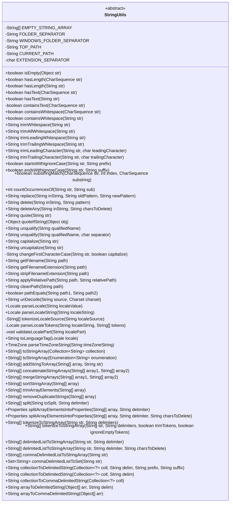

# 基础信息

|      |      |
|------|------|
| 名称 | StringUtils |
| 编码语言 | .java |
| 代码路径 | Minis/src/com/minis/util/StringUtils.java |
| 包名 | com.minis.util |
| 依赖项 | ['java.io.ByteArrayOutputStream', 'java.nio.charset.Charset', 'java.util.ArrayList', 'java.util.Arrays', 'java.util.Collection', 'java.util.Collections', 'java.util.Enumeration', 'java.util.Iterator', 'java.util.LinkedHashSet', 'java.util.LinkedList', 'java.util.List', 'java.util.Locale', 'java.util.Properties', 'java.util.Set', 'java.util.StringJoiner', 'java.util.StringTokenizer', 'java.util.TimeZone'] |
| 概述说明 | StringUtils类提供字符串处理工具，支持空值检查、修剪、替换和路径操作。 |

# 说明

StringUtils类是一个专门用于处理字符串的工具类，提供了多种实用方法。其中包括空值检查，用于判断字符串是否为空或null；修剪功能，用于去除字符串两端的空白字符；替换操作，支持将字符串中的特定字符或子串替换为其他内容；路径操作方法，用于处理文件路径相关的字符串操作。这些方法简化了字符串处理任务，提高了开发效率。

# 类列表 Class Summary

| 名称   | 类型  | 说明 |
|-------|------|-------------|
| StringUtils | class | StringUtils类提供字符串处理工具，包括空值检查、修剪、替换、路径操作等方法。 |

## 类 StringUtils

|      |      |
|------|------|
| 访问范围 | public abstract |
| 类型 | class |
| 名称 | StringUtils |
| 说明 | StringUtils类提供字符串处理工具，包括空值检查、修剪、替换、路径操作等方法。 |

### UML类图

### 描述
`StringUtils` 是一个抽象类，提供了大量用于处理字符串的静态方法。这些方法涵盖了字符串的检查、修剪、替换、删除、路径处理、编码解码等多种操作。类中包含多个常量和方法，用于处理字符串的空值检查、长度检查、文本内容检查、路径规范化、字符编码解码等。通过这些方法，开发者可以更方便地进行字符串操作，减少重复代码的编写。

### 内部方法调用关系图

这段代码定义了一个名为 `StringUtils` 的工具类，提供了大量用于处理字符串的静态方法。这些方法涵盖了字符串的空值检查、长度检查、文本内容检查、空白字符处理、字符串截取、路径处理、字符串替换、删除操作、字符串格式化、数组操作等功能。该类的主要目的是简化字符串操作，提供高效的字符串处理工具，适用于各种字符串处理场景。

### 字段列表 Field List

| 名称  | 类型  | 说明 |
|-------|-------|------|
| EMPTY_STRING_ARRAY = {} | String[] | 定义空字符串数组常量EMPTY_STRING_ARRAY。 |
| WINDOWS_FOLDER_SEPARATOR = "\\" | String | 定义Windows文件夹分隔符为反斜杠。 |
| TOP_PATH = ".." | String | 私有静态常量TOP_PATH赋值为".."。 |
| FOLDER_SEPARATOR = "/" | String | 定义静态常量FOLDER_SEPARATOR为斜杠"/"。 |
| CURRENT_PATH = "." | String | 定义当前路径为当前目录的静态常量字符串。 |
| EXTENSION_SEPARATOR = '.' | char | 定义私有静态常量EXTENSION_SEPARATOR，值为'.'。 |

### 方法列表 Method List

| 名称  | 类型  | 说明 |
|-------|-------|------|
| hasText | boolean | 检查字符串非空且包含文本。 |
| trimWhitespace | String | 静态方法去除字符串两端空白字符。 |
| trimLeadingWhitespace | String | 静态方法去除字符串前导空格。 |
| isEmpty | boolean | 判断对象是否为空或空字符串。 |
| trimTrailingWhitespace | String | 删除字符串末尾空白字符的静态方法。 |
| containsText | boolean | 检查字符串是否包含非空白字符。 |
| capitalize | String | 静态方法将字符串首字母大写。 |
| hasLength | boolean | 检查字符串非空且长度大于零。 |
| trimAllWhitespace | String | 该方法去除字符串中所有空白字符并返回结果。 |
| hasText | boolean | 该方法检查字符序列非空且包含文本。 |
| getFilename | String | 从路径中提取文件名，忽略路径分隔符。 |
| parseLocaleString | Locale | 解析字符串生成Locale对象。 |
| containsWhitespace | boolean | 检查字符串是否包含空白字符。 |
| startsWithIgnoreCase | boolean | 方法检查字符串是否以指定前缀开头，忽略大小写。 |
| delete | String | 静态方法删除字符串中匹配模式的部分。 |
| countOccurrencesOf | int | 统计字符串中子串出现次数的静态方法。 |
| containsWhitespace | boolean | 检查字符串是否包含空白字符。 |
| replace | String | 静态方法替换字符串中的指定模式，返回新字符串。 |
| endsWithIgnoreCase | boolean | 静态方法检查字符串是否以指定后缀结尾，忽略大小写。 |
| pathEquals | boolean | 比较两个路径是否相等，先清理路径再比较。 |
| uncapitalize | String | 该方法将字符串首字母转换为小写。 |
| hasLength | boolean | 检查字符序列非空且长度大于零。 |
| trimLeadingCharacter | String | 该方法用于删除字符串开头的指定字符，返回处理后的字符串。 |
| unqualify | String | 提取字符串中最后一个分隔符后的子串。 |
| toLanguageTag | String | 已弃用方法：将Locale对象转换为语言标签字符串。 |
| applyRelativePath | String | 静态方法合并路径，处理相对路径与绝对路径的拼接。 |
| substringMatch | boolean | 方法检查字符串从指定索引开始的子串是否匹配。 |
| toStringArray | String[] | 将字符串集合转换为字符串数组，空集合返回空数组。 |
| addStringToArray | String[] | 静态方法将字符串添加到字符串数组并返回新数组。 |
| delimitedListToStringArray | String[] | 静态方法将带分隔符的字符串转换为数组。 |
| toStringArray | String[] | 将枚举类型转换为字符串数组，若枚举为空则返回空数组。 |
| changeFirstCharacterCase | String | 根据条件修改字符串首字母大小写并返回新字符串。 |
| parseLocale | Locale | 解析字符串为Locale对象，支持单标签和多标签格式。 |
| arrayToDelimitedString | String | 将对象数组按指定分隔符连接成字符串。 |
| arrayToCommaDelimitedString | String | 静态方法将对象数组转换为逗号分隔的字符串。 |
| stripFilenameExtension | String | 该方法去除文件路径中的扩展名，保留路径和文件名。 |
| commaDelimitedListToSet | Set<String> | 将逗号分隔的字符串转换为有序不重复集合。 |
| collectionToDelimitedString | String | 将集合元素拼接成字符串，添加前缀、后缀和分隔符。 |
| cleanPath | String | 清理路径，处理前缀、当前路径和上级路径，返回规范化路径。 |
| tokenizeLocaleSource | String[] | 私有静态方法tokenizeLocaleSource通过tokenizeToStringArray处理localeSource字符串并返回结果。 |
| uriDecode | String | 解码URI字符串，处理百分号编码，返回解码后的字符串。 |
| parseTimeZoneString | TimeZone | 解析时区字符串，无效时抛出异常。 |
| delimitedListToStringArray | String[] | 将字符串按分隔符分割并删除指定字符，返回字符串数组。 |
| splitArrayElementsIntoProperties | Properties | 静态方法将数组元素按分隔符拆分为属性，可指定默认值。 |
| quoteIfString | Object | 静态方法判断对象是否为字符串，是则加引号，否则返回原对象。 |
| removeDuplicateStrings | String[] | 静态方法移除字符串数组中的重复项，返回无重复元素的数组。 |
| trimTrailingCharacter | String | 该方法移除字符串末尾指定字符，返回处理后的字符串。 |
| trimArrayElements | String[] | 该方法用于去除字符串数组各元素的前后空格。 |
| getFilenameExtension | String | 静态方法获取文件路径的扩展名，返回null若路径为空或扩展名无效。 |
| concatenateStringArrays | String[] | 该方法合并两个字符串数组，返回新数组。 |
| mergeStringArrays | String[] | 合并两个字符串数组，去重后返回新数组。 |
| tokenizeToStringArray | String[] | 静态方法将字符串按分隔符切分，支持修剪和忽略空标记。 |
| validateLocalePart | void | 验证字符串仅含字母、数字、空格、下划线、连字符和井号。 |
| unqualify | String | 该方法用于去除字符串中的限定符，默认使用点号作为分隔符。 |
| splitArrayElementsIntoProperties | Properties | 将字符串数组按分隔符拆分为键值对，删除指定字符后存入Properties对象。 |
| split | String[] | 静态方法split按分隔符分割字符串，返回前后两部分。 |
| parseLocaleTokens | Locale | 解析语言环境字符串，生成包含语言、国家和变体的Locale对象。 |
| collectionToDelimitedString | String | 将集合转换为指定分隔符的字符串。 |
| quote | String | 静态方法quote为字符串添加单引号，若字符串为空则返回null。 |
| sortStringArray | String[] | 静态方法排序字符串数组，空数组直接返回。 |
| tokenizeToStringArray | String[] | 静态方法tokenizeToStringArray用于将字符串按指定分隔符拆分为字符串数组。 |
| commaDelimitedListToStringArray | String[] | 将逗号分隔的字符串转换为字符串数组。 |
| collectionToCommaDelimitedString | String | 将集合转换为逗号分隔的字符串。 |
| deleteAny | String | 删除字符串中指定字符，返回新字符串。 |

