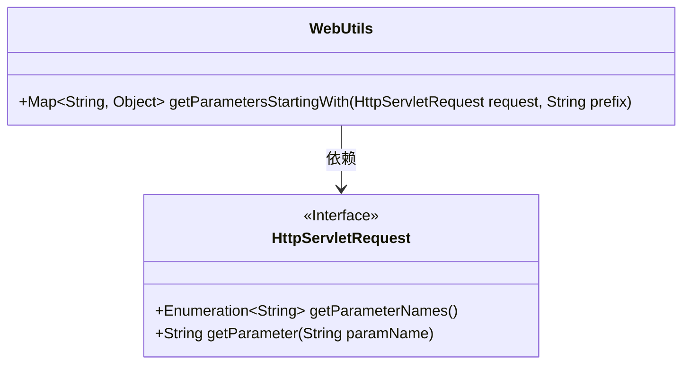
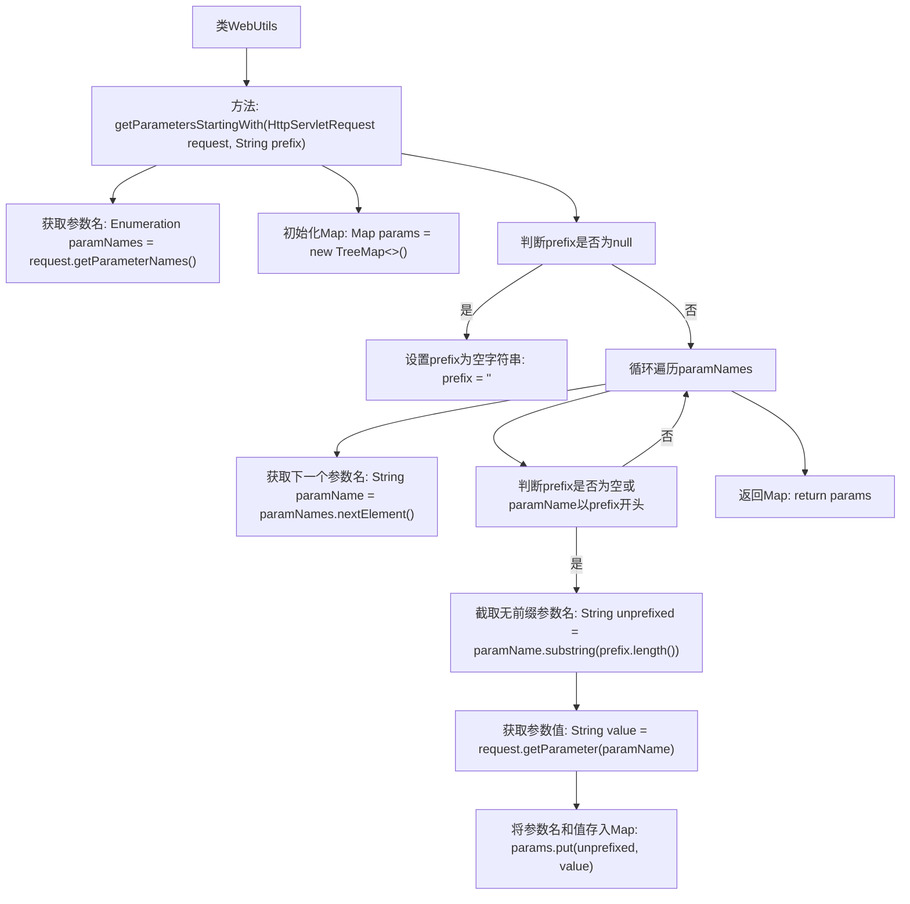

# 基础信息

|      |      |
|------|------|
| 名称 | WebUtils |
| 编码语言 | .java |
| 代码路径 | Minis/src/com/minis/util/WebUtils.java |
| 包名 | com.minis.util |
| 依赖项 | ['java.util.Enumeration', 'java.util.Map', 'java.util.TreeMap', 'javax.servlet.http.HttpServletRequest'] |
| 概述说明 | 从HttpServletRequest提取指定前缀参数并返回Map。 |

# 说明

该功能描述了一个方法，用于从HttpServletRequest对象中提取具有指定前缀的参数，并将这些参数以键值对的形式存储在Map中返回。具体步骤包括从请求对象中获取所有参数，筛选出以指定前缀开头的参数，去除前缀后作为Map的键，对应的参数值作为Map的值。最终返回包含这些键值对的Map，便于后续处理或使用。

# 类列表 Class Summary

| 名称   | 类型  | 说明 |
|-------|------|-------------|
| WebUtils | class | 从HttpServletRequest中获取指定前缀的参数并返回Map。 |

## 类 WebUtils

|      |      |
|------|------|
| 访问范围 | public |
| 类型 | class |
| 名称 | WebUtils |
| 说明 | 从HttpServletRequest中获取指定前缀的参数并返回Map。 |

### UML类图

**描述：**  
`WebUtils` 类包含一个静态方法 `getParametersStartingWith`，该方法从 `HttpServletRequest` 对象中获取所有参数，并筛选出以指定前缀开头的参数。筛选后的参数会被去除前缀，并存储在一个 `TreeMap` 中返回。`HttpServletRequest` 是一个接口，提供了获取请求参数的方法。`WebUtils` 类依赖于 `HttpServletRequest` 接口来获取请求参数。

### 内部方法调用关系图

这段代码定义了一个名为`WebUtils`的类，其中包含一个静态方法`getParametersStartingWith`。该方法从`HttpServletRequest`对象中获取所有参数名，并根据指定的前缀筛选出符合条件的参数，将其存储在一个`TreeMap`中返回。流程图展示了从获取参数名到最终返回处理后的`Map`的完整流程，包括参数名的遍历、前缀的判断、参数值的获取以及结果的存储。

### 字段列表 Field List

| 名称  | 类型  | 说明 |
|-------|-------|------|

### 方法列表 Method List

| 名称  | 类型  | 说明 |
|-------|-------|------|
| getParametersStartingWith | Map<String, Object> | 获取请求参数中以指定前缀开头的键值对。 |

