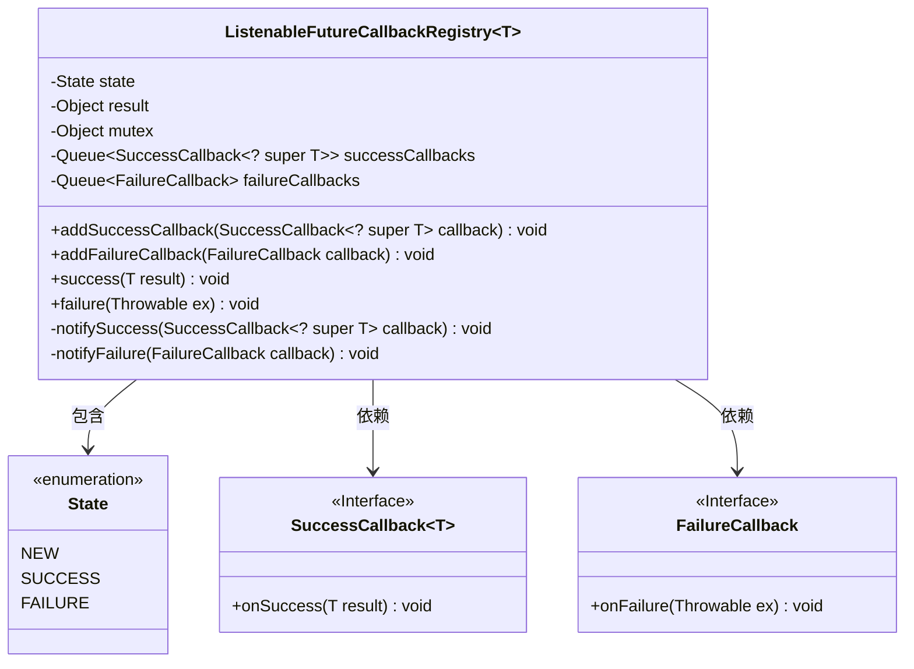
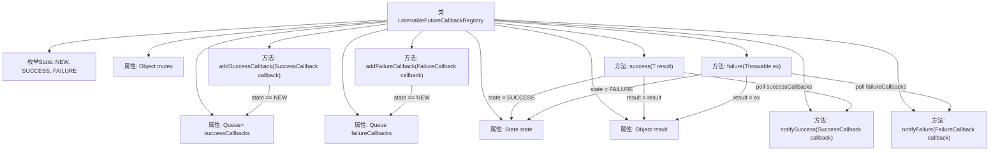

# 基础信息

|      |      |
|------|------|
| 名称 | ListenableFutureCallbackRegistry |
| 编码语言 | .java |
| 代码路径 | Minis/src/com/minis/util/concurrent/ListenableFutureCallbackRegistry.java |
| 包名 | com.minis.util.concurrent |
| 依赖项 | ['java.util.LinkedList', 'java.util.Queue'] |
| 概述说明 | ListenableFutureCallbackRegistry管理回调，支持同步添加和通知。 |

# 说明

ListenableFutureCallbackRegistry是一个用于管理成功和失败回调的机制，它支持同步添加回调和通知功能。该注册表能够有效地处理异步操作的结果，确保在操作完成时，相关的回调函数能够被及时触发和执行。通过同步添加回调，它保证了回调的注册过程不会受到并发问题的影响，从而提高了系统的稳定性和可靠性。同时，通知功能使得回调能够在适当的时候被调用，确保异步操作的结果能够正确地传递给相应的处理逻辑。

# 类列表 Class Summary

| 名称   | 类型  | 说明 |
|-------|------|-------------|
| ListenableFutureCallbackRegistry | class | ListenableFutureCallbackRegistry管理成功和失败回调，支持同步添加和通知。 |

## 类 ListenableFutureCallbackRegistry

|      |      |
|------|------|
| 访问范围 | public |
| 类型 | class |
| 名称 | ListenableFutureCallbackRegistry |
| 说明 | ListenableFutureCallbackRegistry管理成功和失败回调，支持同步添加和通知。 |

### UML类图

这段代码定义了一个`ListenableFutureCallbackRegistry`类，用于管理成功和失败的回调。该类包含两个队列，分别用于存储成功和失败的回调函数。通过`synchronized`块确保线程安全，并根据当前状态决定是否立即执行回调或将其加入队列。`State`枚举类用于表示当前的状态（`NEW`, `SUCCESS`, `FAILURE`）。`SuccessCallback`和`FailureCallback`是接口，分别定义了成功和失败时的回调方法。

### 内部方法调用关系图

这段代码定义了一个`ListenableFutureCallbackRegistry`类，用于管理成功和失败的回调函数。类中包含两个队列分别存储成功和失败的回调，并通过`success`和`failure`方法触发相应的回调。代码通过`mutex`对象进行同步，确保线程安全。流程图展示了类的结构及其方法之间的调用关系，帮助理解代码的执行流程。

### 字段列表 Field List

| 名称  | 类型  | 说明 |
|-------|-------|------|
| state = State.NEW | State | 私有状态变量初始化为NEW。 |
| failureCallbacks = new LinkedList<>() | Queue<FailureCallback> | 定义了一个私有的最终队列，用于存储失败回调。 |
| mutex = new Object() | Object | 定义私有互斥锁对象用于同步控制。 |
| result | Object | 定义私有对象变量result。 |
| successCallbacks = new LinkedList<>() | Queue<SuccessCallback<? super T>> | 私有队列存储成功回调，类型为泛型T的父类。 |

### 方法列表 Method List

| 名称  | 类型  | 说明 |
|-------|-------|------|
| notifyFailure | void | 调用失败回调并处理异常。 |
| notifySuccess | void | 方法notifySuccess调用回调函数onSuccess处理结果，捕获异常不处理。 |
| success | void | 方法success设置状态为SUCCESS，赋值结果，并通知所有成功回调。 |
| addFailureCallback | void | 方法 `addFailureCallback` 在同步块中添加失败回调，仅当状态为 `NEW` 时执行。 |
| addSuccessCallback | void | 方法`addSuccessCallback`在同步块中根据状态`NEW`添加成功回调。 |
| failure | void | 方法failure同步处理异常，更新状态为FAILURE并通知所有回调。 |

