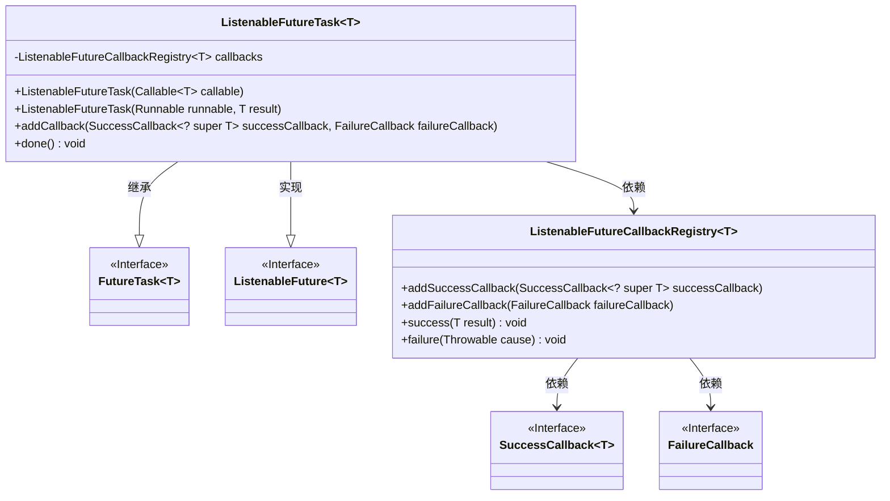
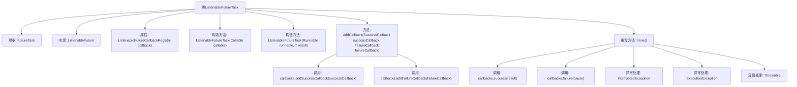

# 基础信息

|      |      |
|------|------|
| 名称 | ListenableFutureTask |
| 编码语言 | .java |
| 代码路径 | Minis/src/com/minis/util/concurrent/ListenableFutureTask.java |
| 包名 | com.minis.util.concurrent |
| 依赖项 | ['java.util.concurrent.Callable', 'java.util.concurrent.ExecutionException', 'java.util.concurrent.FutureTask'] |
| 概述说明 | ListenableFutureTask继承FutureTask，实现ListenableFuture，支持成功和失败回调。 |

# 说明

ListenableFutureTask继承自FutureTask，并实现了ListenableFuture接口。它扩展了FutureTask的功能，支持在任务成功或失败时执行回调操作。这种设计使得开发者能够更灵活地处理异步任务的结果，通过注册回调函数来响应任务的完成状态，从而增强了异步编程的便利性和可控性。

# 类列表 Class Summary

| 名称   | 类型  | 说明 |
|-------|------|-------------|
| ListenableFutureTask | class | ListenableFutureTask继承FutureTask，实现ListenableFuture，支持成功和失败回调。 |

## 类 ListenableFutureTask

|      |      |
|------|------|
| 访问范围 | public |
| 类型 | class |
| 名称 | ListenableFutureTask |
| 说明 | ListenableFutureTask继承FutureTask，实现ListenableFuture，支持成功和失败回调。 |

### UML类图

这段代码定义了一个`ListenableFutureTask`类，它继承自`FutureTask`并实现了`ListenableFuture`接口。该类允许在任务完成时注册成功和失败的回调函数。`ListenableFutureCallbackRegistry`类用于管理这些回调函数，并在任务完成时调用相应的回调。`SuccessCallback`和`FailureCallback`是接口，分别用于处理任务成功和失败的情况。

### 内部方法调用关系图

这段代码定义了一个`ListenableFutureTask`类，继承自`FutureTask`并实现了`ListenableFuture`接口。该类通过`ListenableFutureCallbackRegistry`管理回调函数，允许添加成功和失败回调。`done`方法在任务完成时被调用，根据任务执行结果触发相应的回调。异常处理机制确保在任务执行过程中捕获并处理中断、执行异常和其他异常情况。

### 字段列表 Field List

| 名称  | 类型  | 说明 |
|-------|-------|------|
| callbacks = new ListenableFutureCallbackRegistry<>() | ListenableFutureCallbackRegistry<T> | 私有ListenableFutureCallbackRegistry实例用于管理回调。 |

### 方法列表 Method List

| 名称  | 类型  | 说明 |
|-------|-------|------|
| addCallback | void | 添加成功和失败回调函数到回调列表。 |
| done | void | 方法done处理异步任务结果，成功调用回调，失败处理异常并回调。 |

