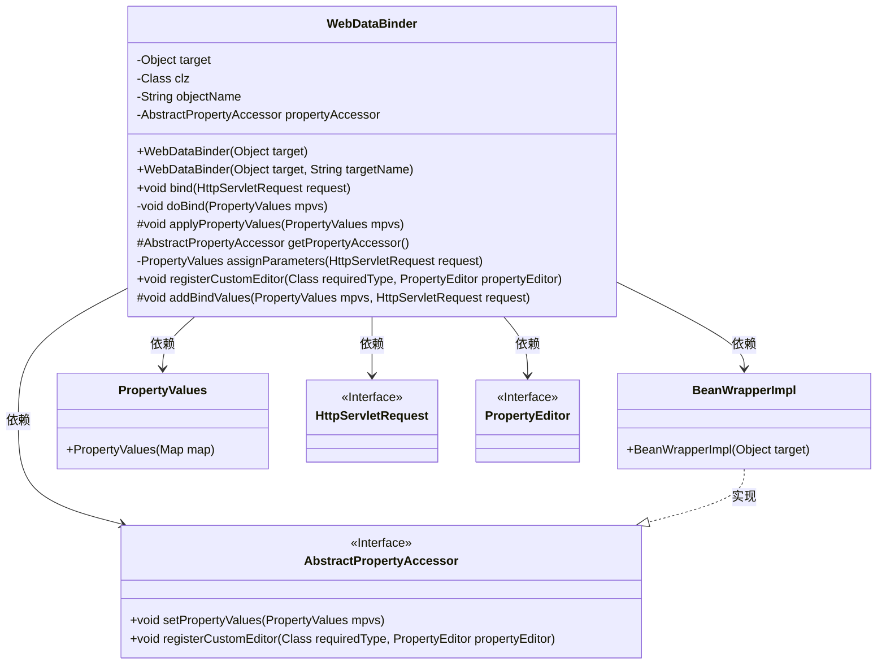

# 基础信息

|      |      |
|------|------|
| 名称 | WebDataBinder |
| 编码语言 | .java |
| 代码路径 | Minis/src/com/minis/web/bind/WebDataBinder.java |
| 包名 | com.minis.web.bind |
| 依赖项 | ['java.util.Map', 'javax.servlet.http.HttpServletRequest', 'com.minis.beans.AbstractPropertyAccessor', 'com.minis.beans.BeanWrapperImpl', 'com.minis.beans.PropertyEditor', 'com.minis.beans.PropertyValues', 'com.minis.util.WebUtils'] |
| 概述说明 | WebDataBinder类用于绑定HTTP请求参数到目标对象，支持自定义编辑器和属性访问。 |

# 说明

WebDataBinder类是一个用于将HTTP请求参数绑定到目标对象的工具。它支持自定义属性编辑器和属性访问，提供了灵活的参数处理机制，使得开发者能够根据需要定制参数的绑定和转换过程，从而更高效地处理HTTP请求数据。

# 类列表 Class Summary

| 名称   | 类型  | 说明 |
|-------|------|-------------|
| WebDataBinder | class | WebDataBinder类用于绑定HTTP请求参数到目标对象，支持自定义属性编辑器和属性访问。 |

## 类 WebDataBinder

|      |      |
|------|------|
| 访问范围 | public |
| 类型 | class |
| 名称 | WebDataBinder |
| 说明 | WebDataBinder类用于绑定HTTP请求参数到目标对象，支持自定义属性编辑器和属性访问。 |

### UML类图

类图描述：
`WebDataBinder` 类用于绑定HTTP请求参数到目标对象。它包含一个目标对象、对象名称、类类型和一个属性访问器。通过`bind`方法，它将请求参数赋值给目标对象的属性。`AbstractPropertyAccessor` 是一个接口，定义了设置属性值和注册自定义编辑器的方法，`BeanWrapperImpl` 是其实现类。`PropertyValues` 类用于封装属性值，`HttpServletRequest` 和 `PropertyEditor` 是接口，分别表示HTTP请求和属性编辑器。

### 内部方法调用关系图

```mermaid
graph TD
    A["类WebDataBinder"]
    B["属性: Object target"]
    C["属性: Class<?> clz"]
    D["属性: String objectName"]
    E["属性: AbstractPropertyAccessor propertyAccessor"]
    F["构造方法: WebDataBinder(Object target)"]
    G["构造方法: WebDataBinder(Object target, String targetName)"]
    H["方法: void bind(HttpServletRequest request)"]
    I["方法: void doBind(PropertyValues mpvs)"]
    J["方法: void applyPropertyValues(PropertyValues mpvs)"]
    K["方法: AbstractPropertyAccessor getPropertyAccessor()"]
    L["方法: PropertyValues assignParameters(HttpServletRequest request)"]
    M["方法: void registerCustomEditor(Class<?> requiredType, PropertyEditor propertyEditor)"]
    N["方法: void addBindValues(PropertyValues mpvs, HttpServletRequest request)"]
    O["调用: assignParameters(request)"]
    P["调用: addBindValues(mpvs, request)"]
    Q["调用: doBind(mpvs)"]
    R["调用: applyPropertyValues(mpvs)"]
    S["调用: getPropertyAccessor().setPropertyValues(mpvs)"]
    T["调用: WebUtils.getParametersStartingWith(request, '')"]
    U["调用: getPropertyAccessor().registerCustomEditor(requiredType, propertyEditor)"]

    A --> B
    A --> C
    A --> D
    A --> E
    A --> F
    A --> G
    A --> H
    A --> I
    A --> J
    A --> K
    A --> L
    A --> M
    A --> N
    H --> O
    H --> P
    H --> Q
    I --> R
    J --> S
    L --> T
    M --> U
```

这段代码定义了一个`WebDataBinder`类，用于绑定HTTP请求参数到目标对象。类中包含多个属性和方法，主要用于处理请求参数并将其应用到目标对象的属性中。流程图展示了类的结构及其方法之间的调用关系，从构造方法到参数绑定和属性应用的完整流程。

### 字段列表 Field List

| 名称  | 类型  | 说明 |
|-------|-------|------|
| target | Object | 定义私有对象变量target。 |
| propertyAccessor | AbstractPropertyAccessor | 属性访问器抽象类实例。 |
| objectName | String | 声明一个私有字符串变量objectName。 |
| clz | Class<?> | 私有类变量clz，类型为Class<?>。 |

### 方法列表 Method List

| 名称  | 类型  | 说明 |
|-------|-------|------|
| getPropertyAccessor | AbstractPropertyAccessor | 该方法返回当前对象的属性访问器实例。 |
| applyPropertyValues | void | 该方法通过属性访问器设置属性值。 |
| registerCustomEditor | void | 注册自定义属性编辑器，用于特定类型。 |
| doBind | void | 私有方法doBind调用applyPropertyValues处理属性值。 |
| bind | void | 绑定HTTP请求参数到属性值并执行绑定操作。 |
| addBindValues | void | 该方法用于将HTTP请求中的值绑定到属性值对象。 |
| assignParameters | PropertyValues | 方法从HTTP请求中提取参数并返回属性值对象。 |

