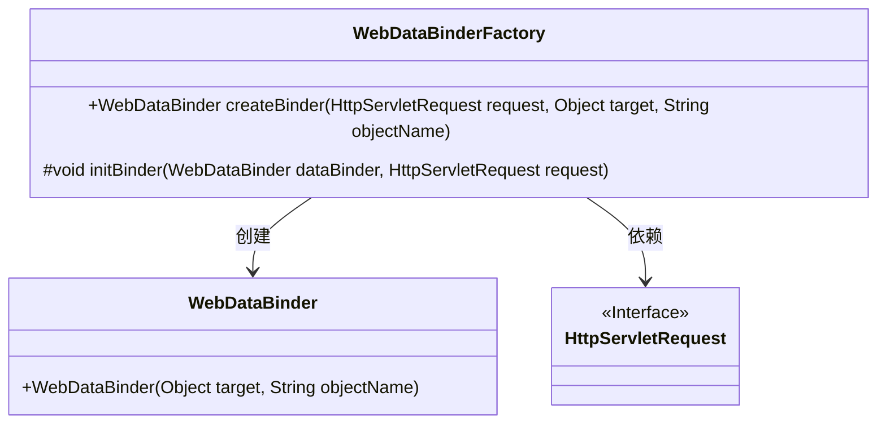
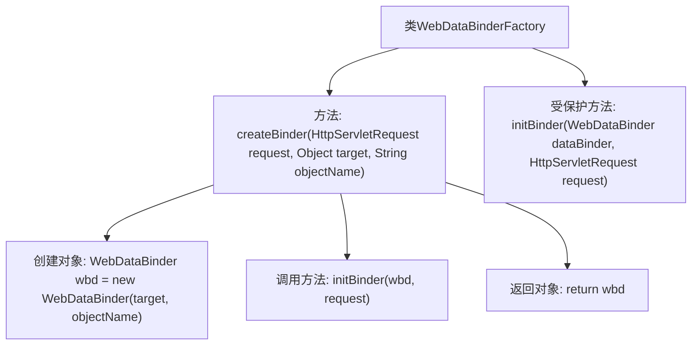

# 基础信息

|      |      |
|------|------|
| 名称 | WebDataBinderFactory |
| 编码语言 | .java |
| 代码路径 | Minis/src/com/minis/web/bind/support/WebDataBinderFactory.java |
| 包名 | com.minis.web.bind.support |
| 依赖项 | ['javax.servlet.http.HttpServletRequest', 'com.minis.web.bind.WebDataBinder'] |
| 概述说明 | WebDataBinderFactory类用于创建和初始化WebDataBinder对象。 |

# 说明

WebDataBinderFactory类的主要功能是创建并初始化WebDataBinder对象。WebDataBinder对象用于在Spring框架中处理数据绑定和验证操作。通过WebDataBinderFactory，开发者可以便捷地获取配置好的WebDataBinder实例，确保数据绑定过程的高效性和准确性。

# 类列表 Class Summary

| 名称   | 类型  | 说明 |
|-------|------|-------------|
| WebDataBinderFactory | class | WebDataBinderFactory类创建并初始化WebDataBinder对象。 |

## 类 WebDataBinderFactory

|      |      |
|------|------|
| 访问范围 | public |
| 类型 | class |
| 名称 | WebDataBinderFactory |
| 说明 | WebDataBinderFactory类创建并初始化WebDataBinder对象。 |

### UML类图

**描述：**  
`WebDataBinderFactory` 类负责创建 `WebDataBinder` 对象，并通过 `initBinder` 方法对其进行初始化。`WebDataBinder` 类用于绑定目标对象和对象名称。`HttpServletRequest` 是一个接口，用于处理HTTP请求。`WebDataBinderFactory` 依赖于 `HttpServletRequest` 来执行初始化操作。

### 内部方法调用关系图

这段代码展示了`WebDataBinderFactory`类的工作流程。`createBinder`方法首先创建一个`WebDataBinder`对象，然后调用`initBinder`方法对其进行初始化，最后返回该对象。`initBinder`方法是一个受保护的空方法，可以在子类中重写以实现自定义的初始化逻辑。整个过程简洁明了，确保了`WebDataBinder`对象的正确创建和初始化。

### 字段列表 Field List

| 名称  | 类型  | 说明 |
|-------|-------|------|

### 方法列表 Method List

| 名称  | 类型  | 说明 |
|-------|-------|------|
| initBinder | void | 初始化WebDataBinder以处理HTTP请求。 |
| createBinder | WebDataBinder | 创建并初始化WebDataBinder，绑定目标对象与请求。 |

