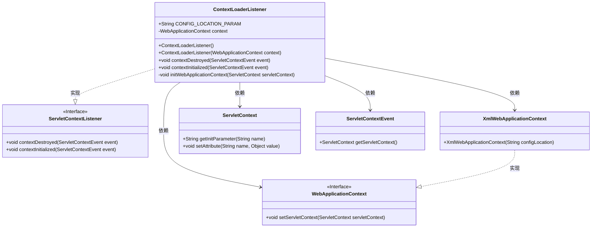

# 基础信息

|      |      |
|------|------|
| 名称 | ContextLoaderListener |
| 编码语言 | .java |
| 代码路径 | Minis/src/com/minis/web/context/ContextLoaderListener.java |
| 包名 | com.minis.web.context |
| 依赖项 | ['javax.servlet.ServletContext', 'javax.servlet.ServletContextEvent', 'javax.servlet.ServletContextListener', 'com.minis.web.context.support.XmlWebApplicationContext'] |
| 概述说明 | ContextLoaderListener初始化Web应用上下文并加载XML配置。 |

# 说明

ContextLoaderListener用于初始化Web应用上下文，它通过读取XML配置文件来加载应用上下文，并将该上下文设置为ServletContext的属性，以便在整个Web应用中共享和使用。这一过程确保了应用上下文的正确加载和配置，为后续的Web请求处理提供了必要的环境支持。

# 类列表 Class Summary

| 名称   | 类型  | 说明 |
|-------|------|-------------|
| ContextLoaderListener | class | ContextLoaderListener初始化Web应用上下文，通过XML配置加载并设置ServletContext属性。 |

## 类 ContextLoaderListener

|      |      |
|------|------|
| 访问范围 | public |
| 类型 | class |
| 名称 | ContextLoaderListener |
| 说明 | ContextLoaderListener初始化Web应用上下文，通过XML配置加载并设置ServletContext属性。 |

### UML类图

这段代码定义了一个 `ContextLoaderListener` 类，它实现了 `ServletContextListener` 接口，用于监听 Servlet 上下文的初始化和销毁事件。在 `contextInitialized` 方法中，它通过 `initWebApplicationContext` 方法初始化了一个 `WebApplicationContext`，并将其设置为 Servlet 上下文的属性。`XmlWebApplicationContext` 是 `WebApplicationContext` 的一个具体实现，用于加载 XML 配置的上下文。

### 内部方法调用关系图

这段代码定义了一个`ContextLoaderListener`类，实现了`ServletContextListener`接口，用于在Web应用启动时初始化Spring的`WebApplicationContext`。`contextInitialized`方法会在Servlet上下文初始化时被调用，进而调用`initWebApplicationContext`方法，该方法从Servlet上下文中获取配置参数，创建并设置`WebApplicationContext`对象，并将其存储在Servlet上下文中。整个流程确保了Spring应用上下文的正确初始化和配置。

### 字段列表 Field List

| 名称  | 类型  | 说明 |
|-------|-------|------|
| CONFIG_LOCATION_PARAM = "contextConfigLocation" | String | 定义配置位置参数的静态常量字符串。 |
| context | WebApplicationContext | 私有Web应用上下文变量声明。 |

### 方法列表 Method List

| 名称  | 类型  | 说明 |
|-------|-------|------|
| initWebApplicationContext | void | 初始化Web应用上下文，设置ServletContext并存储为根上下文。 |
| contextInitialized | void | 重写ServletContextEvent初始化方法以初始化Web应用上下文。 |
| contextDestroyed | void | 重写ServletContextEvent销毁方法，无具体实现。 |

