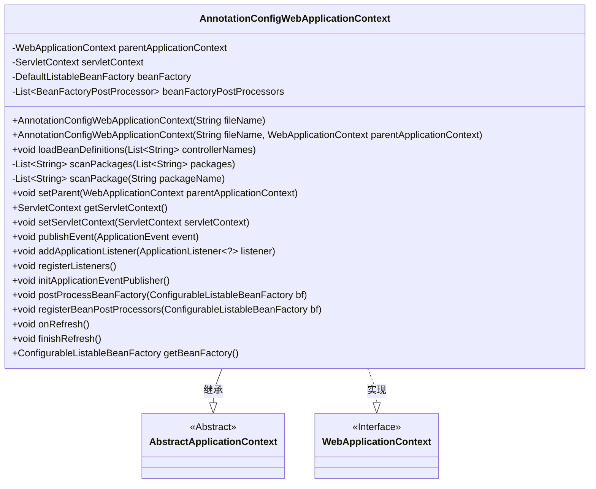

# 基础信息

|      |      |
|------|------|
| 名称 | AnnotationConfigWebApplicationContext |
| 编码语言 | .java |
| 代码路径 | Minis/src/com/minis/web/context/support/AnnotationConfigWebApplicationContext.java |
| 包名 | com.minis.web.context.support |
| 依赖项 | ['java.io.File', 'java.net.MalformedURLException', 'java.net.URL', 'java.util.ArrayList', 'java.util.List', 'javax.servlet.ServletContext', 'com.minis.aop.framework.autoproxy.BeanNameAutoProxyCreator', 'com.minis.beans.BeansException', 'com.minis.beans.factory.annotation.AutowiredAnnotationBeanPostProcessor', 'com.minis.beans.factory.config.BeanDefinition', 'com.minis.beans.factory.config.BeanFactoryPostProcessor', 'com.minis.beans.factory.config.BeanPostProcessor', 'com.minis.beans.factory.config.ConfigurableListableBeanFactory', 'com.minis.beans.factory.support.DefaultListableBeanFactory', 'com.minis.context.AbstractApplicationContext', 'com.minis.context.ApplicationEvent', 'com.minis.context.ApplicationEventPublisher', 'com.minis.context.ApplicationListener', 'com.minis.context.ContextRefreshedEvent', 'com.minis.context.SimpleApplicationEventPublisher', 'com.minis.web.context.WebApplicationContext'] |
| 概述说明 | AnnotationConfigWebApplicationContext继承AbstractApplicationContext，实现WebApplicationContext，用于加载Bean定义和刷新上下文。 |

# 说明

AnnotationConfigWebApplicationContext类继承自AbstractApplicationContext，并实现了WebApplicationContext接口。该类主要用于加载Bean定义和刷新应用程序上下文，适用于基于注解配置的Web应用程序。

# 类列表 Class Summary

| 名称   | 类型  | 说明 |
|-------|------|-------------|
| AnnotationConfigWebApplicationContext | class | AnnotationConfigWebApplicationContext类继承AbstractApplicationContext，实现WebApplicationContext，用于加载Bean定义和刷新上下文。 |

## 类 AnnotationConfigWebApplicationContext

|      |      |
|------|------|
| 访问范围 | public |
| 类型 | class |
| 名称 | AnnotationConfigWebApplicationContext |
| 说明 | AnnotationConfigWebApplicationContext类继承AbstractApplicationContext，实现WebApplicationContext，用于加载Bean定义和刷新上下文。 |

### UML类图

这段代码定义了一个 `AnnotationConfigWebApplicationContext` 类，它继承自 `AbstractApplicationContext` 并实现了 `WebApplicationContext` 接口。该类主要用于在Web应用中加载和管理Spring的Bean定义。它通过扫描指定的包路径来获取控制器类名，并将这些类注册到Bean工厂中。代码中还包含了一系列与Bean工厂、事件发布、监听器注册相关的方法，用于管理Spring应用上下文的生命周期和事件处理。

### 内部方法调用关系图

```mermaid
graph TD
    A["类AnnotationConfigWebApplicationContext"]
    B["属性: WebApplicationContext parentApplicationContext"]
    C["属性: ServletContext servletContext"]
    D["属性: DefaultListableBeanFactory beanFactory"]
    E["属性: List<BeanFactoryPostProcessor> beanFactoryPostProcessors"]
    F["构造方法: AnnotationConfigWebApplicationContext(String fileName)"]
    G["构造方法: AnnotationConfigWebApplicationContext(String fileName, WebApplicationContext parentApplicationContext)"]
    H["方法: loadBeanDefinitions(List<String> controllerNames)"]
    I["方法: List<String> scanPackages(List<String> packages)"]
    J["方法: List<String> scanPackage(String packageName)"]
    K["方法: setParent(WebApplicationContext parentApplicationContext)"]
    L["方法: getServletContext()"]
    M["方法: setServletContext(ServletContext servletContext)"]
    N["方法: publishEvent(ApplicationEvent event)"]
    O["方法: addApplicationListener(ApplicationListener<?> listener)"]
    P["方法: registerListeners()"]
    Q["方法: initApplicationEventPublisher()"]
    R["方法: postProcessBeanFactory(ConfigurableListableBeanFactory bf)"]
    S["方法: registerBeanPostProcessors(ConfigurableListableBeanFactory bf)"]
    T["方法: onRefresh()"]
    U["方法: finishRefresh()"]
    V["方法: getBeanFactory()"]

    A --> B
    A --> C
    A --> D
    A --> E
    A --> F
    A --> G
    A --> H
    A --> I
    A --> J
    A --> K
    A --> L
    A --> M
    A --> N
    A --> O
    A --> P
    A --> Q
    A --> R
    A --> S
    A --> T
    A --> U
    A --> V
```

这段代码定义了一个`AnnotationConfigWebApplicationContext`类，继承自`AbstractApplicationContext`并实现了`WebApplicationContext`接口。该类主要用于管理Spring应用上下文，包括加载Bean定义、扫描包、注册监听器、发布事件等功能。代码通过构造方法初始化上下文，并通过多个方法处理Bean工厂的配置和刷新操作。流程图展示了类的属性、构造方法和主要方法的调用关系。

### 字段列表 Field List

| 名称  | 类型  | 说明 |
|-------|-------|------|
| parentApplicationContext | WebApplicationContext | 私有父应用上下文变量。 |
| servletContext | ServletContext | ServletContext私有变量声明。 |
| beanFactoryPostProcessors =			new ArrayList<BeanFactoryPostProcessor>() | List<BeanFactoryPostProcessor> | 初始化BeanFactoryPostProcessor列表。 |
| beanFactory | DefaultListableBeanFactory | BeanFactory实例化用于管理Spring框架中的Bean对象。 |

### 方法列表 Method List

| 名称  | 类型  | 说明 |
|-------|-------|------|
| setParent | void | 设置父应用上下文并更新Bean工厂父级。 |
| onRefresh | void | 重写onRefresh方法，调用beanFactory的refresh方法。 |
| getBeanFactory | ConfigurableListableBeanFactory | 重写方法，返回可配置的Bean工厂实例。 |
| initApplicationEventPublisher | void | 初始化应用事件发布器，设置为简单应用事件发布器。 |
| publishEvent | void | 重写publishEvent方法，调用应用事件发布器发布事件。 |
| getServletContext | ServletContext | 重写getServletContext方法，返回当前servletContext对象。 |
| scanPackage | List<String> | 扫描指定包下的类文件，返回类名列表。 |
| loadBeanDefinitions | void | 遍历控制器列表，注册每个控制器的Bean定义到Bean工厂。 |
| setServletContext | void | 重写setServletContext方法，将servletContext赋值给成员变量。 |
| addApplicationListener | void | 重写方法，将应用监听器添加到事件发布器中。 |
| finishRefresh | void | 重写finishRefresh方法，发布ContextRefreshedEvent事件。 |
| postProcessBeanFactory | void | 重写postProcessBeanFactory方法，处理BeanFactory配置。 |
| registerBeanPostProcessors | void | 注册BeanPostProcessor，处理Autowired注解，捕获异常。 |
| registerListeners | void | 该方法注册监听器，遍历所有Bean，若为ApplicationListener则添加到事件发布器。 |
| scanPackages | List<String> | 扫描指定包并返回控制器名称列表。 |

