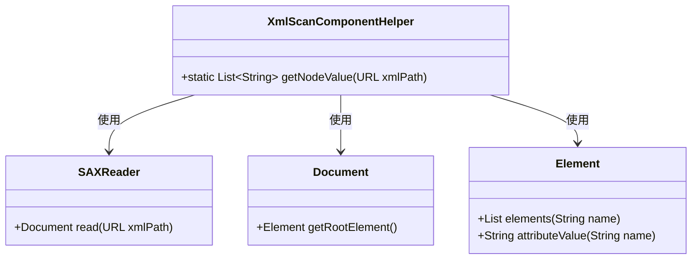
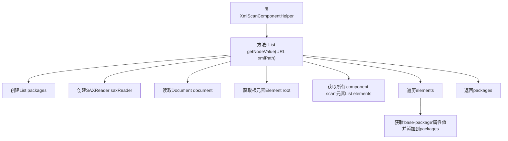

# 基础信息

|      |      |
|------|------|
| 名称 | XmlScanComponentHelper |
| 编码语言 | .java |
| 代码路径 | Minis/src/com/minis/web/context/support/XmlScanComponentHelper.java |
| 包名 | com.minis.web.context.support |
| 依赖项 | ['java.net.MalformedURLException', 'java.net.URL', 'java.util.ArrayList', 'java.util.HashMap', 'java.util.Iterator', 'java.util.List', 'java.util.Map', 'org.dom4j.Document', 'org.dom4j.DocumentException', 'org.dom4j.Element', 'org.dom4j.Node', 'org.dom4j.io.SAXReader'] |
| 概述说明 | XmlScanComponentHelper类使用SAXReader解析XML，提取component-scan节点的base-package属性值。 |

# 说明

XmlScanComponentHelper类利用SAXReader工具解析XML文件，主要目的是提取component-scan节点中的base-package属性值。该过程涉及读取XML结构，定位特定节点，并获取其属性信息，以便后续处理或配置使用。

# 类列表 Class Summary

| 名称   | 类型  | 说明 |
|-------|------|-------------|
| XmlScanComponentHelper | class | XmlScanComponentHelper类通过SAXReader解析XML，获取component-scan节点的base-package属性值。 |

## 类 XmlScanComponentHelper

|      |      |
|------|------|
| 访问范围 | public |
| 类型 | class |
| 名称 | XmlScanComponentHelper |
| 说明 | XmlScanComponentHelper类通过SAXReader解析XML，获取component-scan节点的base-package属性值。 |

### UML类图

这段代码定义了一个 `XmlScanComponentHelper` 类，其中包含一个静态方法 `getNodeValue`，用于从指定的 XML 文件中提取 `component-scan` 节点的 `base-package` 属性值，并将其作为字符串列表返回。代码依赖于 `SAXReader` 类来解析 XML 文件，并通过 `Document` 和 `Element` 类来遍历和提取 XML 节点信息。

### 内部方法调用关系图

这段代码定义了一个名为 `XmlScanComponentHelper` 的类，其中包含一个静态方法 `getNodeValue`，用于从指定的 XML 文件中提取所有 `component-scan` 元素的 `base-package` 属性值，并将这些值存储在一个 `List<String>` 中返回。代码首先使用 `SAXReader` 读取 XML 文件，然后获取根元素，接着遍历所有 `component-scan` 元素并提取其 `base-package` 属性值，最后将这些值添加到 `packages` 列表中并返回。

### 字段列表 Field List

| 名称  | 类型  | 说明 |
|-------|-------|------|

### 方法列表 Method List

| 名称  | 类型  | 说明 |
|-------|-------|------|
| getNodeValue | List<String> | Java方法从XML读取组件扫描包路径。 |

