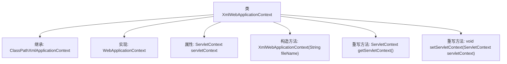

# 基础信息

|      |      |
|------|------|
| 名称 | XmlWebApplicationContext |
| 编码语言 | .java |
| 代码路径 | Minis/src/com/minis/web/context/support/XmlWebApplicationContext.java |
| 包名 | com.minis.web.context.support |
| 依赖项 | ['javax.servlet.ServletContext', 'com.minis.context.ClassPathXmlApplicationContext', 'com.minis.web.context.WebApplicationContext'] |
| 概述说明 | XmlWebApplicationContext继承ClassPathXmlApplicationContext，实现WebApplicationContext，管理ServletContext。 |

# 说明

XmlWebApplicationContext继承自ClassPathXmlApplicationContext，同时实现了WebApplicationContext接口，主要用于管理ServletContext。它结合了类路径下的XML配置文件和Web应用上下文的功能，适合在Web环境中使用，能够有效处理与ServletContext相关的资源和管理任务。

# 类列表 Class Summary

| 名称   | 类型  | 说明 |
|-------|------|-------------|
| XmlWebApplicationContext | class | XmlWebApplicationContext继承ClassPathXmlApplicationContext，实现WebApplicationContext，管理ServletContext。 |


## 类 XmlWebApplicationContext

|      |      |
|------|------|
| 访问范围 | public |
| 类型 | class |
| 名称 | XmlWebApplicationContext |
| 说明 | XmlWebApplicationContext继承ClassPathXmlApplicationContext，实现WebApplicationContext，管理ServletContext。 |


### UML类图

```mermaid
classDiagram
    class ClassPathXmlApplicationContext {
        // 父类，未展示具体成员
    }
    class XmlWebApplicationContext {
        -ServletContext servletContext
        +XmlWebApplicationContext(String fileName)
        +ServletContext getServletContext()
        +void setServletContext(ServletContext servletContext)
    }
    <<Interface>> WebApplicationContext {
        // 接口，未展示具体成员
    }
    ClassPathXmlApplicationContext <|-- XmlWebApplicationContext
    WebApplicationContext <|.. XmlWebApplicationContext
```

这段代码定义了一个 `XmlWebApplicationContext` 类，它继承自 `ClassPathXmlApplicationContext` 并实现了 `WebApplicationContext` 接口。`XmlWebApplicationContext` 类包含一个私有的 `ServletContext` 成员变量，并提供了构造函数以及获取和设置 `ServletContext` 的方法。类图展示了 `XmlWebApplicationContext` 类与 `ClassPathXmlApplicationContext` 和 `WebApplicationContext` 之间的继承和实现关系。


### 内部方法调用关系图



这段代码定义了一个名为`XmlWebApplicationContext`的类，它继承自`ClassPathXmlApplicationContext`并实现了`WebApplicationContext`接口。类中包含一个`ServletContext`类型的属性`servletContext`，并通过构造方法`XmlWebApplicationContext(String fileName)`初始化父类。此外，类中还重写了`getServletContext()`和`setServletContext(ServletContext servletContext)`方法，用于获取和设置`servletContext`属性。该类的设计主要用于在Web应用程序中管理XML配置文件的加载和Servlet上下文的操作。

### 字段列表 Field List

| 名称  | 类型  | 说明 |
|-------|-------|------|
| servletContext | ServletContext | ServletContext私有变量声明。 |

### 方法列表 Method List

| 名称  | 类型  | 说明 |
|-------|-------|------|
| getServletContext | ServletContext | 重写ServletContext方法，返回当前servletContext对象。 |
| setServletContext | void | 重写setServletContext方法，将servletContext赋值给当前对象。 |


