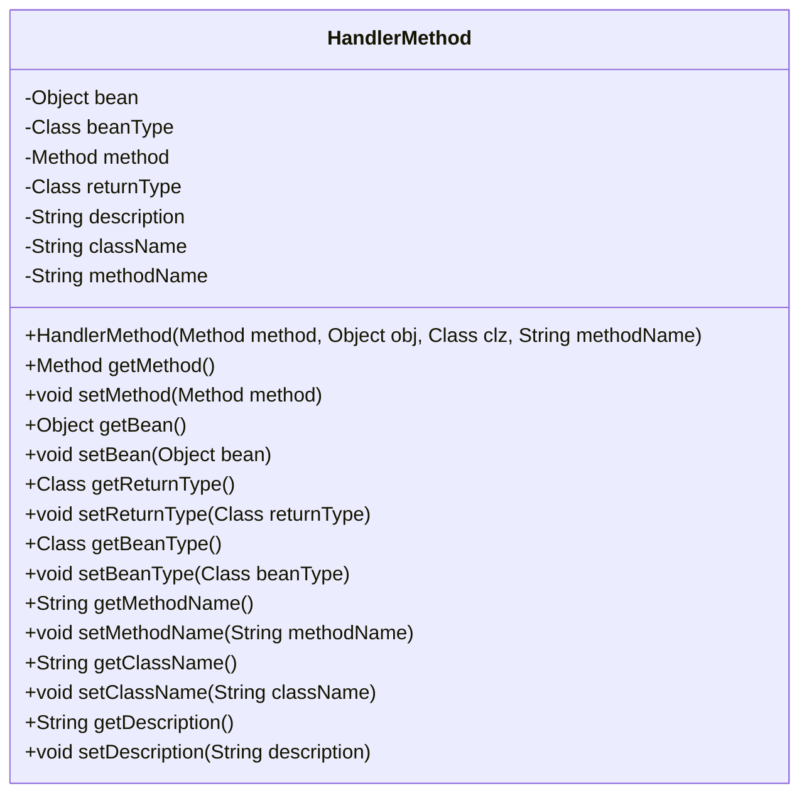

# 基础信息

|      |      |
|------|------|
| 名称 | HandlerMethod |
| 编码语言 | .java |
| 代码路径 | Minis/src/com/minis/web/method/HandlerMethod.java |
| 包名 | com.minis.web.method |
| 依赖项 | ['java.lang.reflect.Method'] |
| 概述说明 | HandlerMethod类封装方法、对象、类名，提供getter和setter方法。 |

# 说明

HandlerMethod类是一个封装了方法、对象和类名等信息的类，它提供了相应的getter和setter方法，用于获取和设置这些封装的信息。通过这种封装，HandlerMethod类能够有效地管理和操作与特定方法相关的数据，为调用和处理方法提供了便利。

# 类列表 Class Summary

| 名称   | 类型  | 说明 |
|-------|------|-------------|
| HandlerMethod | class | HandlerMethod类封装了方法、对象、类名等信息，提供getter和setter方法。 |

## 类 HandlerMethod

|      |      |
|------|------|
| 访问范围 | public |
| 类型 | class |
| 名称 | HandlerMethod |
| 说明 | HandlerMethod类封装了方法、对象、类名等信息，提供getter和setter方法。 |

### UML类图

**描述：**  
`HandlerMethod` 类用于封装与处理方法相关的信息，包括方法本身、所属对象、对象类型、方法名等。该类提供了多个 getter 和 setter 方法，用于获取和设置这些属性。通过构造函数 `HandlerMethod`，可以初始化方法、对象、对象类型和方法名。该类主要用于在运行时动态处理和管理方法调用，适用于需要反射或动态方法调用的场景。

### 内部方法调用关系图

```mermaid
graph TD
    A["类HandlerMethod"]
    B["属性: Object bean"]
    C["属性: Class<?> beanType"]
    D["属性: Method method"]
    E["属性: Class<?> returnType"]
    F["属性: String description"]
    G["属性: String className"]
    H["属性: String methodName"]
    I["构造方法: HandlerMethod(Method method, Object obj, Class<?> clz, String methodName)"]
    J["方法: Method getMethod()"]
    K["方法: void setMethod(Method method)"]
    L["方法: Object getBean()"]
    M["方法: void setBean(Object bean)"]
    N["方法: Class<?> getReturnType()"]
    O["方法: void setReturnType(Class<?> returnType)"]
    P["方法: Class<?> getBeanType()"]
    Q["方法: void setBeanType(Class<?> beanType)"]
    R["方法: String getMethodName()"]
    S["方法: void setMethodName(String methodName)"]
    T["方法: String getClassName()"]
    U["方法: void setClassName(String className)"]
    V["方法: String getDescription()"]
    W["方法: void setDescription(String description)"]

    A --> B
    A --> C
    A --> D
    A --> E
    A --> F
    A --> G
    A --> H
    A --> I
    A --> J
    A --> K
    A --> L
    A --> M
    A --> N
    A --> O
    A --> P
    A --> Q
    A --> R
    A --> S
    A --> T
    A --> U
    A --> V
    A --> W
```

这段代码定义了一个名为`HandlerMethod`的类，包含多个属性和方法。属性包括`bean`、`beanType`、`method`、`returnType`、`description`、`className`和`methodName`。类提供了这些属性的getter和setter方法，以及一个构造方法用于初始化部分属性。该类主要用于封装与处理方法相关的信息，如方法对象、所属类的类型、方法名等。

### 字段列表 Field List

| 名称  | 类型  | 说明 |
|-------|-------|------|
| methodName | String | 私有字符串变量 methodName。 |
| method | Method | 私有方法实例变量声明。 |
| className | String | 声明了一个私有字符串类型的类名变量。 |
| bean | Object | 私有对象bean的声明。 |
| beanType | Class<?> | 私有类变量，类型为泛型Class<?>，用于存储Bean类型。 |
| returnType | Class<?> | 私有类变量，类型为泛型类。 |
| description | String | 私有字符串类型变量描述。 |

### 方法列表 Method List

| 名称  | 类型  | 说明 |
|-------|-------|------|
| setDescription | void | 设置描述信息的公共方法。 |
| setReturnType | void | 设置方法返回类型为指定类。 |
| getClassName | String | 获取类名的方法。 |
| getMethod | Method | 获取方法的公共访问器。 |
| setBeanType | void | 设置Bean类型的Java方法。 |
| getBean | Object | 该方法返回一个对象的bean实例。 |
| getDescription | String | 该方法返回描述字符串。 |
| getReturnType | Class<?> | 获取方法返回类型的Class对象。 |
| setMethodName | void | 设置方法名称的公共方法。 |
| setMethod | void | 设置方法属性，将传入的方法赋值给当前对象的方法属性。 |
| getBeanType | Class<?> | 获取Bean类型的公共方法。 |
| getMethodName | String | 该方法返回名为methodName的字符串。 |
| setBean | void | 设置对象的bean属性。 |
| setClassName | void | 该方法用于设置类名，将传入的字符串赋值给类的成员变量。 |

