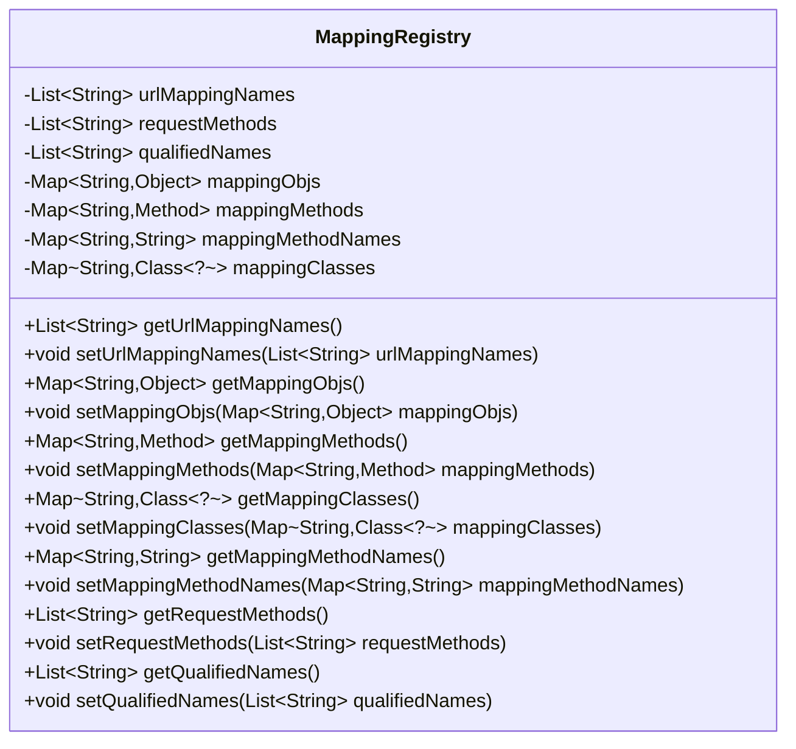

# 基础信息

|      |      |
|------|------|
| 名称 | MappingRegistry |
| 编码语言 | .java |
| 代码路径 | Minis/src/com/minis/web/method/annotation/MappingRegistry.java |
| 包名 | com.minis.web.method.annotation |
| 依赖项 | ['java.lang.reflect.Method', 'java.util.ArrayList', 'java.util.HashMap', 'java.util.List', 'java.util.Map'] |
| 概述说明 | MappingRegistry类存储并获取URL映射、请求方法及关联对象信息。 |

# 说明

MappingRegistry类负责存储和获取URL映射、请求方法、限定名以及相关的映射对象、方法和类等信息。该类的主要功能是管理这些关键数据，确保在需要时能够准确检索和使用。通过这种方式，MappingRegistry类为系统提供了高效的信息管理和访问机制。

# 类列表 Class Summary

| 名称   | 类型  | 说明 |
|-------|------|-------------|
| MappingRegistry | class | MappingRegistry类包含URL映射、请求方法、限定名及映射对象、方法、类等信息的存储与获取。 |

## 类 MappingRegistry

|      |      |
|------|------|
| 访问范围 | public |
| 类型 | class |
| 名称 | MappingRegistry |
| 说明 | MappingRegistry类包含URL映射、请求方法、限定名及映射对象、方法、类等信息的存储与获取。 |

### UML类图

**描述：**  
`MappingRegistry` 类用于管理URL映射、请求方法、限定名称、映射对象、映射方法、映射方法名称和映射类的关系。它通过多个私有成员变量存储这些信息，并提供相应的公有getter和setter方法来访问和修改这些数据。该类主要用于在Web应用程序中维护和处理不同URL请求与后端方法之间的映射关系。

### 内部方法调用关系图

```mermaid
graph TD
    A["类MappingRegistry"]
    B["属性: List<String> urlMappingNames"]
    C["属性: List<String> requestMethods"]
    D["属性: List<String> qualifiedNames"]
    E["属性: Map<String,Object> mappingObjs"]
    F["属性: Map<String,Method> mappingMethods"]
    G["属性: Map<String,String> mappingMethodNames"]
    H["属性: Map<String,Class<?>> mappingClasses"]
    I["方法: List<String> getUrlMappingNames()"]
    J["方法: void setUrlMappingNames(List<String> urlMappingNames)"]
    K["方法: Map<String,Object> getMappingObjs()"]
    L["方法: void setMappingObjs(Map<String,Object> mappingObjs)"]
    M["方法: Map<String,Method> getMappingMethods()"]
    N["方法: void setMappingMethods(Map<String,Method> mappingMethods)"]
    O["方法: Map<String,Class<?>> getMappingClasses()"]
    P["方法: void setMappingClasses(Map<String,Class<?>> mappingClasses)"]
    Q["方法: Map<String,String> getMappingMethodNames()"]
    R["方法: void setMappingMethodNames(Map<String,String> mappingMethodNames)"]
    S["方法: List<String> getRequestMethods()"]
    T["方法: void setRequestMethods(List<String> requestMethods)"]
    U["方法: List<String> getQualifiedNames()"]
    V["方法: void setQualifiedNames(List<String> qualifiedNames)"]

    A --> B
    A --> C
    A --> D
    A --> E
    A --> F
    A --> G
    A --> H
    A --> I
    A --> J
    A --> K
    A --> L
    A --> M
    A --> N
    A --> O
    A --> P
    A --> Q
    A --> R
    A --> S
    A --> T
    A --> U
    A --> V
```

这段代码定义了一个名为 `MappingRegistry` 的类，该类主要用于管理 URL 映射、请求方法、限定名称、映射对象、映射方法、映射方法名称和映射类等数据。类中包含多个私有属性，每个属性都有对应的 `getter` 和 `setter` 方法，用于访问和修改这些属性的值。该类的主要作用是存储和检索与 URL 映射相关的各种信息，适用于需要管理复杂映射关系的场景。

### 字段列表 Field List

| 名称  | 类型  | 说明 |
|-------|-------|------|
| urlMappingNames = new ArrayList<>() | List<String> | 定义一个私有字符串列表变量urlMappingNames。 |
| mappingObjs = new HashMap<>() | Map<String,Object> | 创建了一个私有HashMap对象mappingObjs。 |
| requestMethods = new ArrayList<>() | List<String> | 定义一个私有字符串列表变量requestMethods。 |
| mappingMethodNames = new HashMap<>() | Map<String,String> | 创建了一个用于存储方法名映射的私有HashMap。 |
| mappingClasses = new HashMap<>() | Map<String,Class<?>> | 创建了一个用于存储类映射的私有HashMap变量。 |
| qualifiedNames = new ArrayList<>() | List<String> | 声明一个存储字符串的私有列表变量qualifiedNames。 |
| mappingMethods = new HashMap<>() | Map<String,Method> | 创建字符串到方法映射的哈希表。 |

### 方法列表 Method List

| 名称  | 类型  | 说明 |
|-------|-------|------|
| getUrlMappingNames | List<String> | 获取URL映射名称列表的方法。 |
| setMappingObjs | void | 设置映射对象的Map类型参数。 |
| getMappingObjs | Map<String,Object> | 获取映射对象的方法，返回Map类型数据。 |
| getRequestMethods | List<String> | 获取请求方法列表的函数。 |
| getQualifiedNames | List<String> | 返回qualifiedNames列表的方法。 |
| setUrlMappingNames | void | 设置URL映射名称列表的方法。 |
| getMappingClasses | Map<String,Class<?>> | 获取映射类的方法，返回字符串与类的映射关系。 |
| setQualifiedNames | void | 该方法用于设置qualifiedNames属性的值。 |
| getMappingMethods | Map<String,Method> | 该方法返回一个包含字符串和方法的映射集合。 |
| getMappingMethodNames | Map<String,String> | 该方法返回一个包含映射方法名称的字符串映射。 |
| setMappingMethods | void | 设置映射方法，将传入的映射方法赋值给当前对象。 |
| setRequestMethods | void | 设置请求方法列表。 |
| setMappingMethodNames | void | 设置映射方法名称为传入的映射表。 |
| setMappingClasses | void | 设置映射类方法，将传入的映射类赋值给当前对象。 |

