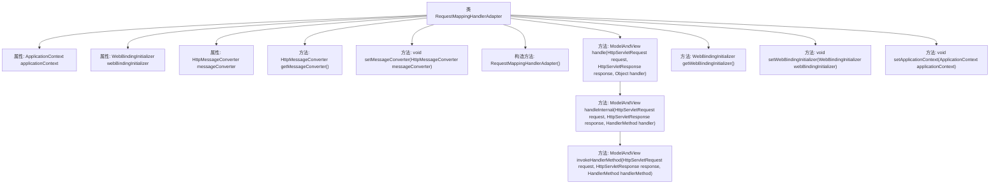

# 基础信息

|      |      |
|------|------|
| 名称 | RequestMappingHandlerAdapter |
| 编码语言 | .java |
| 代码路径 | Minis/src/com/minis/web/method/annotation/RequestMappingHandlerAdapter.java |
| 包名 | com.minis.web.method.annotation |
| 依赖项 | ['java.io.PrintWriter', 'java.lang.reflect.Method', 'java.lang.reflect.Parameter', 'java.util.Map', 'javax.servlet.http.HttpServletRequest', 'javax.servlet.http.HttpServletResponse', 'com.minis.beans.BeansException', 'com.minis.context.ApplicationContext', 'com.minis.context.ApplicationContextAware', 'com.minis.http.converter.HttpMessageConverter', 'com.minis.web.bind.WebDataBinder', 'com.minis.web.bind.annotation.PathVariable', 'com.minis.web.bind.annotation.ResponseBody', 'com.minis.web.bind.support.WebBindingInitializer', 'com.minis.web.bind.support.WebDataBinderFactory', 'com.minis.web.context.WebApplicationContext', 'com.minis.web.method.HandlerMethod', 'com.minis.web.servlet.HandlerAdapter', 'com.minis.web.servlet.ModelAndView'] |
| 概述说明 | RequestMappingHandlerAdapter处理HTTP请求，绑定参数并调用处理器方法，返回结果。 |

# 说明

RequestMappingHandlerAdapter负责处理HTTP请求，它通过绑定请求参数到处理器方法的参数上，然后调用相应的处理器方法。处理完成后，返回一个ModelAndView对象，或者直接生成响应内容返回给客户端。这个适配器在Spring MVC框架中扮演着核心角色，确保请求能够正确映射到相应的处理器方法，并处理返回结果。

# 类列表 Class Summary

| 名称   | 类型  | 说明 |
|-------|------|-------------|
| RequestMappingHandlerAdapter | class | RequestMappingHandlerAdapter处理HTTP请求，绑定参数并调用处理器方法，返回ModelAndView或直接响应。 |

## 类 RequestMappingHandlerAdapter

|      |      |
|------|------|
| 访问范围 | public |
| 类型 | class |
| 名称 | RequestMappingHandlerAdapter |
| 说明 | RequestMappingHandlerAdapter处理HTTP请求，绑定参数并调用处理器方法，返回ModelAndView或直接响应。 |

### UML类图

```mermaid
classDiagram
    class RequestMappingHandlerAdapter {
        -ApplicationContext applicationContext
        -WebBindingInitializer webBindingInitializer
        -HttpMessageConverter messageConverter
        +RequestMappingHandlerAdapter()
        +HttpMessageConverter getMessageConverter()
        +void setMessageConverter(HttpMessageConverter messageConverter)
        +ModelAndView handle(HttpServletRequest request, HttpServletResponse response, Object handler) throws Exception
        -ModelAndView handleInternal(HttpServletRequest request, HttpServletResponse response, HandlerMethod handler)
        #ModelAndView invokeHandlerMethod(HttpServletRequest request, HttpServletResponse response, HandlerMethod handlerMethod) throws Exception
        +WebBindingInitializer getWebBindingInitializer()
        +void setWebBindingInitializer(WebBindingInitializer webBindingInitializer)
        +void setApplicationContext(ApplicationContext applicationContext) throws BeansException
    }

    class HandlerAdapter {
        <<Interface>>
        +ModelAndView handle(HttpServletRequest request, HttpServletResponse response, Object handler) throws Exception
    }

    class ApplicationContextAware {
        <<Interface>>
        +void setApplicationContext(ApplicationContext applicationContext) throws BeansException
    }

    class HttpMessageConverter {
        <<Interface>>
        +void write(Object obj, HttpServletResponse response)
    }

    class WebBindingInitializer {
        <<Interface>>
        +void initBinder(WebDataBinder webDataBinder)
    }

    class HandlerMethod {
        +Method getMethod()
        +Object getBean()
    }

    class WebDataBinderFactory {
        +WebDataBinder createBinder(HttpServletRequest request, Object target, String objectName)
    }

    class WebDataBinder {
        +void bind(HttpServletRequest request)
    }

    RequestMappingHandlerAdapter ..|> HandlerAdapter : 实现
    RequestMappingHandlerAdapter ..|> ApplicationContextAware : 实现
    RequestMappingHandlerAdapter --> HttpMessageConverter : 使用
    RequestMappingHandlerAdapter --> WebBindingInitializer : 使用
    RequestMappingHandlerAdapter --> HandlerMethod : 使用
    RequestMappingHandlerAdapter --> WebDataBinderFactory : 使用
    WebDataBinderFactory --> WebDataBinder : 创建
    WebBindingInitializer --> WebDataBinder : 初始化
```

### 描述
`RequestMappingHandlerAdapter` 是一个实现了 `HandlerAdapter` 和 `ApplicationContextAware` 接口的类，用于处理HTTP请求并返回 `ModelAndView`。它依赖于 `HttpMessageConverter` 和 `WebBindingInitializer` 来处理消息转换和数据绑定。通过 `HandlerMethod` 和 `WebDataBinderFactory`，它能够解析方法参数并调用相应的处理器方法。该类通过 `ApplicationContext` 获取Spring上下文，并通过 `WebDataBinder` 进行数据绑定。整体设计使得请求处理更加灵活和可扩展。

### 内部方法调用关系图

这段代码定义了一个`RequestMappingHandlerAdapter`类，它实现了`HandlerAdapter`和`ApplicationContextAware`接口。该类主要用于处理HTTP请求，并将请求映射到相应的处理方法上。它包含了对请求的处理逻辑，包括获取请求参数、调用处理方法、处理返回结果等。代码中通过`handle`方法接收请求，然后调用`handleInternal`方法进行内部处理，最终通过`invokeHandlerMethod`方法执行具体的处理逻辑，并根据处理结果返回`ModelAndView`对象。此外，类中还提供了对`HttpMessageConverter`和`WebBindingInitializer`的获取和设置方法。

### 字段列表 Field List

| 名称  | 类型  | 说明 |
|-------|-------|------|
| applicationContext= null | ApplicationContext | 私有变量applicationContext初始化为null。 |
| messageConverter = null | HttpMessageConverter | 私有消息转换器变量初始化为空。 |
| webBindingInitializer = null | WebBindingInitializer | 私有Web绑定初始化器变量未初始化。 |

### 方法列表 Method List

| 名称  | 类型  | 说明 |
|-------|-------|------|
| setApplicationContext | void | 重写方法，设置应用上下文实例。 |
| getMessageConverter | HttpMessageConverter | 该方法返回HTTP消息转换器实例。 |
| setWebBindingInitializer | void | 设置Web绑定初始化器的方法。 |
| handle | ModelAndView | 重写方法处理HTTP请求并返回模型视图。 |
| handleInternal | ModelAndView | 处理请求并调用方法，返回ModelAndView对象。 |
| getWebBindingInitializer | WebBindingInitializer | 获取Web绑定初始化器的方法。 |
| setMessageConverter | void | 设置HTTP消息转换器的方法。 |
| invokeHandlerMethod | ModelAndView | 处理HTTP请求，解析参数并调用方法，返回ModelAndView或响应体。 |

