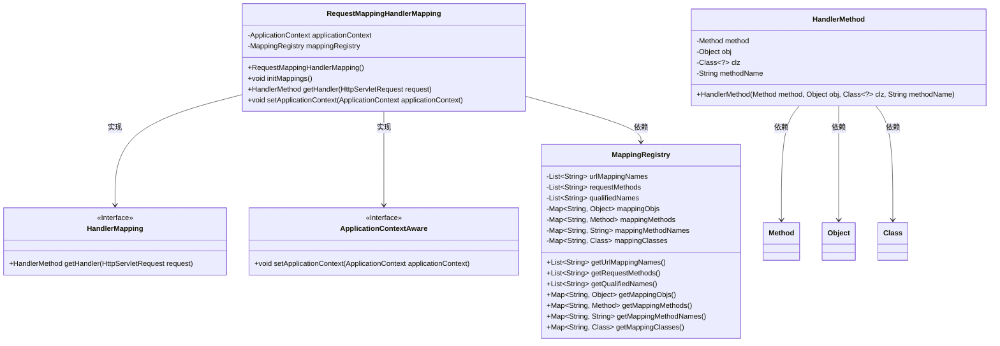
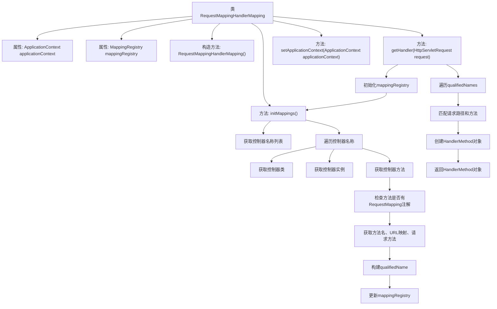

# 基础信息

|      |      |
|------|------|
| 名称 | RequestMappingHandlerMapping |
| 编码语言 | .java |
| 代码路径 | Minis/src/com/minis/web/method/annotation/RequestMappingHandlerMapping.java |
| 包名 | com.minis.web.method.annotation |
| 依赖项 | ['java.lang.reflect.Method', 'java.util.ArrayList', 'java.util.Arrays', 'javax.servlet.http.HttpServletRequest', 'com.minis.beans.BeansException', 'com.minis.context.ApplicationContext', 'com.minis.context.ApplicationContextAware', 'com.minis.util.PatternMatchUtils', 'com.minis.web.bind.annotation.RequestMapping', 'com.minis.web.context.WebApplicationContext', 'com.minis.web.method.HandlerMethod', 'com.minis.web.servlet.HandlerMapping'] |
| 概述说明 | RequestMappingHandlerMapping类实现HandlerMapping接口，负责初始化映射和处理HTTP请求。 |

# 说明

RequestMappingHandlerMapping类实现了HandlerMapping接口，主要负责初始化HTTP请求的映射关系，并处理这些请求。通过实现该接口，该类能够将特定的请求路径映射到相应的处理器方法上，从而确保请求能够被正确路由和处理。这一过程涉及对请求的解析、匹配以及最终的处理，是Spring框架中处理HTTP请求的核心组件之一。

# 类列表 Class Summary

| 名称   | 类型  | 说明 |
|-------|------|-------------|
| RequestMappingHandlerMapping | class | RequestMappingHandlerMapping类实现HandlerMapping接口，初始化映射并处理HTTP请求。 |

## 类 RequestMappingHandlerMapping

|      |      |
|------|------|
| 访问范围 | public |
| 类型 | class |
| 名称 | RequestMappingHandlerMapping |
| 说明 | RequestMappingHandlerMapping类实现HandlerMapping接口，初始化映射并处理HTTP请求。 |

### UML类图

这段代码描述了一个`RequestMappingHandlerMapping`类，它实现了`HandlerMapping`和`ApplicationContextAware`接口，用于处理HTTP请求的映射。`RequestMappingHandlerMapping`类通过`initMappings`方法初始化映射关系，将控制器类中的方法与其对应的URL路径和请求方法进行匹配，并将这些信息存储在`MappingRegistry`类中。`getHandler`方法根据请求的路径和方法，从`MappingRegistry`中查找对应的处理方法，并返回一个`HandlerMethod`对象。整个过程涉及到多个类的协作，包括`MappingRegistry`和`HandlerMethod`，它们分别用于存储映射信息和封装处理方法。

### 内部方法调用关系图

**描述：**  
`RequestMappingHandlerMapping`类负责处理HTTP请求的映射。它通过`initMappings`方法初始化控制器和方法映射，存储在`mappingRegistry`中。`getHandler`方法根据请求路径和方法匹配已注册的映射，返回对应的`HandlerMethod`对象。`setApplicationContext`方法用于设置应用上下文。整个过程涉及控制器类的加载、方法注解的检查、映射的构建和匹配，最终返回处理请求的方法对象。

### 字段列表 Field List

| 名称  | 类型  | 说明 |
|-------|-------|------|
| mappingRegistry = null | MappingRegistry | 私有变量mappingRegistry初始化为null。 |
| applicationContext | ApplicationContext | 应用上下文实例化。 |

### 方法列表 Method List

| 名称  | 类型  | 说明 |
|-------|-------|------|
| setApplicationContext | void | 重写方法，设置应用上下文为指定值。 |
| initMappings | void | 初始化控制器映射，获取请求方法和URL，并注册到映射注册表中。 |
| getHandler | HandlerMethod | 方法根据请求路径和方法匹配映射，返回对应的处理器方法。 |

