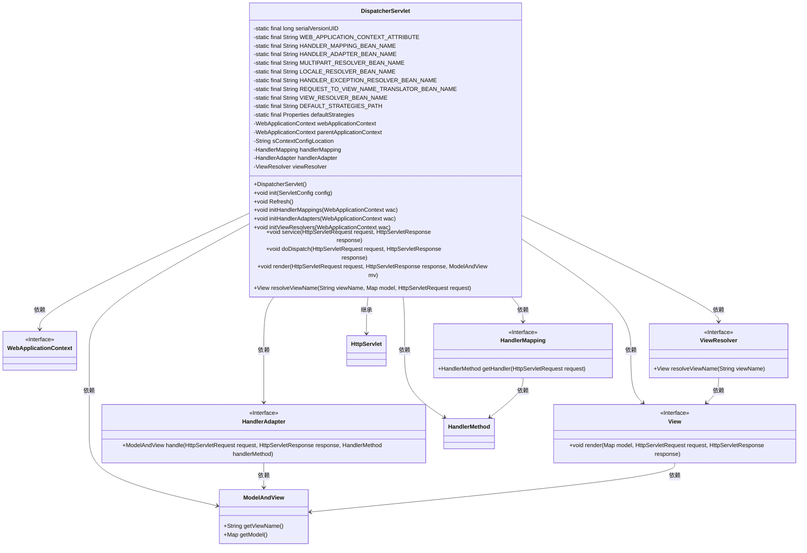
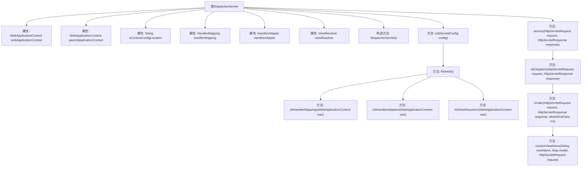

# 基础信息

|      |      |
|------|------|
| 名称 | DispatcherServlet |
| 编码语言 | .java |
| 代码路径 | Minis/src/com/minis/web/servlet/DispatcherServlet.java |
| 包名 | com.minis.web.servlet |
| 依赖项 | ['java.util.Map', 'java.util.Properties', 'javax.servlet.ServletConfig', 'javax.servlet.ServletException', 'javax.servlet.http.HttpServlet', 'javax.servlet.http.HttpServletRequest', 'javax.servlet.http.HttpServletResponse', 'com.minis.beans.BeansException', 'com.minis.web.context.WebApplicationContext', 'com.minis.web.context.support.AnnotationConfigWebApplicationContext', 'com.minis.web.method.HandlerMethod', 'com.minis.web.method.annotation.RequestMappingHandlerMapping'] |
| 概述说明 | DispatcherServlet类负责处理HTTP请求，初始化组件并执行请求分发与视图渲染。 |

# 说明

DispatcherServlet类是处理HTTP请求的核心组件，负责初始化处理器映射、适配器和视图解析器。它执行请求的分发，将请求传递给相应的处理器进行处理，并最终完成视图的渲染。DispatcherServlet在整个请求处理流程中起到关键作用，确保请求能够被正确地解析、处理和响应。

# 类列表 Class Summary

| 名称   | 类型  | 说明 |
|-------|------|-------------|
| DispatcherServlet | class | DispatcherServlet类处理HTTP请求，初始化处理器映射、适配器和视图解析器，执行请求分发和视图渲染。 |

## 类 DispatcherServlet

|      |      |
|------|------|
| 访问范围 | public |
| 类型 | class |
| 名称 | DispatcherServlet |
| 说明 | DispatcherServlet类处理HTTP请求，初始化处理器映射、适配器和视图解析器，执行请求分发和视图渲染。 |

### UML类图

这段代码定义了一个 `DispatcherServlet` 类，它是 Spring MVC 框架中的核心组件，负责处理 HTTP 请求并将其分发给相应的处理器。`DispatcherServlet` 依赖于多个接口和类，如 `WebApplicationContext`、`HandlerMapping`、`HandlerAdapter`、`ViewResolver` 和 `View`，通过这些组件实现请求的处理和视图的渲染。代码展示了如何初始化这些组件，并通过 `doDispatch` 方法将请求分发给适当的处理器，最终渲染视图返回给客户端。

### 内部方法调用关系图

这段代码定义了一个 `DispatcherServlet` 类，用于处理HTTP请求。它通过初始化 `WebApplicationContext` 来加载配置，并通过 `HandlerMapping`、`HandlerAdapter` 和 `ViewResolver` 来处理请求和生成响应。`init` 方法负责初始化上下文和配置，`Refresh` 方法用于刷新处理器和视图解析器。`service` 方法处理请求并调用 `doDispatch` 方法进行请求分发，最终通过 `render` 方法渲染视图。

### 字段列表 Field List

| 名称  | 类型  | 说明 |
|-------|-------|------|
| serialVersionUID = 1L | long | 定义了一个静态不可变的序列化版本ID。 |
| sContextConfigLocation | String | 私有字符串变量sContextConfigLocation。 |
| webApplicationContext | WebApplicationContext | 私有Web应用上下文变量声明。 |
| handlerMapping | HandlerMapping | 私有变量handlerMapping用于处理映射。 |
| parentApplicationContext | WebApplicationContext | 私有父应用上下文变量。 |
| handlerAdapter | HandlerAdapter | 私有成员变量handlerAdapter声明。 |
| REQUEST_TO_VIEW_NAME_TRANSLATOR_BEAN_NAME = "viewNameTranslator" | String | 静态常量定义视图名称翻译器的Bean名称为"viewNameTranslator"。 |
| viewResolver | ViewResolver | 私有视图解析器变量声明。 |
| defaultStrategies = null | Properties | 默认策略属性为静态常量且初始值为空。 |
| LOCALE_RESOLVER_BEAN_NAME = "localeResolver" | String | 静态常量LOCALE_RESOLVER_BEAN_NAME值为"localeResolver"。 |
| HANDLER_EXCEPTION_RESOLVER_BEAN_NAME = "handlerExceptionResolver" | String | 静态常量HANDLER_EXCEPTION_RESOLVER_BEAN_NAME值为handlerExceptionResolver。 |
| DEFAULT_STRATEGIES_PATH = "DispatcherServlet.properties" | String | 私有静态常量DEFAULT_STRATEGIES_PATH指向"DispatcherServlet.properties"。 |
| MULTIPART_RESOLVER_BEAN_NAME = "multipartResolver" | String | 定义静态常量MULTIPART_RESOLVER_BEAN_NAME为multipartResolver。 |
| HANDLER_MAPPING_BEAN_NAME = "handlerMapping" | String | 定义了一个名为HANDLER_MAPPING_BEAN_NAME的静态常量字符串，值为"handlerMapping"。 |
| VIEW_RESOLVER_BEAN_NAME = "viewResolver" | String | VIEW_RESOLVER_BEAN_NAME为viewResolver的静态常量字符串。 |
| HANDLER_ADAPTER_BEAN_NAME = "handlerAdapter" | String | 定义静态常量HANDLER_ADAPTER_BEAN_NAME，值为"handlerAdapter"。 |
| WEB_APPLICATION_CONTEXT_ATTRIBUTE = DispatcherServlet.class.getName() + ".CONTEXT" | String | DispatcherServlet类中定义的WEB_APPLICATION_CONTEXT_ATTRIBUTE属性。 |

### 方法列表 Method List

| 名称  | 类型  | 说明 |
|-------|-------|------|
| Refresh | void | Refresh方法初始化处理器映射、适配器和视图解析器。 |
| initHandlerAdapters | void | 初始化处理器适配器，捕获并打印异常。 |
| render | void | 根据模型视图渲染HTTP响应，若无视图则关闭输出流。 |
| initHandlerMappings | void | 初始化处理器映射，从上下文获取HandlerMapping bean并处理异常。 |
| doDispatch | void | 处理HTTP请求，获取处理器方法，执行并渲染结果。 |
| resolveViewName | View | 解析视图名称，返回对应视图对象，若无则返回空。 |
| init | void | Servlet初始化时获取上下文配置并创建应用上下文。 |
| initViewResolvers | void | 初始化视图解析器，从应用上下文获取指定Bean并处理异常。 |
| service | void | 重写service方法，设置Web应用上下文并调用doDispatch处理请求。 |

