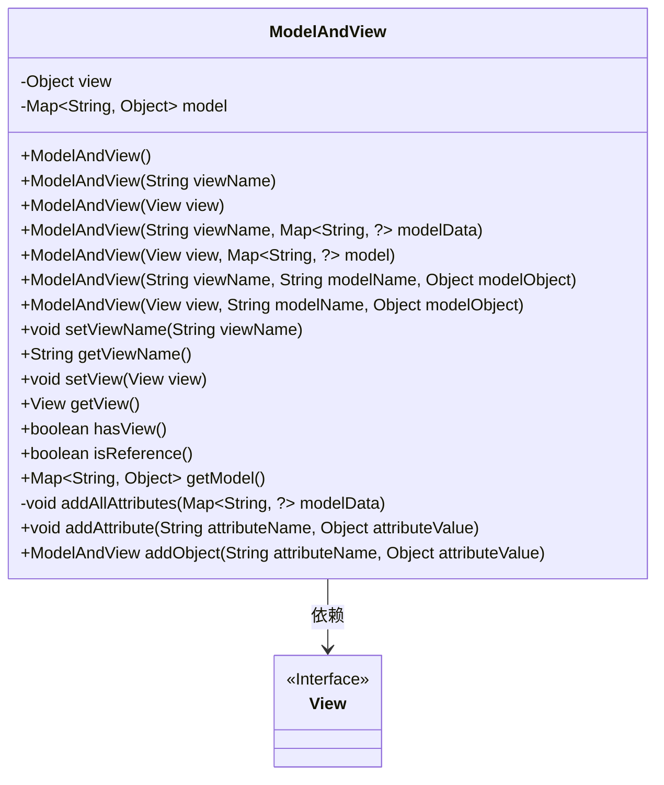

# 基础信息

|      |      |
|------|------|
| 名称 | ModelAndView |
| 编码语言 | .java |
| 代码路径 | Minis/src/com/minis/web/servlet/ModelAndView.java |
| 包名 | com.minis.web.servlet |
| 依赖项 | ['java.util.HashMap', 'java.util.Map'] |
| 概述说明 | ModelAndView类管理视图和模型数据，支持多种构造和操作。 |

# 说明

ModelAndView类是一个用于管理视图和模型数据的工具，它提供了多种构造和操作方法，以便开发者能够灵活地处理视图和模型之间的交互。通过该类，可以方便地设置和获取视图名称、模型数据以及进行其他相关操作，从而简化了视图与模型的管理流程。

# 类列表 Class Summary

| 名称   | 类型  | 说明 |
|-------|------|-------------|
| ModelAndView | class | ModelAndView类用于管理视图和模型数据，支持多种构造和操作方法。 |

## 类 ModelAndView

|      |      |
|------|------|
| 访问范围 | public |
| 类型 | class |
| 名称 | ModelAndView |
| 说明 | ModelAndView类用于管理视图和模型数据，支持多种构造和操作方法。 |

### UML类图

### 描述
`ModelAndView` 类用于在MVC模式中封装视图和模型数据。它支持多种构造函数，允许通过视图名称或视图对象初始化，并可以添加模型数据。类中的方法用于设置和获取视图、检查视图类型、以及管理模型数据。`View` 接口标记了视图对象，`ModelAndView` 依赖于 `View` 接口来处理视图相关操作。

### 内部方法调用关系图

```mermaid
graph TD
    A["类ModelAndView"]
    B["属性: Object view"]
    C["属性: Map<String, Object> model"]
    D["构造方法: ModelAndView()"]
    E["构造方法: ModelAndView(String viewName)"]
    F["构造方法: ModelAndView(View view)"]
    G["构造方法: ModelAndView(String viewName, Map<String, ?> modelData)"]
    H["构造方法: ModelAndView(View view, Map<String, ?> model)"]
    I["构造方法: ModelAndView(String viewName, String modelName, Object modelObject)"]
    J["构造方法: ModelAndView(View view, String modelName, Object modelObject)"]
    K["方法: setViewName(String viewName)"]
    L["方法: getViewName()"]
    M["方法: setView(View view)"]
    N["方法: getView()"]
    O["方法: hasView()"]
    P["方法: isReference()"]
    Q["方法: getModel()"]
    R["私有方法: addAllAttributes(Map<String, ?> modelData)"]
    S["方法: addAttribute(String attributeName, Object attributeValue)"]
    T["方法: addObject(String attributeName, Object attributeValue)"]

    A --> B
    A --> C
    A --> D
    A --> E
    A --> F
    A --> G
    A --> H
    A --> I
    A --> J
    A --> K
    A --> L
    A --> M
    A --> N
    A --> O
    A --> P
    A --> Q
    A --> R
    A --> S
    A --> T
```

该流程图展示了`ModelAndView`类的结构及其内部方法调用关系。`ModelAndView`类包含两个主要属性：`view`和`model`，并提供了多个构造方法用于初始化这些属性。此外，类中还定义了多个方法用于设置和获取视图名称、视图对象、模型数据等。私有方法`addAllAttributes`用于将外部模型数据添加到内部模型中，而`addAttribute`和`addObject`方法则用于向模型中添加单个属性。通过这些方法，`ModelAndView`类能够灵活地管理和操作视图与模型数据。

### 字段列表 Field List

| 名称  | 类型  | 说明 |
|-------|-------|------|
| view | Object | 代码片段声明了一个私有对象变量view。 |
| model = new HashMap<>() | Map<String, Object> | 创建一个名为model的私有HashMap对象，用于存储键值对。 |

### 方法列表 Method List

| 名称  | 类型  | 说明 |
|-------|-------|------|
| setView | void | 设置当前视图为指定视图。 |
| isReference | boolean | 方法检查视图是否为字符串类型。 |
| getModel | Map<String, Object> | 获取当前模型的Map对象。 |
| getView | View | 该方法返回当前视图对象，若非视图类型则返回null。 |
| setViewName | void | 设置视图名称的方法，将传入的viewName赋值给当前视图。 |
| addObject | ModelAndView | 方法`addObject`用于添加属性并返回当前对象。 |
| hasView | boolean | 检查视图是否存在，若存在返回true，否则返回false。 |
| addAttribute | void | 方法addAttribute将属性名和值存入model中。 |
| getViewName | String | 该方法返回视图名称，若视图为字符串类型则返回，否则返回空。 |
| addAllAttributes | void | 方法`addAllAttributes`将非空`modelData`内容全部加入`model`。 |

