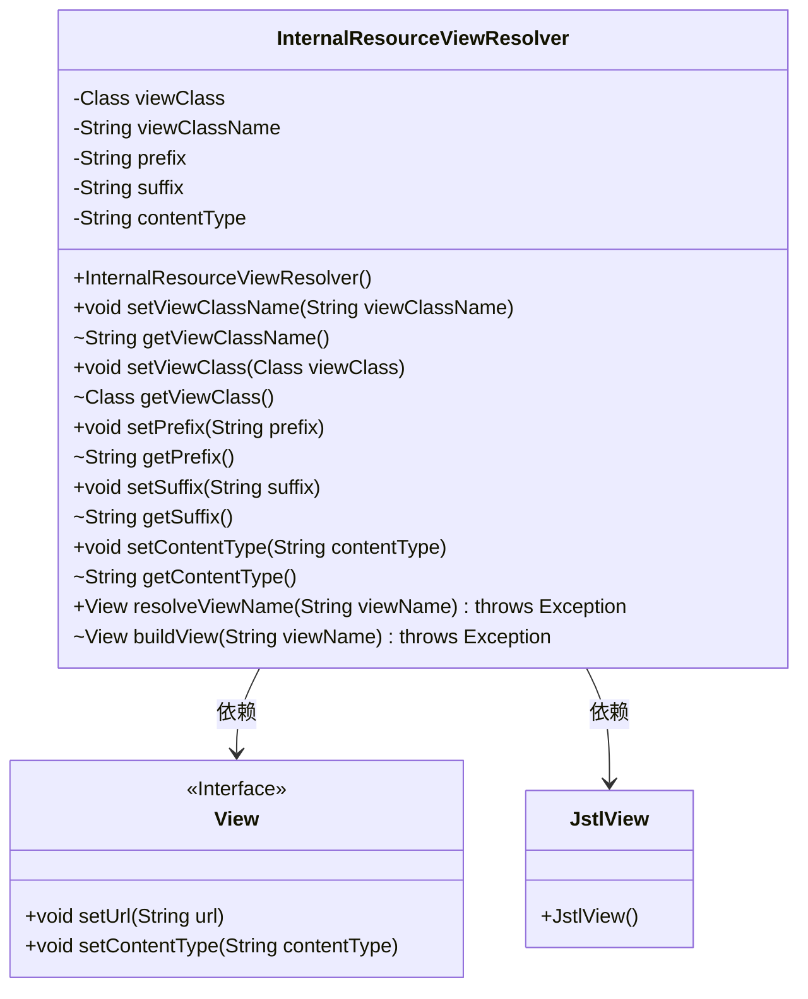
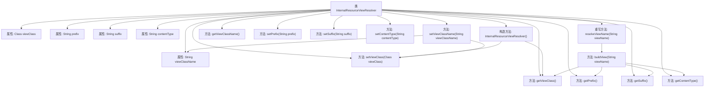

# 基础信息

|      |      |
|------|------|
| 名称 | InternalResourceViewResolver |
| 编码语言 | .java |
| 代码路径 | Minis/src/com/minis/web/servlet/view/InternalResourceViewResolver.java |
| 包名 | com.minis.web.servlet.view |
| 依赖项 | ['com.minis.web.servlet.View', 'com.minis.web.servlet.ViewResolver'] |
| 概述说明 | InternalResourceViewResolver解析视图，设置类、前缀、后缀、内容类型并构建实例。 |

# 说明

InternalResourceViewResolver类主要用于视图解析，通过设置视图类、前缀、后缀和内容类型等参数，构建并返回视图实例。该类在视图解析过程中起到关键作用，确保视图能够正确匹配和呈现。

# 类列表 Class Summary

| 名称   | 类型  | 说明 |
|-------|------|-------------|
| InternalResourceViewResolver | class | InternalResourceViewResolver类用于解析视图，设置视图类、前缀、后缀和内容类型，并构建视图实例。 |

## 类 InternalResourceViewResolver

|      |      |
|------|------|
| 访问范围 | public |
| 类型 | class |
| 名称 | InternalResourceViewResolver |
| 说明 | InternalResourceViewResolver类用于解析视图，设置视图类、前缀、后缀和内容类型，并构建视图实例。 |

### UML类图

这段代码定义了一个 `InternalResourceViewResolver` 类，它实现了 `ViewResolver` 接口，用于解析视图名称并构建视图对象。`InternalResourceViewResolver` 类包含多个私有属性，如 `viewClass`、`viewClassName`、`prefix`、`suffix` 和 `contentType`，并通过公有和受保护的方法来设置和获取这些属性。`resolveViewName` 方法用于解析视图名称并返回视图对象，而 `buildView` 方法则负责构建视图对象。`View` 是一个接口，定义了视图的基本操作，而 `JstlView` 是 `View` 的一个具体实现类。

### 内部方法调用关系图

这段代码定义了一个 `InternalResourceViewResolver` 类，用于解析视图名称并构建视图对象。类中包含多个属性和方法，用于设置和获取视图类、视图名称、前缀、后缀以及内容类型。`resolveViewName` 方法调用 `buildView` 方法来构建视图对象，`buildView` 方法通过反射实例化视图类，并设置视图的URL和内容类型。

### 字段列表 Field List

| 名称  | 类型  | 说明 |
|-------|-------|------|
| viewClassName = "" | String | 定义私有字符串变量viewClassName并初始化为空。 |
| contentType | String | 定义了一个私有字符串变量contentType。 |
| viewClass = null | Class<?> | 私有变量viewClass初始化为null。 |
| suffix = "" | String | 定义一个私有字符串变量suffix，初始值为空。 |
| prefix = "" | String | 定义私有字符串变量prefix并初始化为空。 |

### 方法列表 Method List

| 名称  | 类型  | 说明 |
|-------|-------|------|
| getContentType | String | 获取内容类型的方法。 |
| getViewClassName | String | 该方法返回当前视图类名。 |
| getSuffix | String | 获取后缀字符串的方法。 |
| getViewClass | Class<?> | 该方法返回当前视图类的类型。 |
| getPrefix | String | 获取并返回类中前缀字符串的方法。 |
| setViewClass | void | 设置视图类属性为指定类。 |
| setPrefix | void | 该方法设置前缀，若传入参数为空则设为空字符串。 |
| setContentType | void | 设置内容类型的方法，更新实例变量contentType。 |
| buildView | View | 构建视图实例，设置URL和内容类型后返回。 |
| resolveViewName | View | 重写resolveViewName方法，调用buildView返回视图。 |
| setSuffix | void | 设置字符串后缀，若为空则默认为空字符串。 |
| setViewClassName | void | 方法设置视图类名，尝试加载类并设置视图类，捕获类未找到异常。 |

