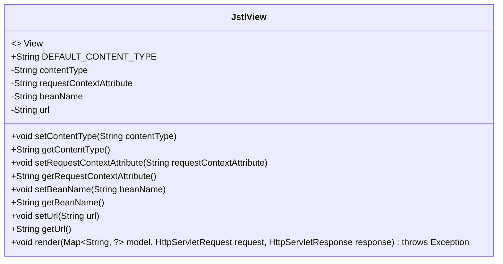
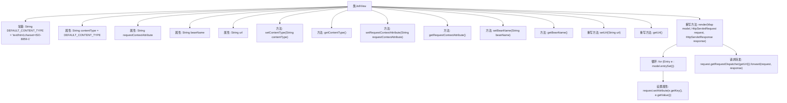

# 基础信息

|      |      |
|------|------|
| 名称 | JstlView |
| 编码语言 | .java |
| 代码路径 | Minis/src/com/minis/web/servlet/view/JstlView.java |
| 包名 | com.minis.web.servlet.view |
| 依赖项 | ['java.util.Map', 'java.util.Map.Entry', 'javax.servlet.http.HttpServletRequest', 'javax.servlet.http.HttpServletResponse', 'com.minis.web.servlet.View'] |
| 概述说明 | JstlView实现View接口，管理类型、属性、Bean名和URL，支持渲染。 |

# 说明

JstlView类实现了View接口，负责管理内容类型、请求属性、Bean名称和URL，同时具备渲染功能，确保视图的生成和展示。

# 类列表 Class Summary

| 名称   | 类型  | 说明 |
|-------|------|-------------|
| JstlView | class | JstlView类实现View接口，管理内容类型、请求属性、Bean名称和URL，并支持渲染功能。 |

## 类 JstlView

|      |      |
|------|------|
| 访问范围 | public |
| 类型 | class |
| 名称 | JstlView |
| 说明 | JstlView类实现View接口，管理内容类型、请求属性、Bean名称和URL，并支持渲染功能。 |

### UML类图

### 描述
`JstlView` 类实现了 `View` 接口，用于处理视图渲染。它包含多个属性，如 `contentType`、`requestContextAttribute`、`beanName` 和 `url`，并提供了相应的 getter 和 setter 方法。`render` 方法负责将模型数据设置到请求属性中，并通过请求转发将控制权传递给指定的 URL。该类主要用于在 Web 应用程序中处理视图的渲染逻辑。

### 内部方法调用关系图

这段代码定义了一个名为 `JstlView` 的类，该类实现了 `View` 接口。它包含多个属性和方法，用于设置和获取内容类型、请求上下文属性、Bean名称和URL。`render` 方法是核心功能，它将模型数据设置到请求属性中，并通过请求转发将控制权传递给指定的URL。流程图展示了类的结构及其方法之间的调用关系。

### 字段列表 Field List

| 名称  | 类型  | 说明 |
|-------|-------|------|
| url | String | 定义了一个私有的字符串变量url。 |
| DEFAULT_CONTENT_TYPE = "text/html;charset=ISO-8859-1" | String | 默认内容类型为text/html，字符集为ISO-8859-1。 |
| beanName | String | 私有字符串变量beanName。 |
| requestContextAttribute | String | 定义私有字符串变量requestContextAttribute。 |
| contentType = DEFAULT_CONTENT_TYPE | String | 私有字符串变量contentType初始化为DEFAULT_CONTENT_TYPE。 |

### 方法列表 Method List

| 名称  | 类型  | 说明 |
|-------|-------|------|
| getRequestContextAttribute | String | 获取请求上下文属性的方法。 |
| setRequestContextAttribute | void | 设置请求上下文属性的方法。 |
| getContentType | String | 获取内容类型的方法，返回当前对象的contentType属性。 |
| setUrl | void | 重写setUrl方法，用于设置url变量。 |
| getUrl | String | 重写getUrl方法，返回当前对象的url属性。 |
| setContentType | void | 设置内容类型的方法，参数为contentType。 |
| render | void | 重写渲染方法，将模型数据设置到请求属性并转发到指定URL。 |
| getBeanName | String | 方法返回当前对象的beanName属性值。 |
| setBeanName | void | 设置Bean名称的方法，将传入的beanName赋值给当前对象的beanName属性。 |

